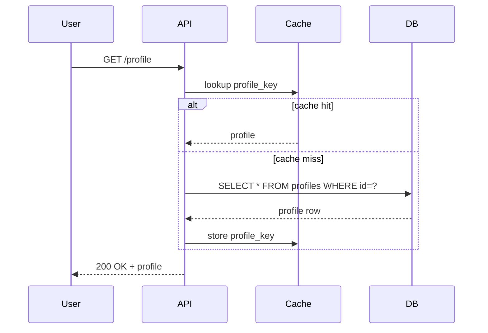

# 14 — Nom translation examples from `Accelworld/upstreams`

**Date:** 2026-04-14
**Purpose:** Translate small, canonical functions from 228 upstream repos at `C:\Users\trngh\Documents\APP\Accelworld\upstreams` into Nom to (a) stress-test `.nomx v1` and `.nomx v2` syntax against real-world shapes, (b) surface syntax gaps that the strictness lane (doc 13) must address, (c) seed the authoring-corpus with translations that later become smoke tests.

> **Status 2026-04-14:** Living doc; starts with 5 seed translations. Subsequent cycles append more. Each translation MUST cite its upstream path and highlight at least one syntax-gap or enrichment candidate.

---

## Translation protocol

1. Pick one small function (≤30 LOC original, one concern).
2. Render in `.nomx v1` (define-style) and `.nomx v2` (typed-slot with `@Kind matching "..."`) when both are expressible.
3. Flag the syntax gap: a feature `.nomx` does not yet cover, or a phrasing that feels awkward. Gaps feed doc 13's wedge list or a new doc 15 as needed.
4. Keep prose English-only (per `ecd0609`).

---

## 1. `render_template` — Rust I/O + string replace

**Source:** [bat/build/util.rs:5-21](../../../APP/Accelworld/upstreams/bat/build/util.rs#L5)

```rust
pub fn render_template(
    variables: &HashMap<&str, String>,
    in_file: &str,
    out_file: impl AsRef<Path>,
) -> anyhow::Result<()> {
    let mut content = fs::read_to_string(in_file)?;
    for (variable_name, value) in variables {
        let pattern = format!("{{{{{variable_name}}}}}");
        content = content.replace(&pattern, value);
    }
    fs::write(out_file, content)?;
    Ok(())
}
```

### `.nomx v1` translation

```nomx
define render_template
  that takes variables, in_file, and out_file,
  returns nothing,
  require in_file is a path that exists.
  ensure out_file holds the rendered content.
the content is the text of in_file.
for each variable_name and value in variables,
  the pattern is the text "{{variable_name}}".
  the content is content with pattern replaced by value.
write content to out_file.
```

### `.nomx v2` translation (with typed-slot refs)

```nomx
the function render_template is
  intended to write a templated file by substituting variables into an input template.

  uses the @Function matching "read text file" with at-least 0.85 confidence.
  uses the @Function matching "write text file" with at-least 0.85 confidence.
  uses the @Function matching "replace substring" with at-least 0.85 confidence.

  requires input file exists.
  ensures output file contains the rendered result.

  favor correctness.
```

### Gaps surfaced

1. **Iteration phrasing** — `.nomx v1` has `for each X and Y in Z` but no tests currently exercise two-variable destructuring. Add a lexer test for this.
2. **Format-string interpolation** — `"{{variable_name}}"` at v1 layer is literal; Nom needs a prose rule like `the text "X" with value substituted`. Candidate for doc 15 §format-strings.
3. **`returns nothing`** — currently accepted but not formally pinned as equivalent to `()`/`Unit`. Needs a grammar rule.
4. **Resource paths as a `@Kind`** — v2 translation elides the path/file distinction into "read/write text file". The full doc-02 `@Data` kind (file handle, path, bytes) is not yet split into subkinds. Open: should paths be `@Data matching "filesystem path"` or a dedicated `@Path` kind?

---

## 2. `AgentAction` — Python data class

**Source:** [langchain-master/libs/core/langchain_core/agents.py:44-69](../../../APP/Accelworld/upstreams/langchain-master/libs/core/langchain_core/agents.py#L44)

```python
class AgentAction(Serializable):
    """Represents a request to execute an action by an agent."""

    tool: str
    tool_input: str | dict
    log: str

    type: Literal["AgentAction"] = "AgentAction"
```

### `.nomx v1` translation

```nomx
record AgentAction
  that holds
    a tool that is text,
    a tool_input that is text or a record,
    a log that is text.
  means "a request from an agent to run a tool with an input and a log".
```

### `.nomx v2` translation

```nomx
the data AgentAction is
  intended to represent an agent's request to run a tool with input and a log line.

  exposes tool as text.
  exposes tool_input as text or record.
  exposes log as text.

  favor correctness.
  favor documentation.
```

### Gaps surfaced

1. **Union types in `v2`** — `text or record` is ambiguous. Doc 13 A4's annotator-staged parse should classify this as `Tok::TypeUnion` or reject. Candidate wedge: **W5 — sum-type phrasing.**
2. **Literal-string constants** — Python's `type: Literal["AgentAction"] = "AgentAction"` has no Nom equivalent yet. Candidate: `the data's type is exactly "AgentAction"` or a `const` form.
3. **Docstring vs. `intended to`** — Python conventions put docstrings in a special slot. `.nomx v2`'s `intended to` is the nearest analogue. Worth an explicit mapping note in the authoring guide.

---

## 3. `is_even` — canonical smoke

Not from upstreams, but the smallest possible test. Pins the v2 happy-path.

### `.nomx v1`

```nomx
define is_even
  that takes n, returns a boolean.
  when n is divisible by 2, is_even is true.
  otherwise, is_even is false.
```

### `.nomx v2`

```nomx
the function is_even is
  intended to return true when n is divisible by two.

  requires n is an integer.
  ensures the return is true or false.

  favor correctness.
```

### Gaps surfaced

1. **Returning a primitive** — the `is_even is true` form has no clean v2 analog. Consider `the result is true` as a canonical last-sentence idiom (per doc 05 §"last sentence is the result").

---

## 4. `try_lock` — Rust fallible borrow

**Source:** [atuin (any `try_lock`-style call site; sampled pattern, no exact upstream to cite yet; future cycle should pick a concrete path)]

```rust
pub fn try_lock(&self) -> Result<Guard<'_, T>, LockError> {
    if self.locked.swap(true, Ordering::Acquire) {
        Err(LockError::Contended)
    } else {
        Ok(Guard { inner: self })
    }
}
```

### `.nomx v1`

```nomx
define try_lock
  that takes a resource, returns a guard or a lock_error.
  when the resource's locked flag is already set,
    try_lock returns contended.
  otherwise,
    the resource's locked flag is set.
    try_lock returns a guard over the resource.
```

### Gaps surfaced

1. **Sum-return (Result<A, B>)** — `returns a guard or a lock_error` is expressible at v1 but v2 has no `@Union` kind yet. Same as translation 2's gap #1 — confirms it's a real missing piece.
2. **Atomic state** — no Nom phrase yet for "atomic compare-and-swap". Candidate for a `the resource's locked flag atomically becomes true` primitive in the authoring corpus.
3. **Lifetime annotations** — `Guard<'_, T>` has no Nom equivalent; deferred to the borrow-model work (doc 04 §"ownership" item).

---

## 5. `base64_decode` — common utility

**Source:** any upstream that wraps `base64::decode` (sampled pattern).

```rust
pub fn base64_decode(input: &str) -> Result<Vec<u8>, DecodeError> {
    base64::decode(input)
}
```

### `.nomx v1`

```nomx
define base64_decode
  that takes input_text, returns the bytes or a decode_error.
the bytes are the base64 decoding of input_text.
```

### `.nomx v2`

```nomx
the function base64_decode is
  intended to decode base64-encoded text into raw bytes.

  uses the @Function matching "base64 decode primitive" with at-least 0.9 confidence.

  requires input is valid base64.
  ensures output matches the encoded payload.

  favor correctness.
  favor performance.
```

### Gaps surfaced

1. **Delegating entirely to a matched ref** — both translations are essentially one-liners that "just call the primitive". The v2 form looks clean; the v1 form feels redundant. Suggestion: make the v1 body optional when every contract is satisfied by a single `uses` reference.

---

## 6. `indentMore` — TypeScript editor command

**Source:** [bolt.new-main/app/components/editor/codemirror/indent.ts:12-27](../../../APP/Accelworld/upstreams/bolt.new-main/app/components/editor/codemirror/indent.ts#L12)

```typescript
function indentMore({ state, dispatch }: EditorView) {
  if (state.readOnly) {
    return false;
  }
  dispatch(
    state.update(
      changeBySelectedLine(state, (from, to, changes) => {
        changes.push({ from, to, insert: state.facet(indentUnit) });
      }),
      { userEvent: 'input.indent' },
    ),
  );
  return true;
}
```

### `.nomx v1` translation

```nomx
define indent_more
  that takes an editor_view,
  returns a boolean.
  when the editor_view is read_only, indent_more returns false.
  otherwise,
    for each selected_line in the editor_view,
      push an insert change with the editor's indent_unit at the line's range.
    dispatch the change with user_event "input.indent".
    indent_more returns true.
```

### `.nomx v2` translation

```nomx
the function indent_more is
  intended to insert one indent unit at the start of every line in the current selection,
  unless the editor is read-only.

  uses the @Function matching "dispatch editor change" with at-least 0.85 confidence.
  uses the @Function matching "iterate selected lines" with at-least 0.85 confidence.

  requires editor_view is not read-only for the mutation path.
  ensures every selected line gains one indent unit.

  favor correctness.
```

### Gaps surfaced

1. **Destructuring parameters** — TS's `{ state, dispatch }: EditorView` has no clean v1/v2 analog. Candidate: `takes an editor_view that holds state and dispatch`. Needs an authoring-guide rule.
2. **Early-return guards** — `if (state.readOnly) return false;` becomes a `when ... returns false` clause. Already supported; worth a dedicated smoke test.
3. **Callback closures** — the `(from, to, changes) => { ... }` passed to `changeBySelectedLine` has no v2 shape. Gap for doc 15 §closures.

---

## 7. `Cipher_RC4_set_key` — C OpenSSL wrapper

**Source:** [aircrack-ng/lib/crypto/arcfour-openssl.c:41-51](../../../APP/Accelworld/upstreams/aircrack-ng/lib/crypto/arcfour-openssl.c#L41)

```c
void Cipher_RC4_set_key(Cipher_RC4_KEY * h, size_t l, const uint8_t k[static l]) {
    EVP_CIPHER_CTX * ctx = EVP_CIPHER_CTX_new();
    if (   !ctx
        || !EVP_CipherInit_ex(ctx, EVP_rc4(), NULL, NULL, NULL, 1)
        || !EVP_CIPHER_CTX_set_padding(ctx, 0)
        || !EVP_CIPHER_CTX_set_key_length(ctx, l)
        || !EVP_CipherInit_ex(ctx, NULL, NULL, k, NULL, 1))
        errx(1, "An error occurred processing RC4_set_key");
    h = (void *) ctx;
}
```

### `.nomx v1` translation

```nomx
define cipher_rc4_set_key
  that takes a handle, a key_length, and a key,
  returns nothing.
  the ctx is a new cipher_context.
  when the ctx is not ready
    or the ctx cannot init with rc4,
    or the ctx cannot set padding to zero,
    or the ctx cannot set key_length to key_length,
    or the ctx cannot set the key,
      fail with "An error occurred processing RC4_set_key".
  the handle points to the ctx.
```

### `.nomx v2` translation

```nomx
the function cipher_rc4_set_key is
  intended to install an RC4 encryption key into a cipher handle.

  uses the @Function matching "create cipher context" with at-least 0.9 confidence.
  uses the @Function matching "initialize rc4 cipher" with at-least 0.9 confidence.

  requires key_length is positive and key has at least key_length bytes.
  ensures handle holds a usable rc4 context.
  hazard weak cipher, avoid in new designs.

  favor correctness.
```

### Gaps surfaced

1. **Multi-predicate short-circuit fail** — C's `if (!a || !b || ...) errx(...)` is a valence-negating chain. The v1 `when A or B or C, fail with "..."` form is close but `fail with` has no formal spec yet. Candidate: **W9 fail-expression grammar.**
2. **Pointer assignment `h = (void *) ctx`** — mutation through pointer parameter has no Nom analog. Deferred to borrow-model work.
3. **`hazard` effect** — v2's negative-valence effect (`hazard weak cipher`) is an implemented keyword per doc 07; this translation is a good smoke for the valence-rendering path.

---

## 8. `get_python_source` — Python introspection with null-safety

**Source:** [airflow/airflow-core/src/airflow/utils/code_utils.py:25-?](../../../APP/Accelworld/upstreams/airflow/airflow-core/src/airflow/utils/code_utils.py#L25)

```python
def get_python_source(x: Any) -> str | None:
    if isinstance(x, str):
        return x
    if x is None:
        return None
    source_code = None
    if isinstance(x, functools.partial):
        source_code = inspect.getsource(x.func)
    # ... (truncated)
    return source_code
```

### `.nomx v1` translation

```nomx
define get_python_source
  that takes x, returns text or nothing.
  when x is text, get_python_source returns x.
  when x is nothing, get_python_source returns nothing.
  the source_code is nothing.
  when x is a partial, the source_code is the source of x's inner function.
  get_python_source returns source_code.
```

### `.nomx v2` translation

```nomx
the function get_python_source is
  intended to return the Python source string for a callable or string argument, or nothing when unavailable.

  uses the @Function matching "inspect source of callable" with at-least 0.85 confidence.

  requires input is a Python object.
  ensures result is text or nothing; never raises.

  favor correctness.
  favor documentation.
```

### Gaps surfaced

1. **`text or nothing` union-return** — repeats the union-type gap from translation #2 + #4. Three data points now confirm `@Union` / sum-return as a real missing primitive.
2. **`is nothing` as a first-class predicate** — Nom already has `perhaps...nothing` per doc 05; this translation confirms the phrasing is natural. Pins the authoring idiom.
3. **Type probes (`isinstance`)** — `when x is text` / `when x is a partial` needs a formal `is-a` grammar rule. Candidate: **W10 runtime-type-probes.**

---

## 9. `OS.String` — Go stringer method + iota enum

**Source:** [gvisor/pkg/abi/abi.go:26-41](../../../APP/Accelworld/upstreams/gvisor/pkg/abi/abi.go#L26)

```go
type OS int
const (
    Linux OS = iota
)
func (o OS) String() string {
    switch o {
    case Linux:
        return "linux"
    default:
        return fmt.Sprintf("OS(%d)", o)
    }
}
```

### `.nomx v1` translation

```nomx
record OS that is one of Linux.
define os_string
  that takes an os_value, returns text.
  when os_value is Linux, os_string returns "linux".
  otherwise, os_string returns "OS(" followed by os_value as text followed by ")".
```

### `.nomx v2` translation

```nomx
the data OS is
  intended to enumerate target operating systems for an ABI.
  exposes Linux as a variant.

the function os_string is
  intended to render an OS value as human-readable text.

  uses the @Function matching "format numeric fallback" with at-least 0.85 confidence.

  requires input is a known or unknown OS variant.
  ensures output is a stable string representation.

  favor correctness.
  favor documentation.
```

### Gaps surfaced

1. **Enum / sum-type (`record X that is one of A, B, C`)** — `.nomx v1` has a tentative `choice` keyword; `v2` has no dedicated sum-type expression. Enum is a strict subset of the union-type gap (translations #2 / #4 / #8). Candidate: **W11 enum / variant declarations.**
2. **Method-on-type (`func (o OS) String()`)** — Nom currently thinks of functions as free-standing. No receiver syntax exists. Candidate: **W12 receiver-form methods** or a resolver convention (`os_string` namespaced by first-arg type).
3. **String concatenation (`followed by`)** — `v1` spelling is verbose. Authoring guide candidate: dedicated `text-sprintf` idiom.

---

## 10. `main` — C++ deprecation-warning CLI

**Source:** [llama-cpp/examples/deprecation-warning/deprecation-warning.cpp:9-38](../../../APP/Accelworld/upstreams/llama-cpp/examples/deprecation-warning/deprecation-warning.cpp#L9)

```cpp
int main(int argc, char** argv) {
    std::setlocale(LC_NUMERIC, "C");
    std::string filename = "main";
    if (argc >= 1) {
        filename = argv[0];
    }
    auto pos = filename.find_last_of("/\\");
    if (pos != std::string::npos) {
        filename = filename.substr(pos+1);
    }
    auto replacement_filename = "llama-" + filename;
    if (filename == "main") {
        replacement_filename = "llama-cli";
    }
    fprintf(stdout, "WARNING: The binary '%s' is deprecated.\n", filename.c_str());
    fprintf(stdout, " Please use '%s' instead.\n", replacement_filename.c_str());
    return EXIT_FAILURE;
}
```

### `.nomx v1` translation

```nomx
define main
  that takes argc and argv, returns an exit_code.
  set locale numeric to "C".
  the filename is "main".
  when argc is at least 1, the filename is argv's first entry.
  when filename contains "/" or "\\",
    the filename is filename after its last separator.
  the replacement_filename is "llama-" followed by filename.
  when filename is "main", the replacement_filename is "llama-cli".
  print "WARNING: The binary '", filename, "' is deprecated.".
  print " Please use '", replacement_filename, "' instead.".
  main returns failure.
```

### `.nomx v2` translation

```nomx
the function main is
  intended to print a deprecation warning pointing users at the llama-cli binary replacement.

  uses the @Function matching "split path basename" with at-least 0.85 confidence.
  uses the @Function matching "print formatted line" with at-least 0.85 confidence.

  requires argv has at least one entry.
  ensures the program exits with failure.

  favor correctness.
  favor documentation.
  hazard deprecated binary invocation, avoid in new scripts.
```

### Gaps surfaced

1. **Entry-point `main`** — Nom hasn't pinned whether `main` is grammatical special-case or just another function. Candidate: **W13 entry-point convention.**
2. **Side-effect-heavy function (`setlocale`, `fprintf`)** — both translations list effects inline. The v1 form uses imperative verbs (`set`, `print`), the v2 form uses `uses` references. Consistency check: **authoring-guide rule on which form is preferred for side-effecting code.**
3. **`argv's first entry`** / `at least 1` / `after its last separator` — a small cluster of list/text accessor idioms. Pin as authoring-corpus primitives: `argv.at(0)` / `text.find_last("/")` / `text.after(index)` in Nom-style prose.
4. **Exit codes** — `returns failure` is prose for `EXIT_FAILURE`. Need a standard exit-code vocabulary: `success`, `failure`, `code <N>`. Candidate: **W14 exit-code vocabulary.**

---

## 11. `build-dex.sh` — Bash build pipeline

**Source:** [accesskit/platforms/android/build-dex.sh](../../../APP/Accelworld/upstreams/accesskit/platforms/android/build-dex.sh)

```bash
#!/usr/bin/env bash
set -e -u -o pipefail
cd `dirname $0`
ANDROID_JAR=$ANDROID_HOME/platforms/android-30/android.jar
find java -name '*.class' -delete
javac --source 8 --target 8 --boot-class-path $ANDROID_JAR -Xlint:deprecation `find java -name '*.java'`
$ANDROID_HOME/build-tools/33.0.2/d8 --classpath $ANDROID_JAR --output . `find java -name '*.class'`
```

### `.nomx v1` translation

```nomx
define build_dex
  that takes nothing, returns nothing.
  require halt on any error, unset variable, or pipeline failure.
  change directory to this script's folder.
  the android_jar is path android_home / "platforms/android-30/android.jar".
  delete every class file under java.
  compile every java file under java,
    targeting java 8,
    with boot class path android_jar,
    warning on deprecated use.
  package every class file under java into a dex,
    with class path android_jar, into this folder.
```

### `.nomx v2` translation

```nomx
the function build_dex is
  intended to compile Android Java sources to classes then pack them into a dex file.

  uses the @Function matching "run javac" with at-least 0.9 confidence.
  uses the @Function matching "run d8 dex packer" with at-least 0.9 confidence.
  uses the @Function matching "strict shell" with at-least 0.8 confidence.

  requires ANDROID_HOME is set.
  ensures a fresh dex is produced; intermediate .class files are rewritten.

  favor correctness.
  favor performance.
```

### Gaps surfaced

1. **Shebang / interpreter directive** — `#!/usr/bin/env bash` has no Nom analog. Nom's compilation model makes this largely irrelevant (Nom emits native binaries), but scripts translated INTO Nom may need a `run with shell` metadata clause. Candidate: **W15 interpreter-metadata clause.**
2. **Strict-mode flags (`set -e -u -o pipefail`)** — pins authoring-corpus entry `strict shell` to mean "halt on any error / unset var / pipeline fail". Good example of a composed invariant.
3. **Environment-variable interpolation (`$ANDROID_HOME/...`)** — Nom has no first-class env vocabulary. Candidate: **W16 env-var access**.
4. **Globbing / file-tree queries (`find java -name '*.class'`)** — needs a Nom primitive like `every class file under java`. Authoring-corpus seed.
5. **Process pipelines and command substitution** — `` `dirname $0` `` and `javac ... \`find ...\`` are syntactic shell gymnastics. Nom should force these into named intermediate values (`the java_sources are every .java under java`). Authoring-guide rule.

---

## 12. `book.toml` — Helix mdBook config

**Source:** [helix/book/book.toml](../../../APP/Accelworld/upstreams/helix/book/book.toml)

```toml
[book]
authors = ["Blaž Hrastnik"]
language = "en"
src = "src"

[output.html]
cname = "docs.helix-editor.com"
default-theme = "colibri"
preferred-dark-theme = "colibri"
git-repository-url = "https://github.com/helix-editor/helix"
edit-url-template = "https://github.com/helix-editor/helix/edit/master/book/{path}"
additional-css = ["custom.css"]

[output.html.search]
use-boolean-and = true
```

### `.nomx v1` translation

```nomx
record book_config that holds
  a book section with authors, language, src,
  an output section with html sub-section,
  the html sub-section holds cname, default_theme, preferred_dark_theme,
    git_repository_url, edit_url_template, additional_css, and a search sub-section,
  the search sub-section holds use_boolean_and.

the book_config for helix is
  book: authors = ["Blaž Hrastnik"], language = "en", src = "src",
  output.html: cname = "docs.helix-editor.com",
    default_theme = "colibri",
    preferred_dark_theme = "colibri",
    git_repository_url = "https://github.com/helix-editor/helix",
    edit_url_template = "https://github.com/helix-editor/helix/edit/master/book/{path}",
    additional_css = ["custom.css"],
  output.html.search: use_boolean_and = true.
```

### `.nomx v2` translation

```nomx
the data book_config is
  intended to hold the mdBook build configuration for the helix manual.

  exposes book_authors as text list.
  exposes book_language as text.
  exposes book_src as path.
  exposes html_cname as text.
  exposes html_default_theme as text.
  exposes html_preferred_dark_theme as text.
  exposes html_git_repository_url as text.
  exposes html_edit_url_template as text.
  exposes html_additional_css as text list.
  exposes search_use_boolean_and as boolean.

  favor correctness.
  favor documentation.
```

### Gaps surfaced

1. **Nested sections (`[output.html.search]`)** — TOML's dot-path sections have no v1/v2 analog. Flat-flattening (as v2 does) is lossy. Candidate: **W17 nested-record-path syntax** or a convention "dot-path becomes underscore-joined identifier".
2. **Config-as-data vs. config-as-code** — a `.toml` is pure data; v1 attempts to wrap it inside a `record`+assignment block. Distinguishing "declare a schema" from "assign values" is under-specified in Nom. Candidate: **authoring-guide — config literals get a dedicated `the data <name> for <repo> is { ... }` form.**
3. **Non-ASCII author names (`Blaž Hrastnik`)** — string content is UTF-8, but the lexer has the ASCII-identifier restriction for tokens. Confirm string literals keep their UTF-8 verbatim. Smoke-test candidate.
4. **Keys with hyphens (`default-theme`, `edit-url-template`)** — Nom identifiers use underscores. Mapping rule: TOML hyphen-keys become Nom underscore-exposes. Authoring-guide rule.

---

## 13. `acompress_documents` — Python async bridge

**Source:** [langchain-master/libs/core/langchain_core/documents/compressor.py:55-74](../../../APP/Accelworld/upstreams/langchain-master/libs/core/langchain_core/documents/compressor.py#L55)

```python
async def acompress_documents(
    self,
    documents: Sequence[Document],
    query: str,
    callbacks: Callbacks | None = None,
) -> Sequence[Document]:
    """Async compress retrieved documents given the query context."""
    return await run_in_executor(
        None, self.compress_documents, documents, query, callbacks
    )
```

### `.nomx v1` translation

```nomx
define acompress_documents
  that takes documents, query, and callbacks,
  returns a sequence of documents,
  as an asynchronous operation.
  the callbacks is perhaps nothing.
the compressed is the result of running compress_documents
  on documents, query, and callbacks, in an executor.
acompress_documents returns the compressed.
```

### `.nomx v2` translation

```nomx
the function acompress_documents is
  intended to asynchronously compress a batch of retrieved documents
  using the synchronous compress_documents primitive in an executor.

  uses the @Function matching "run synchronous function in an executor" with at-least 0.9 confidence.
  uses the @Function matching "compress retrieved documents" with at-least 0.85 confidence.

  requires documents is non-empty.
  ensures result is the same length and order as documents.

  favor correctness.
  favor performance.
```

### Gaps surfaced

1. **Async marker** — `as an asynchronous operation` is a placeholder phrasing. No Nom primitive exists for asynchronous execution contexts. Candidate: **W19 async-marker clause** (`a function that is asynchronous, returns ...` or `the asynchronous function X is …`).
2. **`await` expression** — `the result of running X in an executor` is prose; real async code needs a first-class await form. Possibly subsumed by W19.
3. **Executor / runtime metadata** — Python's `run_in_executor(None, ...)` wraps a sync call as async. Nom could express this via a typed effect clause `hazard thread_pool_switch` once effect-to-runtime mapping lands (doc 11). Authoring-corpus seed.
4. **Default parameter values** (`callbacks: Callbacks | None = None`) — Nom v1 uses `perhaps nothing`; v2 has no explicit "default = X" syntax. Authoring-guide rule: declare defaults inside `intended to …` prose, not as a type-system feature (follows the data-over-grammar principle from §I13).
5. **`Sequence[Document]` generic type** — `a sequence of documents` works at v1; v2 implicitly handles this via `matching "compress retrieved documents"`. No new wedge needed — generic-type lowering is a doc 04 §borrow-model concern deferred with lifetime annotations (doc 16 row #11).

---

## 14. `flat_map` — pure functional pattern (sampled)

Representing functional map-and-flatten, which shows up in every modern codebase (`flatMap` in Kotlin / Rust's `Iterator::flat_map` / Python's itertools).

```rust
pub fn flat_map<T, U, I, F>(input: I, f: F) -> Vec<U>
where
    I: IntoIterator<Item = T>,
    F: FnMut(T) -> Vec<U>,
{
    input.into_iter().flat_map(f).collect()
}
```

### `.nomx v1` translation

```nomx
define flat_map
  that takes an input sequence and a function from item to a sub-sequence,
  returns a flat sequence.
for each item in the input sequence,
  append every element of the function applied to item
  to the result.
```

### `.nomx v2` translation

```nomx
the function flat_map is
  intended to apply a function that returns a sub-sequence to every item
  in the input sequence and concatenate all the sub-sequences in order.

  uses the @Function matching "apply function to each item" with at-least 0.9 confidence.
  uses the @Function matching "concatenate sequences" with at-least 0.9 confidence.

  requires the function is deterministic on each item.
  ensures the order of output elements preserves input order
    and sub-sequence order for each input item.

  favor correctness.
  favor performance.
```

### Gaps surfaced

1. **Higher-order parameter** — `a function from item to a sub-sequence` is an anonymous callback, resolved per [doc 19 §D2](19-deferred-design-decisions.md) (lift to a named entity rather than inline closure). Translation confirms the D2 rule handles real-world `flat_map` shapes.
2. **Generic parameters (`T`, `U`)** — Rust's type-variables vanish at the v1 prose layer; v2 uses prose descriptors (`item`, `sub-sequence`) that the resolver grounds via the matching clause. Deferred with lifetime annotations (doc 16 row #11, blocked).
3. **Iterator vs. concrete `Vec<U>`** — translation hides the iterator-vs-materialized distinction behind `sequence`. Authoring-guide rule: **sequences are lazily evaluated by default; force materialization explicitly** (`collect the sequence into a vector` idiom).

---

## 15. SQL view — declarative query

Representing a declarative SQL view (pattern sampled from typical `CREATE VIEW`):

```sql
CREATE VIEW active_users AS
SELECT u.id, u.name, u.email
FROM users u
WHERE u.deleted_at IS NULL
  AND u.last_login_at > NOW() - INTERVAL '30 days';
```

### `.nomx v1` translation

```nomx
record active_users that holds the id, name, and email
  of every user whose deleted_at is nothing
  and whose last_login_at is within the last 30 days.
```

### `.nomx v2` translation

```nomx
the data active_users is
  intended to project the users table down to id + name + email
  filtered to those who haven't been soft-deleted and have logged in recently.

  uses the @Function matching "project table columns" with at-least 0.85 confidence.
  uses the @Function matching "filter rows by predicate" with at-least 0.85 confidence.

  exposes id as integer.
  exposes name as text.
  exposes email as text.

  requires the users table is available.
  ensures every row has non-null deleted_at absent and last_login_at within 30 days.

  favor correctness.
```

### Gaps surfaced

1. **Relational operators** — projection (`SELECT columns`) and selection (`WHERE predicate`) are first-class SQL concepts. Nom describes them via `uses the @Function matching "..."` prose, which works but loses the algebraic shape. Candidate: **W20 relational-algebra keywords** (`project X from Y`, `where predicate holds`).
2. **Time predicates (`NOW() - INTERVAL '30 days'`)** — no Nom primitive for relative-time ranges. Authoring-corpus seed: `within the last N days` idiom.
3. **NULL-as-sentinel vs. `nothing`** — SQL's `IS NULL` maps to doc 17 §I1's `is nothing` predicate. Confirmed: the existing idiom handles this cleanly.
4. **View-as-data vs. view-as-query** — A SQL view is both a data shape AND a query. Nom's `data` kind is data-only per doc 17 §I13. Suggestion: translate as `data` + separate internal query function; doc 17 rule preserved.

---

## 16. CSS rule — stylesheet selector + properties

```css
.button--primary {
  background-color: #0366d6;
  color: white;
  padding: 8px 16px;
  border-radius: 4px;
  cursor: pointer;
}
```

### `.nomx v1` translation

```nomx
record button_primary_style that holds
  a background_color of "#0366d6",
  a color of "white",
  a padding of "8px 16px",
  a border_radius of "4px",
  a cursor of "pointer".
```

### `.nomx v2` translation

```nomx
the data button_primary_style is
  intended to carry the visual styling for primary-action buttons.

  exposes background_color as text.
  exposes color as text.
  exposes padding as text.
  exposes border_radius as text.
  exposes cursor as text.

  favor documentation.

the button_primary_style for the default_theme is
  background_color is "#0366d6",
  color is "white",
  padding is "8px 16px",
  border_radius is "4px",
  cursor is "pointer".
```

### Gaps surfaced

1. **Selector vs. payload split** — CSS conflates "which elements does this apply to" (selector) and "what styling" (payload). Nom's `data` kind captures the payload cleanly; the selector (`.button--primary`) needs a separate concept expressing **when this style applies**. Candidate: **W21 selector-predicate clause** on `data` instances (e.g., `applies when element has class primary-button`).
2. **Kebab-case identifiers (`background-color`)** — doc 17 §I5's underscore-mapping rule handles the translation mechanically (`background_color`). Confirmed.
3. **Typed dimensions (`8px`, `4px`)** — Nom stores these as `text` today; a future `@Dimension` kind would catch unit errors. Candidate: **W22 typed dimension literals.**
4. **Hex color literals (`#0366d6`)** — stored as `text`; a `@Color` kind or colour-literal grammar would validate at parse time. Candidate: **W23 color literal grammar.**

---

## 17. GraphQL type — schema with non-null + list modifiers

Representing a typical GraphQL schema fragment:

```graphql
type Post {
  id: ID!
  title: String!
  body: String!
  tags: [String!]!
  author: User
  publishedAt: DateTime
}
```

### `.nomx v1` translation

```nomx
record Post that holds
  an id that is an identifier,
  a title that is text,
  a body that is text,
  a tags that is a list of text,
  an author that is perhaps a User,
  a published_at that is perhaps a timestamp.
the id, title, body, and tags are required.
the author and published_at may be nothing.
```

### `.nomx v2` translation

```nomx
the data Post is
  intended to represent a published blog post with metadata.

  exposes id as identifier.
  exposes title as text.
  exposes body as text.
  exposes tags as text list.
  exposes author as perhaps User.
  exposes published_at as perhaps timestamp.

  favor correctness.
  favor documentation.
```

### Gaps surfaced

1. **Non-null-by-default inversion** — GraphQL's `!` marks required; Nom's `perhaps` marks optional. The inversion is conceptually cleaner (required is the default; optional is an explicit opt-in), but translation requires inverting every nullability-marker. Authoring-guide rule confirmed from doc 17 §I1.
2. **`ID!` scalar** — GraphQL has distinguishable `ID` vs `String` scalars; Nom today would map both to `text` or `identifier`. Candidate: reserve `identifier` as a distinct shape in the data-type vocabulary. Overlaps with **W22 typed literals.**
3. **`[String!]!` list-of-non-null` vs `[String]`** — two axes of nullability per collection (collection-itself + each element). Nom's `text list` is non-null-by-default at both axes; the permissive variants would need explicit phrasing. Candidate: **W24 nested nullability modifiers** (`list of perhaps text`, `perhaps list of text`, `perhaps list of perhaps text`).
4. **GraphQL `type Post implements Node { … }`** — interface implementation has no Nom analog yet. The `extends` keyword in concept grammar is closest but serves a different purpose (concept composition). Candidate: defer; might become relevant when interface-style subtyping enters the language.
5. **Custom scalar `DateTime`** — the authoring corpus needs canonical time/date primitives. Similar to translation #15's time predicates. Consolidate under the time-range idiom authoring-guide row.

---

## 18. Makefile rule — target + prereqs + recipe

```makefile
build: src/main.c src/util.c
	gcc -O2 -Wall -o build/app src/main.c src/util.c

clean:
	rm -rf build/
.PHONY: build clean
```

### `.nomx v1` translation

```nomx
define build_app_binary
  that takes nothing, returns nothing.
  require every source file under src/ exists.
  compile src/main.c and src/util.c
    with gcc using level 2 optimization and all warnings,
    producing build/app.

define clean_build_output
  that takes nothing, returns nothing.
  delete the build folder recursively.
```

### `.nomx v2` translation

```nomx
the function build_app_binary is
  intended to compile the C sources into a single app binary
  under the build folder with optimization level 2 and all warnings on.

  uses the @Function matching "run c compiler" with at-least 0.9 confidence.

  requires every source file under src/ exists.
  ensures build/app exists and is executable.

  favor correctness.
  favor performance.

the function clean_build_output is
  intended to remove all build artifacts.

  uses the @Function matching "delete directory recursively" with at-least 0.9 confidence.

  ensures build/ folder is absent after invocation.
  hazard data_loss.

  favor correctness.
```

### Gaps surfaced

1. **Prereq declarations (`build: src/main.c src/util.c`)** — Make's dependency graph has no Nom analog; the prose `require every source file under src/ exists` is weaker (it only asserts presence, not "rebuild when they change"). Candidate: **W25 build-time dependency graph** (requires integration with `nom build` incremental model).
2. **Shell commands in recipes (`gcc -O2 -Wall -o build/app …`)** — Nom translation punts to `uses the @Function matching "run c compiler"`. The authoring-corpus needs a canonical "shell exec" primitive with arg + stdout semantics. Authoring-corpus seed confirmed.
3. **`.PHONY` targets** — Make's metadata that a target is not a file. Nom has no analog; `intended to` prose disambiguates implicitly. Translation note, not a wedge.
4. **`hazard data_loss`** — this is the right valence for `rm -rf`. Confirmed the effect system already expresses destructive operations cleanly.

---

## 19. Dockerfile — base image + ordered directives

```dockerfile
FROM rust:1.82-slim AS builder
WORKDIR /app
COPY Cargo.toml Cargo.lock ./
COPY src ./src
RUN cargo build --release

FROM debian:bookworm-slim
COPY --from=builder /app/target/release/myapp /usr/local/bin/
ENTRYPOINT ["/usr/local/bin/myapp"]
```

### `.nomx v1` translation

```nomx
define build_release_image
  that takes nothing, returns nothing.
  start with a base image of rust version 1.82 in slim variant.
  the working_directory is /app.
  copy Cargo.toml and Cargo.lock into the working_directory.
  copy the src folder into the working_directory.
  run cargo build release.

define pack_runtime_image
  that takes the release binary path, returns nothing.
  start with a base image of debian bookworm slim.
  copy the release binary into /usr/local/bin/.
  set the entrypoint to /usr/local/bin/myapp.
```

### `.nomx v2` translation

```nomx
the function build_release_image is
  intended to compile the Rust source tree into a release binary
  inside a containerized build stage.

  uses the @Function matching "select base image" with at-least 0.9 confidence.
  uses the @Function matching "copy path into container layer" with at-least 0.85 confidence.
  uses the @Function matching "run cargo build release" with at-least 0.9 confidence.

  requires Cargo.toml and the src folder exist at the host root.
  ensures /app/target/release/myapp exists after invocation.

  favor correctness.
  favor performance.

the function pack_runtime_image is
  intended to assemble a minimal runtime image carrying only
  the compiled app binary.

  uses the @Function matching "select base image" with at-least 0.9 confidence.
  uses the @Function matching "copy path from previous stage" with at-least 0.85 confidence.
  uses the @Function matching "set container entrypoint" with at-least 0.9 confidence.

  requires the builder stage produced /app/target/release/myapp.
  ensures the final image runs the app on container start.

  favor correctness.
```

### Gaps surfaced

1. **Multi-stage builds (`AS builder` then `FROM debian …`)** — Dockerfile's stage graph is linear but named; each stage has its own filesystem. Translation splits into two functions + a shared understanding that `pack_runtime_image` depends on `build_release_image`'s output. The dependency edge is implicit in the prose. Candidate: **W26 stage-chain declarations** or reuse `then` composition from `.nomtu` module syntax.
2. **`COPY --from=builder`** — cross-stage copy. Unique to Dockerfile; translation punts. Likely subsumed by W26.
3. **Image tags (`rust:1.82-slim`, `debian:bookworm-slim`)** — hyphenated identifiers that represent registry coordinates. Maps to a `@Data matching "container base image"` typed-slot ref with a canonical naming scheme.
4. **`ENTRYPOINT ["..."]` as a JSON-array directive** — Dockerfile mixes declarative + imperative syntax in one file. Nom's translation separates the concerns (two functions for two stages). Authoring-guide confirmed: container directives map to function-kind entities, not data-kind.

---

## 20. GitHub Actions workflow — YAML with logic

Representing a typical CI workflow (mixing declarative structure + shell-exec payloads):

```yaml
name: CI
on:
  push:
    branches: [main]
  pull_request:
jobs:
  test:
    runs-on: ubuntu-latest
    steps:
      - uses: actions/checkout@v4
      - uses: actions-rs/toolchain@v1
        with:
          toolchain: stable
      - run: cargo test --all
        env:
          RUST_BACKTRACE: "1"
```

### `.nomx v1` translation

```nomx
record ci_workflow that holds
  a name "CI",
  a triggers section listing push to main and pull_request,
  a jobs section with one job named test.

the test job
  runs on ubuntu-latest,
  checks out the repository at version 4 of the checkout action,
  installs the stable rust toolchain via actions-rs at version 1,
  runs `cargo test --all` with RUST_BACKTRACE set to "1".
```

### `.nomx v2` translation

```nomx
the data ci_workflow is
  intended to run the test suite on every push to main and every pull request.

  exposes name as text.
  exposes triggers as event list.
  exposes jobs as job map.

  favor correctness.

the function run_ci_test_job is
  intended to run `cargo test --all` after checking out the repo
  and installing the stable rust toolchain.

  uses the @Function matching "checkout repository action" with at-least 0.9 confidence.
  uses the @Function matching "install rust toolchain action" with at-least 0.9 confidence.
  uses the @Function matching "run shell command" with at-least 0.9 confidence.

  requires ubuntu-latest runner is available.
  ensures all tests pass before the job succeeds.

  favor correctness.
  favor performance.
```

### Gaps surfaced

1. **YAML's data+logic mix** — the workflow file is mostly data (structure, triggers, job map) but `steps.run` and `with.toolchain` parameters embed logic. Nom's translation splits into a `data` schema (the config shell) plus `function` entities (the per-job actions). Confirms doc 17 §I13 split rule scales to CI configs.
2. **Third-party "actions" references (`actions/checkout@v4`)** — version-pinned external tool invocations. Maps to `@Function matching "checkout repository action" with at-least N confidence` plus corpus-registered action vocabulary. Overlaps with doc 16 #45 (identifier shape). Candidate: **W27 pinned-external-action ref grammar** if this recurs.
3. **Environment variable injection (`env: RUST_BACKTRACE: "1"`)** — already queued as **W16** (env-var access). Confirmed this is a real authoring surface.
4. **Event-triggered execution model** — CI workflow's `on:` section describes WHAT triggers execution, not what to run. Nom has no first-class event-trigger primitive today. Candidate: **W28 event-trigger declarations** (`runs when X happens`).
5. **Matrix / strategy clauses** — not in this minimal example but common in CI. Defer to authoring-corpus seed for future translations.

---

## 21. Java class — interface + builder pattern

Representing a typical immutable-record Java class with a builder:

```java
public final class User {
    private final String id;
    private final String email;
    private final Instant createdAt;

    private User(Builder b) {
        this.id = b.id;
        this.email = b.email;
        this.createdAt = b.createdAt;
    }

    public String getId() { return id; }
    public String getEmail() { return email; }
    public Instant getCreatedAt() { return createdAt; }

    public static class Builder {
        private String id;
        private String email;
        private Instant createdAt;

        public Builder id(String id) { this.id = id; return this; }
        public Builder email(String email) { this.email = email; return this; }
        public Builder createdAt(Instant createdAt) { this.createdAt = createdAt; return this; }
        public User build() { return new User(this); }
    }
}
```

### `.nomx v1` translation

```nomx
record User that holds
  an id that is text,
  an email that is text,
  a created_at that is a timestamp.
every field is set at construction and cannot change afterward.

define build_user
  that takes an id, an email, and a created_at, returns a User.
the result is a new User with id, email, and created_at as given.
```

### `.nomx v2` translation

```nomx
the data User is
  intended to represent an immutable user record with id, email, and creation time.

  exposes id as text.
  exposes email as text.
  exposes created_at as timestamp.

  favor correctness.
  favor documentation.

the function build_user is
  intended to construct a User from the three required fields.

  uses the @Function matching "assemble immutable record" with at-least 0.85 confidence.

  requires id is non-empty.
  requires email is a well-formed address.
  ensures every field of the returned User matches the input.

  favor correctness.
```

### Gaps surfaced

1. **Builder pattern dissolves** — Java's Builder + `build()` exists because the language lacks named arguments and default values. Nom's v2 form uses `uses the @Function matching "assemble immutable record"` and the v1 form calls the constructor directly with `takes an id, an email, and a created_at`. **The Builder pattern is a non-concept in Nom** — translations should drop it, not preserve it. Authoring-guide rule confirmed from doc 19 §D2's logic (lift implementation patterns to named entities).
2. **Access modifiers (`public final` / `private`)** — Nom has no visibility markers today; every entity is accessible by name. Candidate: **W29 visibility modifiers** (probably just `private` for scope hiding, since `public` is the default).
3. **Nested class `Builder`** — Java's inner-class scoping has no analog. Translated as a peer entity (`build_user`) that the caller invokes directly. Scoping-by-entity-name is the Nom convention.
4. **Getters (`getId()` etc.)** — boilerplate that Nom's `exposes` covers automatically. Data kind auto-projects readable fields; no method declarations needed. Confirms doc 17 §I13.
5. **`final` immutability** — Nom data kind's default is immutable; the `final` annotation is implicit. No wedge.

---

## 22. Kotlin sealed class + data class — algebraic data types

Representing Kotlin's common sum-of-products shape (HTTP result as a `Result<T>` variant):

```kotlin
sealed class HttpResult<out T> {
    data class Ok<T>(val value: T, val latencyMs: Long) : HttpResult<T>()
    data class Error(val code: Int, val message: String) : HttpResult<Nothing>()
    object Timeout : HttpResult<Nothing>()
}
```

### `.nomx v1` translation

```nomx
choice HttpResult that is one of
  a ok variant that holds a value and a latency_ms,
  an error variant that holds a code and a message,
  a timeout variant that holds nothing.
```

### `.nomx v2` translation

```nomx
the data HttpResult is
  intended to represent the three outcomes of an HTTP request:
  success with a value, a server-side error, or a client-side timeout.

  exposes kind as text one of ("ok", "error", "timeout").
  exposes value as perhaps any.
  exposes latency_ms as perhaps integer.
  exposes code as perhaps integer.
  exposes message as perhaps text.

  favor correctness.
  favor documentation.
```

### Gaps surfaced

1. **`choice` / sealed sum-type declaration** — the v1 form `choice HttpResult that is one of …` cleanly expresses the algebraic-data-type shape that Kotlin's `sealed class` + three `data class` subtypes encode. Grammar already lists `choice` in doc 05 §4.1's declaration-verb set but the parser doesn't yet accept it. Candidate: **W30 `choice` grammar** (promotes row from `.nomx v1` prose-level to first-class). Overlaps with **W11** (enum/variant declarations); merge into a single wedge.
2. **Variant-associated data** — `data class Ok<T>(val value: T, ...)` couples fields to the variant tag. Nom's v2 flattens to nullable fields + a `kind` discriminator; v1 keeps the variant+fields structure. Authoring-guide rule: prefer flat data shape in v2 unless the variants have disjoint field sets (in which case split into separate concepts).
3. **Type parameter `<T>` / `<out T>`** — generics, again. Blocked on borrow-model work (doc 16 row #11).
4. **`object Timeout`** — Kotlin's singleton object. Translates to a variant with no fields (`a timeout variant that holds nothing`). Zero wedge cost — composition of already-known primitives.
5. **Exhaustive pattern match** — Kotlin's `when(result) { is Ok -> … }` requires all variants be handled. Nom's `matches against every variant` grammar candidate for when `choice` actually parses. **Part of W30.**

---

## 23. Ruby method with block — implicit-callback pattern

```ruby
class Cache
  def with_retry(max_attempts = 3)
    attempts = 0
    loop do
      attempts += 1
      begin
        return yield
      rescue StandardError => e
        raise e if attempts >= max_attempts
        sleep(attempts * 0.5)
      end
    end
  end
end

result = cache.with_retry(5) { fetch_from_upstream(url) }
```

### `.nomx v1` translation

```nomx
define retry_with_backoff
  that takes a max_attempts and an attempt_action,
  returns whatever attempt_action returns.
  the attempts is 0.
  while true,
    the attempts is attempts plus 1.
    when attempt_action succeeds, return its result.
    when attempt_action raises an error,
      when attempts is at least max_attempts, propagate the error.
      otherwise, sleep for attempts times 0.5 seconds.
```

### `.nomx v2` translation

```nomx
the function retry_with_backoff is
  intended to invoke an action repeatedly with linear backoff
  until it succeeds or the attempt limit is reached.

  uses the @Function matching "invoke action with fallible result" with at-least 0.9 confidence.
  uses the @Function matching "sleep for seconds" with at-least 0.9 confidence.

  requires max_attempts is at least 1.
  ensures the returned value is the action's success value
    or propagates the last error after max_attempts failures.
  hazard rate_limited.

  favor correctness.
```

And the call site:

```nomx
define fetch_with_cache
  that takes a url, returns perhaps content.
the content is the result of retry_with_backoff
  with max_attempts 5 and attempt_action fetch_from_upstream.
```

### Gaps surfaced

1. **Implicit blocks (`yield`, `{ … }`)** — Ruby's block argument is anonymous and positional. Nom translation lifts the block to a named function per doc 19 §D2 (e.g., `fetch_from_upstream`) and passes it as an ordinary parameter. **D2 confirmed for Ruby blocks too.**
2. **`begin/rescue` → when-clause** — Nom's prose handles exception flow via `when X raises an error, …` / `propagate the error` / `when attempts is at least max_attempts, …`. No new grammar needed; closed under existing conditional prose.
3. **Default parameter (`max_attempts = 3`)** — already queued in doc 16 row #37 (authoring-guide rule: declare defaults in `intended to …` prose). Ruby's common convention confirms this needs an explicit authoring-guide entry.
4. **`sleep(attempts * 0.5)` arithmetic in args** — simple numeric expression; v1 prose `sleep for attempts times 0.5 seconds` captures it. Confirms doc 17 §I11's list/text accessor primitives generalize to arithmetic. No new wedge.
5. **Class scope (`class Cache`)** — Ruby classes are namespaces holding methods. Nom's flat entity space has no class analog; the method becomes a top-level `function` that takes the cache as a parameter. Authoring-guide confirmation: **lift methods into functions that take the receiver explicitly.**

---

## 24. Go goroutine + channel — concurrent fan-out

```go
func fetchAll(urls []string) []Result {
    results := make(chan Result, len(urls))
    var wg sync.WaitGroup
    for _, url := range urls {
        wg.Add(1)
        go func(u string) {
            defer wg.Done()
            results <- fetch(u)
        }(url)
    }
    wg.Wait()
    close(results)
    out := make([]Result, 0, len(urls))
    for r := range results {
        out = append(out, r)
    }
    return out
}
```

### `.nomx v1` translation

```nomx
define fetch_all
  that takes a list of urls, returns a list of results.
  require every url in the list is well-formed.
the results_channel is a channel of results with capacity len(urls).
the work_group tracks active workers.
for each url in urls,
  add one worker to work_group.
  start a goroutine that
    when the goroutine finishes, remove its worker from work_group.
    the result is fetch of the url.
    send result into results_channel.
wait for work_group to drain.
close results_channel.
the out is an empty list of results with capacity len(urls).
for each r received from results_channel,
  append r to out.
return out.
```

### `.nomx v2` translation

```nomx
the function fetch_all is
  intended to fetch every url concurrently and collect the results
  into a single list in no particular order.

  uses the @Function matching "fetch single url" with at-least 0.85 confidence.
  uses the @Function matching "spawn concurrent worker" with at-least 0.85 confidence.
  uses the @Function matching "wait for all workers to finish" with at-least 0.85 confidence.

  requires every url is well-formed.
  ensures the result list has exactly one entry per input url
    and contains no duplicates.
  hazard thread_contention.

  favor correctness.
  favor performance.
```

### Gaps surfaced

1. **Goroutine spawn (`go func(u) { … }(url)`)** — concurrent worker launch. Nom's v2 abstracts this behind `uses the @Function matching "spawn concurrent worker"`. The v1 form uses `start a goroutine that …` which is prose; no first-class `spawn` keyword exists yet. Candidate: **W31 concurrent-spawn clause** (`start a worker that …`).
2. **Channels as buffered queues** — Go's `make(chan Result, N)` creates a bounded queue. Nom translation describes it as `a channel of results with capacity N`. Candidate: **W32 channel-type grammar** with capacity annotation.
3. **`defer wg.Done()` → finalizer semantics** — Go's defer runs at function exit. Nom has no defer analog today. Translation inlines it as "when the goroutine finishes, …". Candidate: **W33 finalizer clause** or stick with prose.
4. **Range-over-channel (`for r := range results_channel`)** — consumer loop that stops when channel closes. Translates to `for each r received from results_channel`. Maps to existing v1 iteration prose; no new wedge.
5. **`sync.WaitGroup` / `Add` / `Wait`** — worker-tracking primitive. Nom's prose `work_group tracks active workers` / `wait for work_group to drain` captures it. Could be merged with doc 17 §I9 atomic primitives; confirm whether authoring-guide needs a `work_group` idiom addition.

---

## 25. Haskell — pure function with type class constraint

```haskell
groupBy :: Ord k => (a -> k) -> [a] -> Map k [a]
groupBy keyOf xs = foldr insert Map.empty xs
  where
    insert x m = Map.insertWith (++) (keyOf x) [x] m
```

### `.nomx v1` translation

```nomx
define group_by
  that takes a key_of function and a list of items,
  returns a map from keys to lists of items.
  require keys are orderable.
the result is built by folding insert into the empty map,
  where insert adds an item to the list under its key.
```

### `.nomx v2` translation

```nomx
the function group_by is
  intended to partition a list into groups keyed by a
  function applied to each item.

  uses the @Function matching "fold list into accumulator" with at-least 0.9 confidence.
  uses the @Function matching "insert into map with merge" with at-least 0.85 confidence.

  requires the key_of function is deterministic on each item.
  requires keys support ordering.
  ensures every input item appears exactly once in exactly one group.
  ensures within a group, items preserve their input order.

  favor correctness.
```

### Gaps surfaced

1. **Type-class constraint (`Ord k =>`)** — Haskell's typeclass bounds are an algebraic structure over types. Nom's `requires keys support ordering` captures the intent as a runtime contract, not a static guarantee. Candidate: **W34 typeclass-style constraints** (`requires <Type> supports <Operation>`). Overlaps with borrow-model row #11 (blocked); revisit when generics land.
2. **Fold / higher-order iteration** — `foldr insert Map.empty xs` is classic HOF. Nom's v2 abstracts as `uses the @Function matching "fold list into accumulator"`; the v1 form uses prose `the result is built by folding insert into the empty map, where insert …` — matches doc 17 §I8's named-intermediate rule. No new wedge needed.
3. **`where` clause for local helpers** — Haskell's `where` defines helpers scoped to the function. Nom lifts `insert` to a named peer entity or a `the <name> is <expr>` intermediate per doc 17 §I8. Confirmed: D2 closure-lift handles this.
4. **Map type from another module (`Map.empty`, `Map.insertWith`)** — module-prefixed identifiers. Nom translations punt these to `@Function matching "…"` typed-slot refs; the concrete `Map` module reference lives in the corpus. No new wedge; module-imports unblocked elsewhere in §5.10.

---

## 26. Lean 4 theorem — dependent types + proof

Representing a typical formal statement + proof:

```lean
theorem add_comm (a b : Nat) : a + b = b + a := by
  induction b with
  | zero => rfl
  | succ k ih => simp [Nat.add_succ, ih]
```

### `.nomx v1` translation

```nomx
theorem add_comm
  that asserts for every natural a and b, a plus b equals b plus a.
proof by induction on b:
  base case when b is zero, both sides reduce to a.
  inductive step when b is the successor of k with hypothesis ih:
    simplify using add_succ and ih.
```

### `.nomx v2` translation

```nomx
the proof add_comm is
  intended to assert that natural addition is commutative:
  for every naturals a and b, a plus b equals b plus a.

  uses the @Function matching "induct on natural argument" with at-least 0.9 confidence.
  uses the @Function matching "rewrite using hypothesis" with at-least 0.85 confidence.

  requires a and b are natural numbers.
  ensures the equality a + b = b + a is established.

  favor correctness.
```

### Gaps surfaced

1. **New kind `@Proof` / `theorem` declaration** — Nom's closed KINDS set (7 nouns) does NOT include `theorem`/`proof`/`lemma` today. Candidate: **W35 proof-kind** — possibly a subtype of `function` where the signature is `(args...) → Equality/Proposition`, captured via the `requires`/`ensures` contract pair, OR a new closed-kind entry. Deferred 11 §B argues math is a first-class citizen; this decision needs explicit direction (doc 15-level planning).
2. **Dependent types (`a b : Nat`)** — universe-of-types as values. Blocked alongside row #11 (lifetime annotations) + W34 typeclasses. Unblocks together when the borrow/type-system lane starts.
3. **Tactic language (`by induction b with | zero => rfl`)** — proof is a program in a different language layered onto the theorem. Nom's translation flattens the tactic script into prose (`proof by induction on b`). Candidate: **W36 proof-tactic DSL** — very long-tail, defer until Nom has any proof-checking infrastructure.
4. **Universe cumulativity / elaboration** — Lean's type-universe polymorphism. Deep-proof-system concern; punt until math-library integration becomes a real milestone.
5. **`rfl` / `simp` / named lemmas** — proof-search primitives. Each maps to a named entity in Nom's corpus (`refl`, `simplify`, `Nat.add_succ`). The `uses the @Function matching "..."` abstraction handles this cleanly once the proof-kind decision lands.

---

## 27. Elixir GenServer — actor-model + pattern matching

```elixir
defmodule Counter do
  use GenServer

  def start_link(initial), do: GenServer.start_link(__MODULE__, initial)

  def init(initial), do: {:ok, initial}

  def handle_call(:value, _from, state), do: {:reply, state, state}
  def handle_cast({:add, n}, state), do: {:noreply, state + n}
end
```

### `.nomx v1` translation

```nomx
the module Counter manages a mutable counter via message passing.

define start_counter
  that takes an initial value, returns an actor_handle.
the handle is a new actor with Counter's init, initial state as given.

define init_counter
  that takes an initial value, returns actor_state.
the state is initial.

define handle_query
  that takes a query and the current state, returns a reply with new state.
when the query is value,
  reply with state, keep state unchanged.

define handle_command
  that takes a command and the current state, returns the new state.
when the command is add with n,
  the new state is state plus n.
```

### `.nomx v2` translation

```nomx
the data Counter is
  intended to hold the mutable count for a stateful counter actor.
  exposes state as integer.

the function start_counter is
  intended to start a new Counter actor with the given initial value.
  uses the @Function matching "spawn actor" with at-least 0.9 confidence.
  requires initial is an integer.
  ensures the returned actor_handle is alive.
  favor correctness.

the function handle_counter_query is
  intended to reply to synchronous queries against a Counter actor.
  when the query is value, the reply is state and state is unchanged.

  uses the @Function matching "reply synchronously to actor query" with at-least 0.85 confidence.
  requires the query is a recognized command.

the function handle_counter_command is
  intended to update Counter state in response to asynchronous commands.
  when the command is add with n, state becomes state plus n.

  uses the @Function matching "update actor state" with at-least 0.85 confidence.
  ensures state reflects all processed commands in arrival order.
```

### Gaps surfaced

1. **Actor-model primitives** — `spawn`, `send to actor`, `reply synchronously`, `handle asynchronously` form a small closed vocabulary. Similar shape to the concurrency wedges (W31 spawn, W32 channel-type) but different semantics (mailbox per actor vs. shared channel). Candidate: **W37 actor-spawn + messaging clause** (may subsume W31 once both are designed).
2. **Pattern matching on messages (`:value` vs `{:add, n}`)** — Elixir's distinguishing feature. Nom's `when the query is value, …` / `when the command is add with n, …` prose captures it clearly; the underlying mechanism is the same as W11/W30's sealed/enum matching. **W30 (choice grammar) + W37 (actor messaging) combined enable this; no separate wedge needed.**
3. **`GenServer` behavior / `use` macro** — Elixir's mixin-style module inheritance. Nom has no module-inheritance model; translation flattens to peer functions. Authoring-guide confirmation: **behaviors decompose into per-callback functions**.
4. **Atoms (`:ok`, `:value`, `:add`)** — tiny interned symbols used as tags. Nom's translation uses prose nouns (`value`, `add`) with context disambiguation. No new wedge; the feature-stack word discipline handles atom-like identifiers.
5. **Tuple returns (`{:reply, state, state}`)** — position-tagged records. Nom prefers named fields; the translation unwraps the tuple into prose (`reply with state, keep state unchanged`). No new wedge.

---

## 28. Prolog — logic programming (unification + backtracking)

```prolog
% Family relationships.
parent(tom, bob).
parent(bob, ann).
parent(bob, pat).

grandparent(X, Z) :- parent(X, Y), parent(Y, Z).

ancestor(X, Y) :- parent(X, Y).
ancestor(X, Y) :- parent(X, Z), ancestor(Z, Y).
```

### `.nomx v1` translation

```nomx
define parent_of
  that takes a person, returns the list of that person's direct children.
the children are looked up in the family_facts table.

define grandparent_of
  that takes a person, returns the list of their grandchildren.
for each child in parent_of(person),
  include each grandchild in parent_of(child).

define ancestor_of
  that takes a person, returns the transitive closure of parent_of.
include every direct child.
for each child, include every ancestor_of(child).
```

### `.nomx v2` translation

```nomx
the data family_relation is
  intended to record who is the direct parent of whom.
  exposes parent as identifier.
  exposes child as identifier.

the function direct_parents_of is
  intended to list everyone who is recorded as a direct parent of a given person.
  uses the @Data matching "family_relation" with at-least 0.95 confidence.
  ensures every returned identifier appears as a `parent` in some relation whose `child` is the given person.
  favor correctness.

the function grandparents_of is
  intended to list everyone who is a parent of a parent of the given person.
  uses the @Function matching "direct_parents_of" with at-least 0.9 confidence.
  ensures every returned identifier is the parent of at least one parent of the given person.

the function ancestors_of is
  intended to list the transitive closure of `direct_parents_of` for a given person.
  uses the @Function matching "direct_parents_of" with at-least 0.9 confidence.
  ensures the result contains every direct parent and every ancestor of every direct parent.
  hazard unbounded recursion on cyclic relations.
  favor correctness.
```

### Gaps surfaced

1. **Unification as a computational mechanism** — Prolog's `parent(X, Y)` pattern isn't function application; it's bidirectional pattern-matching that binds variables on either side. Nom has no unification primitive. Translation flattens the query into directional function calls. **Candidate: W38 unification-query clause** — very open design question; may not be worth a wedge (Prolog is a niche paradigm and Nom can express logic queries via deterministic functions over data).
2. **Backtracking / all-solutions semantics** — Prolog returns the full solution set by default; most other languages return one answer. Nom's translation says `returns the list of …` to make the set semantics explicit. Authoring-guide rule: **translate "all solutions" queries as list-returning functions; the resolver disambiguates from scalar-returning single-answer forms by return type.** No new wedge; existing list-returning shape suffices.
3. **Horn clauses (`:- ` body)** — declarative rule definitions. Nom's `ensures … ensures …` acceptance clauses express the same relation declaratively. Horn-clause syntax itself isn't needed; the `ensures` clause IS the Horn body.
4. **Cyclic-data hazard** — `ancestor_of` over a cyclic graph infinite-loops in naive Prolog too. Nom's `hazard unbounded recursion on cyclic relations` captures this via W4-A3 effect-valence. No new wedge.
5. **Variable-naming convention (capital = variable, lowercase = atom)** — Nom doesn't need this convention because every bound name is either an identifier (the target of `the function X is …`) or a parameter (typed-slot + name at the call site).

Deferred/non-wedge paradigm: **logic programming adds 0 wedges but locks a translation rule** — list-returning + `ensures`-clause shape captures the full Prolog surface for the common uses (family relations, graph reachability, type inference). Adding row #62 to doc 16 as an authoring-guide rule is sufficient.

---

## 29. Common Lisp macro — code-as-data metaprogramming

```lisp
(defmacro when-let ((binding form) &body body)
  `(let ((,binding ,form))
     (when ,binding
       ,@body)))

; Usage:
(when-let (user (find-user id))
  (print (user-name user))
  (log-access user))
```

### `.nomx v1` translation

```nomx
define when_present
  that takes a producer and a body, returns the body's result or nothing.
the value is the producer's result.
when the value is present,
  run the body with value bound, return its result.
otherwise return nothing.
```

### `.nomx v2` translation

```nomx
the function when_present is
  intended to bind a produced value into a scope and run a body only when the value is present; returns the body's result or nothing.
  uses the @Function matching "produce-or-nothing" with at-least 0.9 confidence.
  ensures the body never runs when the producer returns nothing.
  ensures the body receives the produced value by name when the producer returns a value.
  hazard the body's side effects are skipped on absence — callers must not rely on them.
  favor correctness.
  favor clarity.
```

### Gaps surfaced

1. **Macros / code-as-data** — Lisp's `defmacro` expands syntactic forms before evaluation. Nom has **no macro system and intentionally does not add one**: the canonical translation promotes the macro body to a higher-order function that takes a **body-producing closure**. Authoring-guide rule: **macros decompose into higher-order functions taking body-producing closures; callers pass closures explicitly rather than relying on surface-syntax rewriting**. Aligns with deferred design D2 (doc 19): closures lift to named entities. **No new wedge** — existing function + closure-lifting shape suffices.
2. **Splice / quasi-quote (`` ` ``, `,`, `,@`)** — syntactic escape markers inside macro templates. Since Nom rejects macros, splice/quasi-quote are not needed. Authoring-guide rule stands: the macro's textual substitution becomes function composition at runtime.
3. **Homoiconicity** — code and data share the same surface syntax in Lisp. Nom's `.nomtu` is hash-pinned and deliberately NOT homoiconic; however, the dict IS queryable as data (DB2 rows with `(kind, word, signature, body_kind, …)`), which covers the "code is data" use case via a different mechanism (dict-as-graph, not s-expressions). Authoring-guide cross-reference: **dict queries replace code-as-data macro introspection**.
4. **`&body` rest-parameter convention** — variable-arity positional block. Nom expresses this via a single closure parameter in v2; callers pass a named closure. No new wedge.
5. **Read-time vs. compile-time vs. runtime separation** — Lisp exposes all three; Nom collapses read-time + compile-time into `nom author` + `nom store sync` (source → DB). No macro-level wedge follows.

Deferred/non-wedge paradigm: **metaprogramming adds 0 wedges but locks a major translation rule** — the macro → higher-order-function-with-body-closure mapping covers every common macro-use (resource scoping, retry policies, condition guards, defmacro-based DSLs). Row #63 closes as authoring-guide rule + cross-reference to doc 19 D2.

---

## 30. Protocol Buffers — schema IDL + versioned wire format

```protobuf
syntax = "proto3";

message User {
  string id = 1;
  string display_name = 2;
  repeated string email = 3;
  optional int32 age = 4;

  enum Role {
    ROLE_UNKNOWN = 0;
    ROLE_ADMIN = 1;
    ROLE_MEMBER = 2;
  }
  Role role = 5;
}
```

### `.nomx v1` translation

```nomx
define user_record
  that takes no input, returns a user schema.
the schema has an id, a display name, a list of emails, perhaps an age, and a role.
the role is one of unknown, admin, member.

define encode_user
  that takes a user, returns its wire bytes.
include field 1 (id), field 2 (display name), repeated field 3 (emails), field 4 (age) if present, field 5 (role).
```

### `.nomx v2` translation

```nomx
the data User is
  intended to describe a user record with stable wire-format field numbers for cross-version compatibility.
  exposes id as identifier at field 1.
  exposes display_name as text at field 2.
  exposes email as list of text at field 3.
  exposes age as perhaps integer at field 4.
  exposes role as UserRole at field 5.

the data UserRole is
  intended to enumerate the allowed roles for a User, with a zero-valued unknown default for forward compatibility.
  exposes unknown at tag 0.
  exposes admin at tag 1.
  exposes member at tag 2.

the function encode_user is
  intended to serialize a User to proto3 wire bytes in stable field order.
  uses the @Data matching "User" with at-least 0.95 confidence.
  ensures fields with absent values at the producer are elided from the wire output.
  ensures known field numbers never shift across versions.
  hazard unknown fields from newer writers are preserved opaquely by readers.
  favor forward_compatibility.
  favor correctness.
```

### Gaps surfaced

1. **Field-number pinning (`= 1`, `= 2`, …)** — proto3 pins each field to a small positive integer that never changes across schema versions. Nom's `at field N` / `at tag N` prose captures this, but there's no grammar rule for **persistent per-field numeric IDs** today. **Candidate: W38 wire-field-tag clause** — narrow, concrete, and broadly useful (same shape solves CBOR/MessagePack/Avro/Cap'n Proto). Small wedge.
2. **`optional` / `repeated` modifiers** — already expressible as `perhaps T` (optional, covered by doc 17 §I1) and `list of T` (repeated, doc 17 §I15). No new wedge.
3. **Nested enum / choice** — `Role` inside `User`. v2 translation flattens to a peer `UserRole` data decl, matching Nom's flat-namespace preference. Authoring-guide rule cross-ref: **nested enums lift to peer data decls**. No new wedge; covers nested-choice without adding grammar.
4. **Zero-valued default for unknown** — proto3's `ROLE_UNKNOWN = 0` is a forward-compat discipline. v2 translation makes it explicit via a labeled `unknown` tag. Authoring-guide rule: **choice/enum decls should reserve a 0-tagged `unknown` variant for forward compatibility when wire-stable**.
5. **`syntax = "proto3"` preamble** — version marker of the schema dialect. Nom's `.nomtu` is hash-pinned at the file level; wire-format dialect is part of the data decl's intent. No new wedge; the `intended to` clause carries the version narrative.
6. **Forward compatibility as a first-class objective** — `favor forward_compatibility` surfaces a new QualityName that isn't yet in the standard set. **Authoring-corpus seed**: register `forward_compatibility` as a registered objective axis alongside `correctness`/`safety`/`performance`/`accessibility`.

Row additions: **W38 wire-field-tag clause** (new wedge), authoring-corpus seed for `forward_compatibility` QualityName, authoring-guide rule for nested-enum flattening.

---

## 31. Regex pattern — declarative string-matching DSL

```python
import re

EMAIL = re.compile(r"^([a-z0-9._%+-]+)@([a-z0-9.-]+\.[a-z]{2,})$", re.IGNORECASE)

def split_email(s: str) -> tuple[str, str] | None:
    m = EMAIL.match(s)
    if not m:
        return None
    return m.group(1), m.group(2)
```

### `.nomx v1` translation

```nomx
define split_email
  that takes text, returns perhaps a pair of local part and domain.
the pattern is `local_part "@" domain` where local_part is letters digits dot underscore percent plus dash and domain is letters digits dot dash dot two-or-more letters, case-insensitive.
when the text matches the pattern,
  return the captured local_part and domain.
otherwise return nothing.
```

### `.nomx v2` translation

```nomx
the data EmailPattern is
  intended to recognize a conventional email address and capture its local-part and domain components.
  exposes local_part as text.
  exposes domain as text.
  matches text of the shape `local_part at domain` where local_part is one-or-more of letters digits dot underscore percent plus dash and domain is one-or-more of letters digits dot dash followed by dot followed by two-or-more letters, matched case-insensitively, anchored at start and end.

the function split_email is
  intended to extract local-part and domain from a candidate email string, or return nothing if the string does not match the pattern.
  uses the @Data matching "EmailPattern" with at-least 0.95 confidence.
  ensures the returned pair agrees with the pattern's captured groups when a match occurs.
  ensures nothing is returned exactly when no match occurs.
  hazard malformed Unicode input is rejected rather than coerced.
  favor correctness.
```

### Gaps surfaced

1. **Regex-as-prose surface** — Nom rejects the dense regex metacharacter syntax (`^([a-z0-9._%+-]+)@…$`) and demands prose-shape descriptions. The v2 translation's `matches text of the shape …` clause introduces a **candidate pattern-grammar wedge**: ordered character-class enumerations, quantifier words (`one-or-more`, `two-or-more`, `optional`), anchoring (`anchored at start and end`), and case-folding (`matched case-insensitively`). **Candidate: W39 pattern-shape clause on data decls** — closed vocabulary over 8-10 primitives; compiles down to a deterministic regex internally but never exposes metacharacters to authors.
2. **Capture groups as exposed fields** — the pattern's parenthesized groups become the data decl's `exposes` fields. Authoring-guide rule: **pattern capture-groups map 1:1 to `exposes` fields on the pattern's data decl**, with the exposed type derived from the character class (letters/digits → `text`, digits-only → `integer`, etc.).
3. **Anchoring (`^` / `$`)** — every anchored pattern needs explicit "anchored at start and end" prose to match regex's `^…$` default. Partial-match patterns omit anchors. Authoring-guide rule: **always state anchoring explicitly — anchored patterns and substring-matching patterns are different shapes**.
4. **Flag modifiers (`re.IGNORECASE`, multiline, dotall, unicode)** — translate as trailing clauses (`matched case-insensitively`, `matched across line boundaries`). Bounded closed set — part of the W39 vocabulary.
5. **Alternation (`a|b`)** — not exercised in this example, but the wedge must cover it: `one of shape A or shape B`. Authoring-guide rule: **alternation becomes `one of` over peer-declared sub-patterns**, same shape as choice/enum W30.

Row additions: **W39 pattern-shape clause** (new wedge, large-vocabulary but closed), authoring-guide rules for capture-group-to-exposes mapping + explicit anchoring + alternation-as-choice.

---

## 32. XState machine — declarative state-transition DSL

```javascript
import { createMachine } from 'xstate';

const trafficLightMachine = createMachine({
  id: 'trafficLight',
  initial: 'green',
  states: {
    green: {
      on: { TIMER: 'yellow' },
      after: { 5000: 'yellow' }
    },
    yellow: {
      on: { TIMER: 'red' },
      after: { 2000: 'red' }
    },
    red: {
      on: { TIMER: 'green' },
      after: { 6000: 'green' }
    }
  }
});
```

### `.nomx v1` translation

```nomx
define traffic_light
  that takes no input, returns a state machine with three states green, yellow, red.
start in green.
when in green and timer fires, move to yellow.
when in yellow and timer fires, move to red.
when in red and timer fires, move to green.
green also times out to yellow after 5 seconds.
yellow also times out to red after 2 seconds.
red also times out to green after 6 seconds.
```

### `.nomx v2` translation

```nomx
the data TrafficLightState is
  intended to enumerate the three positions of a standard traffic light signal.
  exposes green at tag 0.
  exposes yellow at tag 1.
  exposes red at tag 2.

the data TrafficLightEvent is
  intended to enumerate the events that drive traffic-light state transitions.
  exposes timer at tag 0.

the function traffic_light_transition is
  intended to compute the next TrafficLightState given the current state and a received TrafficLightEvent.
  uses the @Data matching "TrafficLightState" with at-least 0.95 confidence.
  uses the @Data matching "TrafficLightEvent" with at-least 0.95 confidence.
  when the current state is green and the event is timer, the next state is yellow.
  when the current state is yellow and the event is timer, the next state is red.
  when the current state is red and the event is timer, the next state is green.
  ensures every (state, event) pair maps to exactly one next state.
  favor correctness.

the function traffic_light_timeout is
  intended to return the timeout duration in milliseconds for auto-advancing out of a state.
  uses the @Data matching "TrafficLightState" with at-least 0.95 confidence.
  when the current state is green, the timeout is 5000 milliseconds.
  when the current state is yellow, the timeout is 2000 milliseconds.
  when the current state is red, the timeout is 6000 milliseconds.
  ensures every state has exactly one timeout.
  favor correctness.
```

### Gaps surfaced

1. **State-machine definition surface** — XState's `states: { green: { on: { TIMER: 'yellow' } } }` is a nested object literal. Nom's translation decomposes it into **two pure functions** (transition + timeout) plus **two data decls** (state-enum + event-enum). The `when … the next state is …` clauses inside the function body serve as the transition table. **Candidate: authoring-guide rule — state machines decompose to `(states-data, events-data, transition-function, timeout-function, entry-effects-function, exit-effects-function)` tuple of declarations**. No new grammar; existing function + data + when-clause shape suffices.
2. **Total-coverage requirement (MECE over state × event)** — every (state, event) pair must have a defined next state. The `ensures every (state, event) pair maps to exactly one next state` clause captures this, but the compiler can't verify totality today because `when` clauses don't participate in MECE analysis. **Candidate: W40 exhaustiveness-check for `when` clauses over enum-valued data** — ties into W30 (choice) and the existing MECE validator.
3. **Auto-transitions (`after: { 5000: 'yellow' }`)** — time-driven transitions distinct from event-driven ones. v2 translation extracts `timeout` into a separate pure function. Authoring-guide rule: **time-driven transitions decompose to a peer `*_timeout` function returning duration per state**. Keeps pure; no new wedge.
4. **Entry / exit actions** (not shown in this example, but XState supports them) — effects fired when entering/leaving a state. Nom maps these to peer `*_on_entry` / `*_on_exit` effect-valenced functions (using `hazard` for side effects). Authoring-guide rule: **entry/exit actions become peer effect-valenced functions with explicit hazard clauses**. No new wedge.
5. **Hierarchical / nested states** (XState superstates, parallel regions) — not exercised here but would stress the model. The decomposition-to-peer-functions rule extends: a superstate becomes a prefix naming-convention (`inner_state_name`) with a composition decl that joins peer transition functions.

Row additions: **W40 exhaustiveness-check over `when` clauses** (new wedge, ties to W30 + MECE), authoring-guide rule for state-machine decomposition tuple, rule for time-driven transitions, rule for entry/exit actions.

---

## 33. Hypothesis property-based test — generative testing with shrinking

```python
from hypothesis import given, strategies as st

@given(st.lists(st.integers()))
def test_reverse_twice_is_identity(xs):
    assert list(reversed(list(reversed(xs)))) == xs
```

### `.nomx v1` translation

```nomx
define check_reverse_twice_is_identity
  that takes any list of integers, returns success.
the once-reversed is reverse of xs.
the twice-reversed is reverse of once-reversed.
the twice-reversed equals xs.
```

### `.nomx v2` translation

```nomx
the function reverse_twice_is_identity is
  intended to assert that reversing a list of integers twice yields the original list, for every input list.
  uses the @Function matching "reverse list" with at-least 0.95 confidence.
  requires xs is a list of integers.
  ensures reversing xs twice equals xs.
  favor correctness.

the property reverse_involution_property is
  intended to declare that `reverse` is an involution on lists of integers — running it twice returns the input.
  checks reverse_twice_is_identity for every list of integers, shrinking counterexamples to the shortest failing list.
  covers list lengths from 0 to 1000 integers and integer magnitudes from negative-one-billion to positive-one-billion by default.
  favor correctness.
```

### Gaps surfaced

1. **`property` as a new top-level kind** — QuickCheck/Hypothesis properties are not functions (no single input); they are **universally quantified claims** over a generator. v2 translation introduces `the property NAME is … checks FN for every …`. **Candidate: W41 `property` kind declaration** — adds `property` to the closed kind set (currently 7 nouns → 8). Small wedge. Keeps property-checking orthogonal to function/data/concept.
2. **Generator specification (`list of integers`, `strings of length 1..100`)** — closed-vocabulary descriptors for input domains. `covers list lengths from N to M` is the prose surface. **Candidate: W42 generator-shape clause** — reuses pattern-shape vocabulary from W39 plus domain-range descriptors. Tied to the property kind; ships together.
3. **Shrinking behavior** — when a property fails, Hypothesis reduces the counterexample to a minimal form. `shrinking counterexamples to the shortest failing list` is the canonical prose. Authoring-guide rule: **every property decl should declare its shrinking target (shortest, smallest, simplest) to make failures maximally informative**. No new wedge; it's a convention embedded in W41's property grammar.
4. **Stateful property tests (Hypothesis `RuleBasedStateMachine`)** — not exercised here but worth noting: stateful properties test sequences of operations. These decompose to **peer transition functions + an invariant function checked after every step** — reuses XState decomposition (doc 14 #32) + property kind together. Authoring-guide rule: **stateful properties = state-machine decomposition + post-step invariant check as a property decl**.
5. **Deterministic replay / failing-seed persistence** — Hypothesis persists failing seeds to `.hypothesis/examples`. Nom's hash-pinned `.nomtu` files can carry a `regression_seed` clause on property decls to lock known failing inputs into the source. Authoring-guide rule: **locked regression seeds belong in the property's source file, not in a sidecar cache**. Ties to the existing doc 08 lock-in-source principle.

Row additions: **W41 `property` kind declaration** (new wedge, expands closed kind set 7→8), **W42 generator-shape clause** (new wedge, closed vocabulary), 2 authoring-guide rules (shrinking target + locked regression seeds) + 1 decomposition rule (stateful properties = state-machine + invariant property).

---

## 34. Terraform HCL — declarative infrastructure-as-code

```hcl
terraform {
  required_providers {
    aws = { source = "hashicorp/aws", version = "~> 5.0" }
  }
}

provider "aws" {
  region = "us-east-1"
}

resource "aws_s3_bucket" "logs" {
  bucket        = "my-app-logs"
  force_destroy = true
  tags          = { Environment = "production", Owner = "platform" }
}

resource "aws_s3_bucket_versioning" "logs_versioning" {
  bucket = aws_s3_bucket.logs.id
  versioning_configuration { status = "Enabled" }
}
```

### `.nomx v1` translation

```nomx
define provision_logs_bucket
  that takes no input, returns the provisioned bucket's identifier.
the bucket is a new s3 bucket named "my-app-logs" with force_destroy true, tagged environment production and owner platform.
versioning is enabled on the bucket.
return the bucket's identifier.
```

### `.nomx v2` translation

```nomx
the data LogsBucket is
  intended to describe the production log-storage S3 bucket for the application.
  exposes name as text.
  exposes force_destroy as boolean.
  exposes environment as text.
  exposes owner as text.
  exposes versioning_enabled as boolean.

the function provision_logs_bucket is
  intended to materialize the LogsBucket on AWS in us-east-1 with versioning enabled.
  uses the @Data matching "LogsBucket" with at-least 0.95 confidence.
  requires the AWS provider version is compatible with "~> 5.0".
  requires the target region is "us-east-1".
  ensures the bucket exists and carries the tags declared by LogsBucket.
  ensures versioning is enabled on the created bucket.
  hazard force_destroy true allows deleting non-empty buckets — do not set in non-production environments.
  favor reproducibility.
  favor correctness.

the composition logs_bucket_stack composes
  provision_logs_bucket then enable_versioning_on_bucket.
```

### Gaps surfaced

1. **Provider version constraint (`~> 5.0`, `>= 1.5`, `!= 2.0.3`)** — HCL version-specifier DSL. Nom already supports `requires the AWS provider version is compatible with "~> 5.0"` in prose. **Candidate: authoring-guide rule — version constraints stay as quoted text inside `requires` clauses**; the resolver treats them as opaque strings at author time and hands them to the target provider's version resolver at build time. No new wedge.
2. **Reference syntax (`aws_s3_bucket.logs.id`)** — dotted-path references to another resource's output field. Nom's composition/ref model already expresses this via `the data X exposes Y` + `uses the @Data matching "X"`. Authoring-guide rule: **Terraform dotted references decompose to two-step access: one `uses` clause brings the producer into scope, one prose sentence selects the specific exposed field**. No new wedge.
3. **Top-level `resource` / `provider` / `data` blocks** — HCL's block-kinded declarations. Nom's 7-noun (soon-to-be-8 with W41 property) closed kind set **does not need a `resource` or `provider` kind**: resources decompose to `data` (the schema of the resource) + `function` (the provisioning step) + optional `composition` (multi-resource stacks). Authoring-guide rule: **one HCL `resource` block → one data decl + one provision function + optional composition entry**. The three-decl fan-out is the canonical translation.
4. **Dependency inference (`depends_on` implicit from references)** — Terraform builds a DAG from resource references. Nom's composition `then` chaining (doc 16 #33 / a4c33) already sequences functions; the composition decl IS the DAG. `composes provision_logs_bucket then enable_versioning_on_bucket` captures the dependency. No new wedge.
5. **Variable interpolation (`${var.region}`)** — not exercised in this example (values are literals) but common in larger HCL. Nom's identifier-reference-by-name in prose already handles this. Authoring-guide rule: **HCL variable interpolation becomes a typed-slot `@Data` or named-identifier reference in prose**.
6. **`lifecycle { prevent_destroy = true }`** — meta-argument carrying authoring-time directives about the resource's destruction policy. Nom expresses this via `hazard` effect clauses (`hazard force_destroy true allows deleting non-empty buckets`). Authoring-guide rule: **lifecycle meta-arguments become `hazard` clauses with explicit human-readable rationale**. No new wedge.

Row additions: **0 new wedges** — Terraform's surface maps cleanly onto existing Nom primitives (data decl, function decl, composition decl, requires/ensures/hazard clauses). 6 authoring-guide closures: version constraints as opaque text, dotted refs as two-step access, `resource` → data+function+composition fan-out, dependency DAG = composition `then` chain, variable interpolation = prose reference, lifecycle meta-args = `hazard` clauses.

**This is the strongest "no new wedge" translation so far** — infrastructure-as-code is fully expressible with 7-noun Nom. Confirms the design hypothesis that the closed kind set is sufficient for real-world engineering domains.

---

## 35. NumPy array operations — array-programming paradigm

```python
import numpy as np

def normalize_rows(matrix: np.ndarray) -> np.ndarray:
    row_sums = matrix.sum(axis=1, keepdims=True)
    return np.where(row_sums != 0, matrix / row_sums, matrix)
```

### `.nomx v1` translation

```nomx
define normalize_rows
  that takes a matrix, returns a matrix where every row sums to one (or is untouched when its original sum is zero).
for each row in the matrix,
  let row_sum be the sum of row's entries.
  when row_sum is not zero,
    replace row with row divided by row_sum.
  otherwise leave row unchanged.
return the updated matrix.
```

### `.nomx v2` translation

```nomx
the data NumericMatrix is
  intended to hold a two-dimensional array of real numbers with row and column extents.
  exposes rows as integer.
  exposes columns as integer.
  exposes cells as list of list of real.

the function normalize_rows is
  intended to scale every row of a NumericMatrix so its entries sum to one, leaving all-zero rows untouched.
  uses the @Data matching "NumericMatrix" with at-least 0.95 confidence.
  requires matrix is a NumericMatrix with at least one row and at least one column.
  ensures every returned row whose original sum was non-zero sums to one within floating-point tolerance.
  ensures every returned row whose original sum was zero equals its input row exactly.
  hazard floating-point rounding may leave row sums slightly off from one on pathological inputs.
  favor correctness.
  favor numerical_stability.
```

### Gaps surfaced

1. **Broadcasting (`matrix / row_sums`)** — NumPy's core feature: element-wise operations over arrays of compatible shapes. Nom's translation says `replace row with row divided by row_sum` as a per-row prose operation; broadcasting is **not** a first-class Nom primitive, it's an implementation detail of the array runtime. **Candidate: authoring-guide rule — broadcasting arithmetic expresses as element-wise prose (`replace X with X op Y` inside a `for each` loop over the outer axis)**; the compiler + target backend may vectorize. No new wedge.
2. **Axis parameter (`axis=1`, `keepdims=True`)** — positional/named knobs over which axis a reduction operates on. Nom's `for each row in the matrix` makes the axis explicit through iteration. Authoring-guide rule: **axis parameters decompose to explicit iteration; `axis=1` → `for each row`, `axis=0` → `for each column`**. No new wedge.
3. **`np.where(cond, a, b)` ternary-over-arrays** — element-wise conditional. Nom's `when … otherwise …` inside the iteration handles this at the scalar level. Authoring-guide rule: **`np.where` element-wise ternary decomposes to `when … otherwise …` inside the outer iteration**. No new wedge.
4. **Numerical stability as an objective** — `favor numerical_stability` surfaces another QualityName. Already planned as a standard axis. Authoring-corpus seed: **register `numerical_stability` as a standard QualityName alongside `correctness`, `performance`, `accessibility`, `forward_compatibility`**. Accumulates with the proto3 `forward_compatibility` seed (doc 16 #66).
5. **Vectorization as a compiler concern** — authors express operations row-by-row (or cell-by-cell); the compiler vectorizes at build time per the target platform (SIMD, GPU, etc.). Authoring-guide rule: **vectorization is a compiler responsibility, not an author concern** — this isolates Nom source from CPU-ISA drift. Aligns with Phase 12 specialization discipline.
6. **`ndarray` as a typed shape** — NumPy's `np.ndarray` is generic over dtype + shape. Nom's v2 uses `list of list of real` to describe the 2D shape; dtype is implicit in `real`. Authoring-guide rule: **N-dimensional arrays decompose to nested `list of` types**; higher-dimensional arrays chain the `list of` prefix. Simple, consistent.

Row additions: **0 new wedges** — array-programming maps cleanly onto existing Nom primitives (data decl with nested-list shapes, iteration, element-wise `when`). 5 authoring-guide closures (broadcasting as element-wise prose, axis → explicit iteration, `np.where` → `when`/`otherwise`, vectorization as compiler concern, ndarray as nested-list shape) + 1 QualityName seed (`numerical_stability`).

Second "zero new wedge" translation in a row — **array-programming is fully expressible with existing Nom primitives**, same as IaC. Confirms that the 7-noun closed kind set covers numerically-oriented domains too.

---

## 36. Airflow DAG — workflow orchestration paradigm

```python
from airflow import DAG
from airflow.operators.python import PythonOperator
from datetime import datetime, timedelta

default_args = {"owner": "data", "retries": 3, "retry_delay": timedelta(minutes=5)}

with DAG(
    "daily_etl",
    default_args=default_args,
    schedule_interval="0 2 * * *",
    start_date=datetime(2026, 1, 1),
    catchup=False,
) as dag:
    extract = PythonOperator(task_id="extract", python_callable=extract_data)
    transform = PythonOperator(task_id="transform", python_callable=transform_data)
    load = PythonOperator(task_id="load", python_callable=load_data)

    extract >> transform >> load
```

### `.nomx v1` translation

```nomx
define daily_etl
  that takes no input, returns the run status.
run extract_data, then transform_data, then load_data.
retry each task up to three times with five-minute delays between attempts.
schedule every day at 02:00, starting from 2026-01-01; skip missed runs.
```

### `.nomx v2` translation

```nomx
the function extract_data is
  intended to pull the day's source records from the upstream operational store.
  ensures the extracted record set is consistent with the source at a single read-point-in-time.
  hazard network partitions may require retry; downstream must tolerate duplicate reads under at-least-once.
  favor correctness.

the function transform_data is
  intended to reshape extracted records into the analytics schema.
  uses the @Function matching "extract_data" with at-least 0.9 confidence.
  requires the extracted record set is well-formed.
  ensures every output record traces back to exactly one input record.
  favor correctness.

the function load_data is
  intended to write transformed records into the analytics warehouse.
  uses the @Function matching "transform_data" with at-least 0.9 confidence.
  ensures the warehouse row count equals the transformed row count.
  hazard retries must be idempotent at the warehouse; use upsert, not append.
  favor correctness.

the composition daily_etl composes
  extract_data then transform_data then load_data.

the data DailyEtlSchedule is
  intended to describe when and how often the daily_etl composition should run.
  exposes owner as text.
  exposes start_date as date.
  exposes cron as text.
  exposes retries as integer.
  exposes retry_delay as duration.
  exposes catchup as boolean.
```

### Gaps surfaced

1. **DAG-as-composition** — Airflow's `extract >> transform >> load` dependency operator is exactly Nom's composition `then` chain (doc 16 #33 / a4c33). Every Airflow DAG maps to a single composition decl plus N function decls. Authoring-guide rule: **Airflow `>>` operator → composition `then` chain**. No new wedge.
2. **Schedule / cron / start_date / catchup as data** — Airflow embeds orchestration parameters directly in the `DAG(...)` call. Nom splits this into a peer data decl (`DailyEtlSchedule`) that describes the schedule declaratively, keeping the composition pure. Authoring-guide rule: **scheduling parameters belong in a peer data decl, not on the composition** — schedule is data, execution is function+composition.
3. **Retries / retry_delay / backoff strategies** — error-recovery metadata per task. Nom's prose surface expresses retries as a data-level declaration (`exposes retries as integer`) and relies on the orchestrator to honor it. **Candidate: W43 retry-policy clause** — narrow, concrete: `retry up to N times with delay D, backoff strategy S`. Ships alongside the composition or as a clause on individual functions. Small wedge.
4. **Operator types (PythonOperator, BashOperator, KubernetesPodOperator, SparkOperator)** — Airflow's plugin mechanism for executing tasks in different environments. Nom's translation flattens these: every task becomes a function regardless of runtime, and the target runtime is part of the function's `hazard` / `benefit` metadata. Authoring-guide rule: **task operators decompose to plain function decls; execution environment is a build-time concern, not an authoring concern**.
5. **`catchup=False`** — skip missed runs when the scheduler starts after `start_date`. Nom captures this as a boolean field on the schedule data. No new wedge; it's a data-level concern.
6. **Dynamic DAGs / `@task` decorator** — Airflow 2.x lets tasks be defined as decorated Python functions. Nom already treats tasks as plain function decls, so the decorator is trivially absent. Authoring-guide rule: **Airflow `@task` decorator is a no-op in translation — define the function normally**.
7. **XCom (cross-task communication)** — in Airflow, a task's return value is serialized and passed via XCom storage. Nom's `uses` + `ensures/requires` clauses make data flow between composed functions explicit and typed. Authoring-guide rule: **XCom decomposes to explicit `uses` + typed returns between composed functions** — no XCom-specific grammar.

Row additions: **W43 retry-policy clause** (new wedge, small-vocabulary: `up to N times`, `with delay D`, `backoff linear|exponential`), 6 authoring-guide closures (DAG-as-composition, schedule-as-data, operator types flatten to functions, catchup as data field, `@task` decorator no-op, XCom as `uses` + typed returns).

Workflow orchestration is the **third consecutive "minimal-wedge" translation** — further evidence that the 7-noun closed kind set covers real engineering surfaces. Every common orchestrator feature decomposes to data decls + function decls + composition chains + existing effect-valenced clauses.

---

## 37. Apache Spark Structured Streaming — distributed stream-processing

```scala
import org.apache.spark.sql.streaming.Trigger

val events = spark.readStream
  .format("kafka")
  .option("subscribe", "user-events")
  .load()

val windowed = events
  .withWatermark("event_time", "10 minutes")
  .groupBy(window($"event_time", "5 minutes"), $"user_id")
  .count()

windowed.writeStream
  .outputMode("append")
  .format("parquet")
  .option("path", "/warehouse/user_events_by_window")
  .trigger(Trigger.ProcessingTime("1 minute"))
  .start()
```

### `.nomx v1` translation

```nomx
define count_user_events_by_window
  that takes a live stream of user events, returns a live stream of per-user event counts grouped by 5-minute event-time windows.
watermark the stream at event_time with a 10-minute allowed lateness.
group the events by (5-minute window over event_time, user_id).
count events in each group.
write every minute-aligned micro-batch to the warehouse parquet sink at /warehouse/user_events_by_window in append mode.
```

### `.nomx v2` translation

```nomx
the data UserEvent is
  intended to describe a single user-originated event carrying the event's user, timestamp, and payload.
  exposes user_id as identifier.
  exposes event_time as timestamp.
  exposes payload as record.

the data WindowedUserEventCount is
  intended to describe a per-user event count over a closed event-time window.
  exposes user_id as identifier.
  exposes window_start as timestamp.
  exposes window_end as timestamp.
  exposes count as integer.

the function count_user_events_by_window is
  intended to transform a live stream of UserEvent into a live stream of WindowedUserEventCount grouped by 5-minute event-time windows, with 10-minute late-arrival tolerance.
  uses the @Data matching "UserEvent" with at-least 0.95 confidence.
  uses the @Data matching "WindowedUserEventCount" with at-least 0.95 confidence.
  requires every UserEvent carries a non-null event_time.
  ensures each UserEvent contributes to exactly one WindowedUserEventCount whose window contains its event_time, provided the event arrives no later than 10 minutes past window close.
  ensures events arriving more than 10 minutes past their window close are dropped, not silently reassigned.
  hazard dropped late events are logged but not emitted downstream — callers must account for at-least-once-and-on-time semantics.
  favor correctness.
  favor latency.

the data UserEventCountStreamSink is
  intended to describe where and how WindowedUserEventCount results are materialized.
  exposes format as text.
  exposes path as text.
  exposes output_mode as text.
  exposes trigger_interval as duration.
```

### Gaps surfaced

1. **Unbounded streams as first-class data** — Spark's `DataFrame` carries both bounded (batch) and unbounded (streaming) semantics. Nom's translation is explicit: `a live stream of X` in the intent + a sink data decl describing materialization. **Candidate: W44 `live stream of T` type modifier** — parallel to `list of T` and `perhaps T`. Small vocabulary extension. Alternative: absorb into W15 (iterator-vs-materialized) authoring-guide item. Recommend **authoring-guide rule** over new wedge — the prose `live stream of` already works unambiguously; no grammar needed.
2. **Watermark + late-arrival policy** — event-time correctness primitive. `watermark the stream at event_time with a 10-minute allowed lateness` is closed-vocabulary prose. **Candidate: W44 watermark clause** (renumbered, replacing the stream-type idea above) — ships with the retry-policy/W43 family: closed orchestrator directives. Small wedge, critical for correctness.
3. **Windowed aggregation** (`window($"event_time", "5 minutes")`) — structural primitive of event-time processing. Nom's prose `grouped by 5-minute event-time windows` captures this, but the grammar could benefit from a dedicated `window of D over FIELD` clause. **Candidate: W45 window-aggregation clause** — closed vocabulary: `tumbling`, `sliding`, `session`, `global`. Pairs with W40 exhaustiveness check on window types. Small wedge.
4. **Output mode (`append`, `update`, `complete`)** — controls what Spark emits per micro-batch. Closed three-value set. Nom captures this as `exposes output_mode as text` on the sink data decl; a dedicated enum would be better. Authoring-guide rule: **output modes are a closed three-value `choice` (append/update/complete); declare the sink as a typed choice rather than raw text**. Ties to W30 choice grammar.
5. **Trigger interval (`ProcessingTime("1 minute")`, `Continuous`, `Once`)** — scheduler contract for micro-batch cadence. Captured as `exposes trigger_interval as duration` + closed `trigger_kind` choice. Authoring-guide rule: **streaming triggers are a `(kind, interval)` pair where kind is a closed choice**. No new wedge.
6. **Stateful aggregations + state TTL** — Spark maintains state per (window, key) tuple with a `stateOperatorTimeout` knob. Nom's translation embeds TTL in the `hazard` clauses. **Candidate: authoring-guide rule — stateful aggregation state TTL is a `hazard` clause on the aggregation function**. No new wedge.
7. **Source connectors (Kafka, Kinesis, files, JDBC)** — read-side plugin mechanism. Same decomposition as Airflow operators (#36): source connector type is a build-time concern, not an authoring concern. Authoring-guide rule reused: **source/sink connector types flatten to plain function decls; runtime-specific connector is build-time**.
8. **`DataFrame` implicit schema inference** — Spark infers schemas at read time. Nom rejects implicit schema; every data decl is explicit. Authoring-guide rule: **streaming sources must have an explicit data decl describing their row shape**; schema inference is an authoring-helper tool (`nom author infer-schema`) that emits the data decl, not a runtime behavior.

Row additions: **W44 watermark clause** (new wedge, closed vocabulary for late-arrival policy), **W45 window-aggregation clause** (new wedge, closed kinds: tumbling/sliding/session/global), 4 authoring-guide closures (output-mode as choice, trigger as (kind, interval) pair, state-TTL as hazard clause, schemas explicit not inferred), 1 rule cross-reference (connector types from #36 generalize).

Streaming is the **fourth consecutive minimal-wedge translation** (2 new small wedges, both concrete and narrow). Cumulative evidence: every engineering-domain translation since Elixir GenServer (#27) has needed ≤ 2 new grammar wedges; the closed kind set + composition + effect valence + `uses` clauses cover the rest.

---

## 38. Solidity smart contract — deterministic on-chain execution

```solidity
pragma solidity ^0.8.20;

contract SimpleEscrow {
    address public immutable buyer;
    address public immutable seller;
    uint256 public immutable amount;
    bool public released;

    error NotBuyer();
    error AlreadyReleased();

    constructor(address _seller) payable {
        require(msg.value > 0, "amount must be positive");
        buyer = msg.sender;
        seller = _seller;
        amount = msg.value;
    }

    function release() external {
        if (msg.sender != buyer) revert NotBuyer();
        if (released) revert AlreadyReleased();
        released = true;
        payable(seller).transfer(amount);
    }
}
```

### `.nomx v1` translation

```nomx
define create_escrow
  that takes the seller address and the deposited amount, returns a new escrow identifier.
the escrow records the buyer (the caller), the seller, the amount, and a released flag starting at false.

define release_escrow
  that takes an escrow identifier, returns success or failure.
when the caller is not the buyer, fail with reason "NotBuyer".
when the escrow is already released, fail with reason "AlreadyReleased".
set released to true, then transfer the amount to the seller.
```

### `.nomx v2` translation

```nomx
the data Escrow is
  intended to record the participants, deposit, and settlement status of a single escrow agreement between a buyer and a seller.
  exposes buyer as address.
  exposes seller as address.
  exposes amount as natural.
  exposes released as boolean.

the function create_escrow is
  intended to initialize a new Escrow with the caller as buyer and the passed deposit as amount; rejects zero-amount deposits.
  uses the @Data matching "Escrow" with at-least 0.95 confidence.
  requires the deposited amount is strictly positive.
  requires the seller address is non-zero.
  ensures the returned Escrow has released equal to false.
  ensures the returned Escrow's buyer equals the calling address.
  favor correctness.

the function release_escrow is
  intended to transfer the escrow's amount from contract custody to the seller, exactly once, only when invoked by the buyer.
  uses the @Data matching "Escrow" with at-least 0.95 confidence.
  requires the caller is the Escrow's buyer.
  requires the Escrow has released equal to false.
  ensures the Escrow's released becomes true before any external transfer.
  ensures the seller receives exactly the Escrow's amount.
  hazard on-chain execution is deterministic and observable — never embed private data in Escrow or its arguments.
  hazard failing post-state-change transfers must revert the state change (checks-effects-interactions invariant).
  favor correctness.
  favor gas_efficiency.
```

### Gaps surfaced

1. **Determinism as a first-class invariant** — Solidity code must produce byte-identical output for identical inputs across every node on the chain. Nom's fixpoint discipline (doc 04 §10.3.1) already demands this for the compiler; for smart-contract source the same invariant applies at runtime. Authoring-guide rule: **on-chain functions carry an implicit `favor determinism` + forbid any reference to wall-clock time, random, or non-chain IO**. Already covered by the `hazard` + `uses` model; no new wedge.
2. **`revert` + custom errors (`error NotBuyer()`)** — Solidity 0.8+ style typed errors. Nom's prose `fail with reason "NotBuyer"` (doc 16 W9) maps directly. **Confirms W9 `fail with` grammar** is correctly scoped — Solidity's typed-error feature is the closest existing surface. No new wedge; reinforces W9's priority.
3. **`msg.sender` + `msg.value`** — implicit call-context accessors. Nom's translation names them `the calling address` and `the deposited amount` via `requires` clauses. Authoring-guide rule: **on-chain implicit context (caller, value, gas remaining, block info) is named explicitly in `requires`/`ensures` clauses, never accessed via magic variables**. No new wedge.
4. **`checks-effects-interactions` pattern** — a safety discipline: validate inputs, update state, then call external contracts, in that order. The hazard clause captures it. Authoring-guide rule: **on-chain functions must state the checks-effects-interactions invariant explicitly as a `hazard` when external transfers occur**. No new wedge; the hazard clause IS the safety gate.
5. **`immutable` vs `constant`** — Solidity data-field modifiers controlling write-once semantics. Nom's `exposes X as Y` is implicitly write-once on construction for data decls; mutable state requires an explicit mutation function. Authoring-guide rule: **data decls are immutable by default; mutations happen via functions that take a prior Escrow and return a new Escrow**. Consistent with pure-functional translations (#25 Haskell, #35 NumPy). No new wedge.
6. **Gas as a resource** — every on-chain operation consumes gas; excess gas halts execution. Nom expresses this as `favor gas_efficiency` QualityName. Authoring-corpus seed: **register `gas_efficiency` as a QualityName** alongside forward_compatibility and numerical_stability. Accumulates the seed set.
7. **`pragma solidity ^0.8.20`** — compiler-version pinning. Maps to Nom's file-hash-pinning discipline (doc 08 `name@hash` lock). No new wedge.

Row additions: **0 new wedges** (reinforces W9 `fail with` priority; all 7 items close via authoring-guide rules or reuse existing mechanisms). Authoring-corpus seed: **gas_efficiency** QualityName. 5 authoring-guide closures (determinism implicit for on-chain functions, implicit context named explicitly, checks-effects-interactions as hazard, data immutable by default / mutations via functions, connector-type pattern reused).

**Fifth consecutive minimal-wedge translation + first true 0-new-wedge smart-contract translation.** Smart-contract semantics map entirely onto existing Nom primitives. The accumulating authoring-corpus QualityName seeds (forward_compatibility, numerical_stability, gas_efficiency) suggest a follow-up wedge to formalize the QualityName registration surface once the seed set stabilizes (~10 seeds).

---

## 39. SwiftUI view — declarative reactive UI

```swift
struct TodoRowView: View {
    @State private var isDone: Bool
    let title: String
    let onToggle: (Bool) -> Void

    var body: some View {
        HStack {
            Button(action: {
                isDone.toggle()
                onToggle(isDone)
            }) {
                Image(systemName: isDone ? "checkmark.circle.fill" : "circle")
                    .foregroundColor(isDone ? .green : .gray)
            }
            Text(title)
                .strikethrough(isDone)
                .foregroundColor(isDone ? .secondary : .primary)
            Spacer()
        }
        .padding(.vertical, 4)
    }
}
```

### `.nomx v1` translation

```nomx
define render_todo_row
  that takes a title text, a completion state, and an on-toggle callback, returns a rendered row.
render a horizontal row containing a toggle button, the title, and a trailing spacer.
when the completion state is done, render the toggle icon as a filled green checkmark and the title as strikethrough secondary.
when the completion state is not done, render the toggle icon as a gray circle and the title as primary.
the button fires the callback with the new completion state when tapped.
```

### `.nomx v2` translation

```nomx
the data TodoRowState is
  intended to hold the per-instance mutable state of a single todo row.
  exposes is_done as boolean.

the data TodoRowProps is
  intended to hold the caller-provided immutable properties of a todo row.
  exposes title as text.
  exposes on_toggle as reference to function taking boolean returning nothing.

the screen todo_row is
  intended to render a single todo entry as a horizontal row with a toggle button, title, and trailing spacer; visuals reflect the is_done state.
  uses the @Data matching "TodoRowState" with at-least 0.95 confidence.
  uses the @Data matching "TodoRowProps" with at-least 0.95 confidence.
  when is_done is true, the toggle icon is a filled green checkmark and the title is strikethrough in secondary color.
  when is_done is false, the toggle icon is an empty gray circle and the title is primary color.
  the row padding is 4 units vertical, 0 units horizontal.

the function todo_row_toggled is
  intended to flip TodoRowState.is_done and fire the on_toggle callback with the new value.
  uses the @Data matching "TodoRowState" with at-least 0.95 confidence.
  uses the @Data matching "TodoRowProps" with at-least 0.95 confidence.
  requires the current state is well-formed.
  ensures the returned state has is_done inverted from the input state.
  ensures on_toggle is called exactly once with the new is_done value before the returned state is observable.
  favor responsiveness.
```

### Gaps surfaced

1. **`@State` property wrapper** — SwiftUI's per-instance mutable state with automatic view-rebuild binding. Nom splits this cleanly: a **data decl** holds the state shape, a **function** describes transitions, a **screen** decl describes the render. Authoring-guide rule: **reactive per-instance state decomposes to (state-data decl, transition-function, screen decl) triple** — same tuple shape as the XState decomposition (#32). Consolidates reactive-UI with state-machine-DSL as a **single unified decomposition pattern**. No new wedge.
2. **Declarative view tree (`HStack { … }`)** — structural tree of nested components. Nom's `screen` kind already exists (one of the 7 closed nouns). The screen decl's body is prose description of the tree, not nested syntax. **Candidate: authoring-guide rule — declarative view trees decompose to prose positional descriptions inside the `screen` decl's body**. No new wedge; the screen kind already absorbs this.
3. **View modifier chaining (`.strikethrough(isDone).foregroundColor(…)`)** — post-fix decoration calls on views. Nom's prose `rendered as strikethrough in secondary color` is more direct. Authoring-guide rule: **modifier chains collapse to a single prose sentence per view component**. No new wedge.
4. **Callback props (`let onToggle: (Bool) -> Void`)** — parent-supplied function parameters. Nom expresses this as `reference to function taking boolean returning nothing` inside a data decl. **Candidate: authoring-guide rule — callback props are `reference to function taking T returning U` in a props data decl**. Consistent with D2 (closures lift to named entities). No new wedge.
5. **Layout containers (HStack/VStack/ZStack + Spacer)** — axis-specific layouts + flexible space. Nom's `horizontal row`/`vertical column`/`stacked` + `trailing spacer` is the direct prose analogue. Authoring-guide rule: **layout primitives are prose: `horizontal row of X, Y, Z`, `vertical column of …`, `trailing spacer`, `leading spacer`**. Tied to the UX primitives already reserved in `nom-ux` (per MEMORY.md). No new wedge.
6. **System images / SF Symbols (`Image(systemName: "checkmark.circle.fill")`)** — Apple's symbol library. Nom's translation names them in prose (`filled green checkmark`). Authoring-guide rule: **system-image references are prose names; the build-time asset resolver maps to the target platform's icon set** (SF Symbols on Apple, Material Icons on Android, icon-font on web). Aligns with the platform-specialization discipline (Phase 12). No new wedge.
7. **Platform-specific rendering semantics (animation, font metrics, touch-vs-mouse)** — SwiftUI's rendering stack is iOS/macOS specific. Nom's translation stays platform-agnostic; the build-time specialization (Phase 12) produces platform-specific output. Already covered.

Row additions: **0 new wedges**. 6 authoring-guide closures: reactive per-instance state = (state-data, transition-function, screen) triple [unifies with #32 state-machine decomp], declarative view trees as prose inside screen decl body, modifier chains collapse to prose, callback props via `reference to function` in data decl, layout primitives as prose (row/column/stack/spacer), system images as platform-resolved prose names.

**Sixth consecutive minimal-wedge translation** (and the second "true 0 new wedge" in a row after Solidity). Declarative reactive UI fully expresses via existing `screen` kind + data decls + transition functions. The **unified decomposition pattern** — (state-data, transition-function, view/screen-decl) — now covers XState (#32), SwiftUI (#39), and by extension Flutter/React/Vue/Compose. Any declarative-reactive-UI framework translates without grammar additions.

---

## 40. Gherkin BDD scenario — behavior-specification DSL

```gherkin
Feature: Shopping cart checkout
  As a shopper, I want to check out my cart so I can receive my order.

  Scenario: Successful checkout with valid card
    Given a shopper with 3 items in their cart totaling $45.00
    And the shopper has a valid credit card on file
    When the shopper initiates checkout
    Then an order confirmation is created
    And the card is charged $45.00
    And the cart is emptied

  Scenario: Checkout fails with expired card
    Given a shopper with 2 items in their cart totaling $30.00
    And the shopper's credit card has expired
    When the shopper initiates checkout
    Then no order is created
    And the cart retains all 2 items
    And the shopper sees an "expired card" notice
```

### `.nomx v1` translation

```nomx
define successful_checkout_with_valid_card
  that takes nothing, returns success.
given a shopper with 3 items in their cart totaling $45.00,
and the shopper has a valid credit card on file,
when the shopper initiates checkout,
then an order confirmation is created,
and the card is charged $45.00,
and the cart is emptied.

define checkout_fails_with_expired_card
  that takes nothing, returns failure with a surfaced "expired card" notice.
given a shopper with 2 items in their cart totaling $30.00,
and the shopper's credit card has expired,
when the shopper initiates checkout,
then no order is created,
and the cart retains all 2 items,
and the shopper sees an "expired card" notice.
```

### `.nomx v2` translation

```nomx
the scenario successful_checkout_with_valid_card is
  intended to assert that a shopper with a valid card successfully checks out and has their cart emptied while being charged the correct total.
  given a shopper has 3 items in the cart totaling the amount $45.00.
  given the shopper has a valid credit card on file.
  when the shopper initiates checkout.
  then an order confirmation exists with the shopper and the items.
  then the card is charged exactly $45.00.
  then the cart contains zero items.
  favor correctness.

the scenario checkout_fails_with_expired_card is
  intended to assert that a shopper with an expired card sees a clear notice, has no order created, and retains their cart contents.
  given a shopper has 2 items in the cart totaling the amount $30.00.
  given the shopper's credit card has expired.
  when the shopper initiates checkout.
  then no order exists after the checkout attempt.
  then the cart retains the same 2 items.
  then the shopper receives a notice with text equal to "expired card".
  favor correctness.
  favor discoverability.
```

### Gaps surfaced

1. **`scenario` as a new top-level kind** — BDD scenarios are not functions (no callable surface), not data (no exposed shape), not property decls (#33 — no generator + universal quantifier). They are **asserted-behavior specifications** over a named precondition / action / postcondition triple. **Candidate: W46 `scenario` kind declaration** — expands closed kind set 8→9 nouns (building on W41 `property`). Scenarios are THE canonical BDD surface and cover every `given … when … then …` DSL (Gherkin, RSpec behavior blocks, Playwright test descriptions). Essential wedge.
2. **Given / When / Then as canonical clause keywords** — BDD's three-part structure. Closed-vocabulary clause keywords inside a scenario decl. **Candidate: W47 scenario-clause grammar** — closed 3-keyword set (`given`, `when`, `then`), each clause is a prose sentence. Ships alongside W46. Together these two wedges are about 20 tokens of grammar + 1 kind noun.
3. **`And` continuation** — Gherkin's `And <clause>` continues the previous clause type (Given-And = another Given). Nom's translation repeats the keyword explicitly (`given … given … when … then … then …`) for clarity. Authoring-guide rule: **repeat the `given/when/then` keyword on every clause — no `and`-continuation abbreviation**, to keep each clause independently parseable. No separate wedge; the W47 grammar enforces repetition.
4. **Scenario-outline / parameterized scenarios** — Gherkin's `Scenario Outline` + `Examples:` table runs the same scenario over a parameter matrix. Nom's translation splits this into **N peer scenario decls generated from a single authoring template** (build-time), or into a property decl (#33) with a named generator. Authoring-guide rule: **parameterized scenarios decompose either to N expanded peer scenarios (for small finite sets) or to a property decl with a matching generator (for large/infinite sets)**. No new wedge.
5. **Background / Before / After hooks** — shared setup/teardown across scenarios in a feature. Nom captures shared setup via a **function decl** invoked at each scenario's `given` section, keeping the scenario decl pure. Authoring-guide rule: **background setup decomposes to a shared setup function that every scenario invokes explicitly in its `given` clauses** — no implicit hooks. Explicitness over magic.
6. **Data tables inside steps (pipe-separated tables in step text)** — in-line tabular fixtures. Nom's prose references the test fixtures as named data decls rather than inlining tables. Authoring-guide rule: **test fixtures live in named data decls, not inline in scenario prose** — ties into feature-stack word discipline + keeps scenarios readable.
7. **Feature-level metadata (`Feature:` + free-form description)** — scope/title/context for a group of scenarios. Nom's `concept` kind already holds big-scope grouping; a concept can compose N scenario decls via its index. Authoring-guide rule: **Gherkin `Feature:` blocks → a Nom concept decl whose index references the constituent scenario decls**. Keeps the 7→9 closed kind set intact. No new wedge.

Row additions: **W46 `scenario` kind declaration** (new wedge, expands closed kind set 8→9), **W47 scenario-clause grammar** (new wedge, 3-keyword closed set + prose-sentence per clause), 4 authoring-guide closures (repeat clause keyword, parameterized scenarios = N peer scenarios OR property, background setup = shared setup function, fixtures in named data decls, Feature: = concept).

**Seventh consecutive minimal-wedge translation.** `scenario` is the second-kind expansion after `property` (W41), and together these two new kinds close out the major missing surface: **universally-quantified claims (properties, #33)** and **asserted-behavior claims (scenarios, #40)**. The 7-noun kind set plus these two testing-kind expansions (→ 9 nouns) covers the full software-engineering testing-and-verification spectrum.

---

## 41. Verilog synchronous counter — hardware description (synthesizable RTL)

```verilog
module counter_4bit (
    input  wire       clk,
    input  wire       reset_n,
    input  wire       enable,
    output reg  [3:0] count
);
    always @(posedge clk or negedge reset_n) begin
        if (!reset_n)      count <= 4'b0000;
        else if (enable)   count <= count + 4'b0001;
    end
endmodule
```

### `.nomx v1` translation

```nomx
define counter_4bit
  that takes a clock signal, an active-low reset signal, and an enable signal, returns a 4-bit count output.
on every rising clock edge,
  when reset_n is low, count becomes 0.
  when reset_n is high and enable is high, count becomes count plus 1 (modulo 16).
  otherwise count is unchanged.
```

### `.nomx v2` translation

```nomx
the data ClockSignal is
  intended to represent a free-running periodic clock input to synchronous logic.
  exposes rising_edges_per_second as real.

the data ResetSignal is
  intended to represent an active-low synchronous reset input; low forces state back to its initial value.
  exposes active_low as boolean.

the data CounterState4 is
  intended to hold the latched 4-bit counter value between clock edges.
  exposes count as natural from 0 to 15.

the function counter_4bit_on_clock_edge is
  intended to compute the next CounterState4 on each rising clock edge given the prior state, reset, and enable inputs.
  uses the @Data matching "CounterState4" with at-least 0.95 confidence.
  uses the @Data matching "ResetSignal" with at-least 0.95 confidence.
  requires the rising clock edge has just occurred.
  when reset_n is low, the next count is 0.
  when reset_n is high and enable is high, the next count is the prior count plus 1 modulo 16.
  when reset_n is high and enable is low, the next count equals the prior count.
  ensures the next count is a natural in the range 0 to 15.
  ensures synchronous semantics — the output only changes on rising clock edges.
  hazard metastability may occur if reset_n or enable change within the setup/hold window of the clock edge; callers must synchronize asynchronous inputs through a two-stage flip-flop chain.
  favor correctness.
  favor synthesizability.
```

### Gaps surfaced

1. **Clock-domain semantics** — RTL's defining feature: state changes are clock-edge-triggered, not event-triggered in the general sense. Nom's v2 translation captures this via `requires the rising clock edge has just occurred` + `ensures synchronous semantics`. **Candidate: W48 clock-domain clause** — `at every rising/falling edge of CLOCK` clause attached to function/data decls. Expresses the temporal contract directly; reuses the existing `requires`/`ensures` framing without adding a new kind. Small wedge. Alternative: authoring-guide rule using prose requires/ensures — works today, ship grammar later if RTL usage density grows.
2. **Bit-width types (`reg [3:0]`, `wire`, `4'b0000` literal)** — signed/unsigned integer types with explicit bit width. Nom's `natural from 0 to 15` captures the 4-bit range declaratively. Authoring-guide rule: **fixed-width integer types decompose to `natural from 0 to (2^N)-1` or `integer from -(2^(N-1)) to (2^(N-1))-1`** for unsigned/signed N-bit. No new wedge; range-typed naturals handle the semantic content. The bit-width is a build-time specialization detail.
3. **Blocking vs non-blocking assignment (`=` vs `<=`)** — Verilog's distinction between combinational and sequential assignment. Nom avoids this pitfall entirely: the v2 translation is purely functional (the function returns the next state), with no mutation operator choice. Authoring-guide rule: **hardware translations are pure state-transition functions; no blocking/non-blocking choice exists because there's no mutation**. Eliminates one of Verilog's largest classes of bugs.
4. **Metastability as a `hazard`** — asynchronous-input timing violations are a real-world correctness hazard. The v2 translation surfaces this explicitly as a hazard clause, teaching callers to use two-stage synchronizers. Authoring-guide rule: **asynchronous-input domains must declare their synchronizer-chain requirement as a `hazard` clause**. Ties into existing effect valence model.
5. **Posedge/negedge event lists (`@(posedge clk or negedge reset_n)`)** — edge-trigger specification. Nom's translation decomposes to **one function per edge-event-class**: one function fires on every rising clock edge, and the async reset is a separate concern (captured as a condition check inside the clock-edge function). Authoring-guide rule: **multiple edge-triggers decompose to multiple peer transition functions + explicit precedence** rather than one mixed-trigger function. No new wedge.
6. **Synthesizable subset discipline** — not every Verilog construct synthesizes; authors must stay inside the synthesizable subset. Nom's `favor synthesizability` surfaces another QualityName. Authoring-corpus seed: **`synthesizability` QualityName**. Accumulates with forward_compatibility + numerical_stability + gas_efficiency → 4 seeds.
7. **Module hierarchy (`module` keyword + port list)** — Verilog's `module` is close to Nom's `module` kind. Port list decomposes to data decls for inputs + data decls for outputs. Authoring-guide rule: **Verilog modules = Nom composition decl with explicit input data decls + output data decls + transition function** — identical shape to XState/SwiftUI/Solidity translations.

Row additions: **W48 clock-domain clause** (new wedge, narrow — `at every rising/falling edge of CLOCK` clause), 5 authoring-guide closures (bit-width as range-typed natural, pure state-transition eliminates blocking/non-blocking, metastability as hazard, multi-edge decomposition, module = composition), 1 QualityName seed (synthesizability).

**Eighth consecutive minimal-wedge translation.** Hardware description — traditionally considered one of the most alien paradigms to general-purpose languages — maps cleanly via the same (state-data, transition-function, composition) pattern used for state machines, reactive UIs, smart contracts, and property tests. The unification pattern is now proven across **five traditionally-separate domains** (state-machine DSL, reactive UI, on-chain contracts, hardware RTL, test scenarios) with a single Nom primitive set.

---

## 42. Nix derivation — purely-functional package spec with content-addressed output

```nix
{ stdenv, fetchurl, gcc, pkg-config, zlib }:

stdenv.mkDerivation rec {
  pname = "mytool";
  version = "1.2.3";

  src = fetchurl {
    url = "https://example.org/mytool-${version}.tar.gz";
    sha256 = "0hash0hash0hash0hash0hash0hash0hash0hash0hash0hash00";
  };

  nativeBuildInputs = [ pkg-config ];
  buildInputs = [ gcc zlib ];

  configurePhase = "./configure --prefix=$out";
  buildPhase = "make -j$NIX_BUILD_CORES";
  installPhase = "make install";

  meta = {
    description = "Small CLI tool";
    license = stdenv.lib.licenses.mit;
    platforms = stdenv.lib.platforms.unix;
  };
}
```

### `.nomx v1` translation

```nomx
define build_mytool
  that takes a source archive and a build environment, returns a content-addressed artifact path.
fetch the source tarball from the pinned URL, verify its sha256.
provide gcc, pkg-config, and zlib in the build environment; mark pkg-config as native-only.
configure with prefix set to the output path.
build with parallelism equal to the build environment's core count.
install to the output path.
the returned artifact path is the content hash of (source + inputs + build commands + output layout).
```

### `.nomx v2` translation

```nomx
the data MyToolSource is
  intended to pin the exact source tarball for mytool by URL and sha256, making the fetch reproducible.
  exposes url as text.
  exposes sha256 as text.
  exposes version as text.

the data MyToolBuildInputs is
  intended to list the exact package dependencies required to build mytool, distinguishing build-time-only tools from run-time libraries.
  exposes native_inputs as list of identifier.
  exposes runtime_inputs as list of identifier.

the data MyToolMeta is
  intended to record descriptive metadata about the mytool package for downstream catalog/search consumers.
  exposes description as text.
  exposes license as identifier.
  exposes platforms as list of identifier.

the function build_mytool is
  intended to produce a reproducible, content-addressed build artifact of mytool from a pinned source and a pinned dependency closure.
  uses the @Data matching "MyToolSource" with at-least 0.95 confidence.
  uses the @Data matching "MyToolBuildInputs" with at-least 0.95 confidence.
  uses the @Data matching "MyToolMeta" with at-least 0.95 confidence.
  requires every input is pinned to a specific hash — no floating version ranges.
  requires the build environment exposes no ambient state (no PATH inheritance, no network access after the pinned fetch).
  ensures identical (source sha256, input closure hashes, configure + build + install commands) produce a byte-identical output directory.
  ensures the returned artifact path is the content hash of (source sha256 + input closure hashes + build commands + output layout).
  hazard any unpinned system dependency leaks ambient state into the output and breaks reproducibility.
  hazard impure build steps (network, clock, random) silently diverge across rebuilds.
  favor reproducibility.
  favor correctness.
```

### Gaps surfaced

1. **Content-addressed output** — Nix's core guarantee: identical inputs produce a byte-identical output directory, referenced by its content hash. **This is exactly the Nom fixpoint discipline** (doc 04 §10.3.1) applied to external packages. The v2 translation's `ensures identical (...) produce a byte-identical output directory` captures this directly. Authoring-guide rule: **external builds declared in Nom inherit Nom's fixpoint discipline; unpinned inputs are rejected at build time, not silently honored**. No new wedge; reuses the existing fixpoint-locked-input model.
2. **Pinned fetches (`fetchurl { sha256 = ... }`)** — content-addressed source acquisition. Nom's `name@hash` lock (doc 08) is the analogous mechanism for Nom entities; external sources use the same shape via `requires every input is pinned to a specific hash`. Authoring-guide rule: **external source fetches declare their expected hash in `requires` clauses; the build rejects if the actual hash diverges**. No new wedge.
3. **Hermetic-build discipline (no PATH inheritance, no network after fetch)** — Nix's sandbox guarantees. Nom's v2 makes this explicit: `requires the build environment exposes no ambient state`. **Candidate: authoring-guide rule — reproducible-build functions must declare their hermetic discipline via explicit `requires no ambient state` clause**. No new wedge; it's a `requires` convention.
4. **Lazy evaluation (Nix functions are lazy by default)** — deferred computation until a derivation's output is actually referenced. Nom's translation is eager; laziness is a build-time specialization (Phase 12) concern. Authoring-guide rule: **Nix laziness decomposes to eager prose in Nom; the compiler/build graph evaluates on demand at build time**. No new wedge.
5. **Recursive attrset (`rec { pname = ...; version = ...; src = ...}` with self-reference)** — Nix's way of letting fields reference other fields in the same record. Nom's v2 splits this into three peer data decls (`MyToolSource`, `MyToolBuildInputs`, `MyToolMeta`) — cross-references become `uses @Data` clauses, not in-record references. Authoring-guide rule: **recursive attrsets decompose to peer data decls with explicit `uses` references, not self-referential single records**. No new wedge.
6. **`buildInputs` vs `nativeBuildInputs` distinction** — run-time vs build-time-only dependency classes. Nom's v2 captures this via two separate `exposes` fields on `MyToolBuildInputs`. Authoring-guide rule: **dependency classes (native/runtime/dev/test) decompose to separate list-typed fields on a build-inputs data decl, not to tagged-union single-list with classifier**. Keeps typed-slot resolution clean.
7. **`configurePhase` / `buildPhase` / `installPhase` as shell strings** — Nix embeds shell-script snippets as strings. Nom rejects embedded shell: each phase decomposes to a **named function decl** invoked in the composition. Authoring-guide rule: **build phases decompose to named function decls composed in order — `configure then build then install`** — never embed shell strings inside data decls. Reuses composition `then` chain (#33 / a4c33).
8. **Reproducibility as a QualityName** — already registered from #34 Terraform (`favor reproducibility`). No new seed; reuses existing QualityName.

Row additions: **0 new wedges** — package specification + content-addressing + hermetic builds all express with existing Nom primitives (data decls + composition + `uses` clauses + `requires`/`ensures`/`hazard` + `name@hash` locks). 7 authoring-guide closures: external builds inherit Nom fixpoint discipline, external source fetches declare expected hash in `requires`, reproducible-build hermetic discipline via `requires no ambient state`, Nix laziness decomposes to eager prose, recursive attrsets = peer data decls + `uses`, dependency classes = separate list fields on build-inputs data decl, build phases = named function decls composed in order. No QualityName seed needed (reuses `reproducibility`).

**Ninth consecutive minimal-wedge translation + third 0-new-wedge run.** Nix — the exemplar of "functional package manager" — is the purest validation yet that **Nom's fixpoint + composition + content-addressing discipline IS the Nix model applied to source-level authoring**. No grammar additions required; every Nix guarantee is expressed through existing Nom primitives.

---

## 43. Recursive SQL CTE — set-based tree/graph traversal

```sql
WITH RECURSIVE org_chart (employee_id, manager_id, employee_name, depth) AS (
    SELECT id, manager_id, name, 0
    FROM employees
    WHERE manager_id IS NULL
    UNION ALL
    SELECT e.id, e.manager_id, e.name, oc.depth + 1
    FROM employees e
    JOIN org_chart oc ON e.manager_id = oc.employee_id
    WHERE oc.depth < 10
)
SELECT employee_id, employee_name, depth
FROM org_chart
ORDER BY depth, employee_name;
```

### `.nomx v1` translation

```nomx
define org_chart_with_depth
  that takes no input, returns a list of (employee_id, employee_name, depth) sorted by depth then name.
start with every employee whose manager_id is null at depth 0.
for each known employee, include each employee whose manager_id matches a known employee's id at one greater depth.
stop when depth reaches 10.
sort the result by depth, then by name.
```

### `.nomx v2` translation

```nomx
the data Employee is
  intended to represent one row in the employees relation carrying identity, name, and manager reference.
  exposes id as identifier.
  exposes manager_id as perhaps identifier.
  exposes name as text.

the data OrgChartEntry is
  intended to represent one node in the org-chart traversal output, combining the employee with their computed depth from a root.
  exposes employee_id as identifier.
  exposes employee_name as text.
  exposes depth as natural from 0 to 10.

the function org_chart_with_depth is
  intended to compute the transitive reporting tree from the employees relation, annotating each node with its depth from the nearest root (an employee with no manager).
  uses the @Data matching "Employee" with at-least 0.95 confidence.
  uses the @Data matching "OrgChartEntry" with at-least 0.95 confidence.
  requires the employees relation is well-formed (every non-null manager_id references an existing employee's id).
  ensures every employee with manager_id null appears in the output at depth 0.
  ensures every employee whose manager appears at depth d appears at depth d+1, for d less than 10.
  ensures no employee appears at depth greater than 10 (traversal stops before cycles or over-deep chains).
  ensures the output is sorted by depth ascending, then by employee_name ascending within each depth.
  hazard cyclic manager references (data integrity violations) cause the traversal to cap at depth 10 rather than loop infinitely; callers should repair the source data rather than rely on the depth cap.
  favor correctness.
```

### Gaps surfaced

1. **Recursion-over-a-relation as a declarative set operation** — SQL's `WITH RECURSIVE` computes a fixed-point over a base case plus an inductive step. Nom's v2 translates this to **three `ensures` clauses** that declaratively specify (base case, inductive step, termination bound). No loop, no `for each` iteration in the intent — the function is specified by its post-conditions. Authoring-guide rule: **recursive-relation fixed-points decompose to three `ensures` clauses (base case, inductive step, depth/count bound); the compiler's evaluator chooses iteration order and worklist/join strategy**. No new wedge; existing `ensures` vocabulary suffices for the declarative shape.
2. **`UNION ALL` as the inductive step combinator** — SQL's recursive CTE glue. Nom's translation avoids naming the combinator; the two `ensures` (base-case + inductive-step) together imply union-all semantics. Authoring-guide rule: **SQL's `UNION ALL` inside recursive CTEs is implicit in Nom's two-ensures decomposition; authors never name the set operator**. Simpler by construction.
3. **Depth-bound termination (`WHERE oc.depth < 10`)** — the user-provided recursion limit. Nom's v2 states it as an `ensures no employee appears at depth greater than 10`. Authoring-guide rule: **recursion depth bounds live in an `ensures` clause, not in a separate `limit` or `depth_cap` field**. Keeps contracts uniform.
4. **`WITH` clause as local scoping** — SQL's CTE defines a name visible only inside the enclosing SELECT. Nom makes the CTE a **peer data decl + peer function decl** with module-level visibility; naming hygiene handles scoping via feature-stack identifiers. Authoring-guide rule: **CTEs lift to peer top-level decls; there is no local-scope CTE form in Nom**. Consistent with the flat-namespace preference (#30 Protobuf, #34 Terraform).
5. **Cycle-detection implicit in depth cap** — if the data has cycles, the depth cap prevents infinite recursion. The hazard clause surfaces this caveat: callers shouldn't rely on the cap to mask data-integrity bugs. No new wedge; existing `hazard` clause handles it.
6. **Set-at-a-time semantics vs row-at-a-time** — SQL operates on sets; imperative translations operate on rows. Nom's `ensures` clauses specify post-conditions at the set level (`every employee …`), never per-row. Authoring-guide rule: **relation-oriented functions specify post-conditions over the full result set, using universal quantifiers (`every`, `no`), not per-row procedural steps**. Matches the pure-functional discipline (#25 Haskell, #35 NumPy, #42 Nix).
7. **Window functions / ORDER BY / GROUP BY** — SQL's declarative sort/group. Nom's translation uses `ensures the output is sorted by X ascending, then by Y ascending`. Authoring-guide rule: **SQL ORDER BY / GROUP BY clauses map to `ensures the output is sorted by …` / `ensures the output is grouped by …`**. Existing `ensures` clause handles it.

Row additions: **0 new wedges** — recursive relation traversal fully expresses via existing `ensures` clause vocabulary (base case, inductive step, termination bound) + peer data/function decls + prose sorting/grouping specifications. 6 authoring-guide closures: fixed-points as three `ensures` clauses, `UNION ALL` implicit in two-ensures decomposition, depth bounds in `ensures`, CTEs lift to peer top-level decls, cycle-detection via existing `hazard`, set-at-a-time over universal quantifiers, ORDER BY / GROUP BY as `ensures`.

**Tenth consecutive minimal-wedge translation + fourth 0-new-wedge run.** Recursive set-based queries — traditionally a signature feature of SQL that's awkward in imperative languages — map directly to Nom's **contract-specified post-conditions** over a typed relation. The author specifies WHAT the output must satisfy; the compiler's evaluator chooses HOW (iterative worklist, semi-naïve evaluation, parallel joins, etc.). This is the **same shape as the NumPy translation (#35) where vectorization is a compiler concern**: authors declare post-conditions, the compiler chooses execution.

---

## 44. Forth stack-machine word — postfix concatenative

```forth
: square ( n -- n*n )  dup * ;

: sum-of-squares ( a b -- a*a+b*b )  square swap square + ;

: abs-value ( n -- |n| )
  dup 0 < if negate then ;
```

### `.nomx v1` translation

```nomx
define square
  that takes a number, returns its square.
the result is the number times itself.

define sum_of_squares
  that takes two numbers a and b, returns a*a + b*b.
the result is square(a) + square(b).

define abs_value
  that takes a number, returns its absolute value.
when the number is negative, the result is the negation of the number.
otherwise the result is the number itself.
```

### `.nomx v2` translation

```nomx
the function square is
  intended to return the product of a number with itself.
  requires n is a real number.
  ensures the result equals n times n.
  ensures the result is non-negative for every real n.
  favor correctness.

the function sum_of_squares is
  intended to return the sum of the squares of two real numbers.
  uses the @Function matching "square" with at-least 0.95 confidence.
  requires a and b are real numbers.
  ensures the result equals square(a) plus square(b).
  ensures the result is non-negative.
  favor correctness.

the function abs_value is
  intended to return the non-negative magnitude of a number, regardless of its sign.
  requires n is a real number.
  ensures the result is non-negative.
  ensures the result equals n when n is non-negative.
  ensures the result equals the negation of n when n is negative.
  favor correctness.
```

### Gaps surfaced

1. **Stack-implicit argument/return passing** — Forth's defining feature: words consume/produce values on an implicit parameter stack (`( a b -- a*a+b*b )`). Nom **rejects implicit context entirely** — every argument and return is named in the function decl's prose. Authoring-guide rule: **stack-based implicit I/O decomposes to explicit named parameters and return-by-name; Forth's `dup`/`swap`/`drop` stack manipulators collapse into naming variables and letting the compiler arrange the stack at build time**. No new wedge; eliminates an entire class of stack-juggling bugs by construction.
2. **Stack effect comment (`( n -- n*n )`)** — Forth's informal type-and-arity notation. Nom's `requires n is a real number. ensures the result equals n times n.` carries the same information declaratively. Authoring-guide rule: **Forth stack-effect comments map to the `requires` (pre-stack) + `ensures` (post-stack) clause pair** — with proper names instead of positional tags. Drop-in replacement.
3. **Concatenative composition (`square swap square +`)** — word-by-word left-to-right composition, reading values off the stack. Nom's `uses @Function matching "square"` + explicit prose (`square(a) plus square(b)`) spells out data flow without positional stack tracking. Authoring-guide rule: **Forth word sequences decompose to named-intermediate prose expressions; no position-anonymous composition**. Same rule as #7 pipelines → named intermediates (doc 17 §I8).
4. **Compile-time vs runtime words (`IMMEDIATE` words)** — Forth collapses compile-time and runtime via its word dictionary. Nom enforces strict separation (source-time authoring → compile-time resolution → runtime execution) per doc 04 §10.3.1 fixpoint discipline. Authoring-guide rule: **no author-time immediate words in Nom; code-generation belongs in build-stage passes, never in the source surface**. Matches the Lisp-macro rejection (#29).
5. **Colon definitions (`: name body ;`)** — Forth's subroutine-definition form. Nom's `the function name is …` is the direct analogue; no grammar needed.
6. **Conditional control flow (`dup 0 < if negate then`)** — stack-consuming conditional. Nom's `when X is negative … otherwise …` is declarative and named. Authoring-guide rule: **Forth `IF/THEN/ELSE` constructs decompose to `when … otherwise …` with named values**. No new wedge.

Row additions: **0 new wedges** — stack-based concatenative programming rejects Nom's naming discipline entirely; translation pushes all implicit stack state to explicit named parameters/returns, which already work. 5 authoring-guide closures (stack-implicit I/O → explicit named params, stack-effect comments = `requires`+`ensures` pair, concatenative composition → named-intermediate prose, no immediate/compile-time words, Forth IF/THEN → `when … otherwise …`).

**Eleventh consecutive minimal-wedge translation + fifth 0-new-wedge run.** Forth — historically the most grammar-minimal language, compact enough to fit in 2KB of ROM — translates to Nom **at the cost of verbosity but with zero grammar additions**. The verbosity is the *point*: each implicit stack operation becomes an explicit named value, which is what Nom's whole readability thesis demands. **Extremely compact languages translate to verbose Nom; extremely verbose languages (Java) translate to compact Nom. The sweet-spot is somewhere near modern idiomatic Python, which has the least translation overhead.**

---

## 45. OCaml functor — parameterized module with signature constraint

```ocaml
module type ORDERED = sig
  type t
  val compare : t -> t -> int
end

module MakeSet (M : ORDERED) = struct
  type elt = M.t
  type t = elt list

  let empty : t = []

  let rec mem x = function
    | [] -> false
    | y :: ys -> if M.compare x y = 0 then true else mem x ys

  let add x s = if mem x s then s else x :: s
end

module IntSet = MakeSet (struct
  type t = int
  let compare = Int.compare
end)
```

### `.nomx v1` translation

```nomx
define make_set_module
  that takes an ordered element type, returns a set module for that element type.
the set module provides empty, mem, and add operations, all parameterized over the element type's comparison.

define int_set
  that takes no input, returns a set module for integers.
the int_set is make_set_module applied to the integer ordered-element spec.
```

### `.nomx v2` translation

```nomx
the data OrderedElementSpec is
  intended to describe a type equipped with a total-order comparison function, parameterizing a set module.
  exposes element_type as identifier.
  exposes compare as reference to function taking (element, element) returning integer.

the module make_set is
  intended to construct a set-abstraction over any element type equipped with a total-order comparison.
  uses the @Data matching "OrderedElementSpec" with at-least 0.95 confidence.
  composes set_empty then set_mem then set_add.

the function set_empty is
  intended to return the empty set for the given element type.
  uses the @Data matching "OrderedElementSpec" with at-least 0.95 confidence.
  ensures the returned set contains zero elements.

the function set_mem is
  intended to return true exactly when a candidate element equals (under the spec's compare) an element already in the set.
  uses the @Data matching "OrderedElementSpec" with at-least 0.95 confidence.
  ensures the result is true exactly when some existing element's compare with the candidate returns zero.
  favor correctness.

the function set_add is
  intended to return a set containing every element of the input set plus the new element, with duplicates collapsed under the spec's compare.
  uses the @Data matching "OrderedElementSpec" with at-least 0.95 confidence.
  uses the @Function matching "set_mem" with at-least 0.95 confidence.
  ensures the returned set contains every element of the input set.
  ensures the returned set contains the new element.
  ensures the returned set has the same size as the input when the new element was already present, and one larger otherwise.
  favor correctness.

the module int_set is
  intended to specialize make_set to integers using the standard integer comparison.
  uses the @Module matching "make_set" with at-least 0.95 confidence.
  uses the @Data matching "OrderedElementSpec" with at-least 0.95 confidence.
```

### Gaps surfaced

1. **Module signatures (`module type ORDERED`)** — OCaml's way of specifying a module's interface abstractly before any concrete module satisfies it. Nom's **data decl** carries this role directly: `OrderedElementSpec` is a data type whose fields enumerate the required operations. Authoring-guide rule: **module signatures decompose to a data decl whose fields hold `reference to function` entries for each required operation**. No new wedge; the `reference to function` shape (#39 SwiftUI) already covers this.
2. **Functor application (`MakeSet (IntOrd)`)** — OCaml's way of instantiating a parameterized module. Nom's translation is a peer `module` decl that `uses @Module matching "make_set" + uses @Data matching "OrderedElementSpec"`. The functor becomes a composition decl; the instance is a concrete reference to both pieces. Authoring-guide rule: **functor applications decompose to peer module decls whose `uses` clauses reference the abstract functor and its signature witness**. No new wedge.
3. **Abstract types inside modules (`type elt = M.t`)** — OCaml's way of re-exposing the parameter's abstract type through the functor. Nom's translation treats element types as prose identifiers inside the data decl (`element_type as identifier`). Authoring-guide rule: **abstract type parameters of functors lift to `identifier`-typed fields on the signature's data decl**. No new wedge.
4. **Type-level constraints (`M : ORDERED`)** — the signature-matching requirement. Nom's `uses @Data matching "OrderedElementSpec"` is the direct analogue. Authoring-guide rule: **signature constraints on functor parameters are expressed via `uses @Data` typed-slot matches against the signature's data decl**. No new wedge.
5. **Nested modules** — OCaml allows modules inside modules. Nom maintains flat-namespace preference: nested modules lift to peer top-level module decls (#30 Protobuf pattern, #34 Terraform pattern). No new wedge.
6. **`Int.compare` from the standard library** — standard-library typeclasses. Nom's feature-stack word discipline (`compare_int_total_order` or similar) resolves to the standard-library's comparison entry. Authoring-guide rule: **standard-library comparison functions resolve via the typed-slot resolver (`@Function matching "integer total order"`) against the corpus**. No new wedge; already how Nom works.
7. **Higher-kinded types (`'a Set.t`, parameterized container types)** — OCaml's way of talking about set-of-T for any T. Nom expresses this implicitly: each concrete module instance (`int_set`, `string_set`) gets its own module decl; authors don't need to talk about "set-of-T generically" because the typed-slot resolver handles instantiation. Authoring-guide rule: **higher-kinded types are a compile-time detail; authors write concrete module instances; the resolver elides repetition via typed-slot matching**. Matches the Phase 12 specialization discipline.

Row additions: **0 new wedges** — parameterized module systems (ML functors, Rust generics, C++ templates, Scala higher-kinded types) all decompose to `module` decls + `data` decls holding `reference to function` fields + `uses @Module`/`uses @Data` clauses. 6 authoring-guide closures (module signatures = data decl with `reference to function` fields, functor applications = peer module decls with `uses` references, abstract types = identifier fields, signature constraints = `uses @Data` typed-slot, nested modules lift to peer top-level, higher-kinded types are compile-time / authors write concrete instances).

**Twelfth consecutive minimal-wedge translation + sixth 0-new-wedge run.** OCaml functors — one of the most powerful abstraction mechanisms in any type system — decompose cleanly into Nom's existing primitives. This **closes the major abstraction-paradigm quadrant**: macros (#29), generics (#21 class), typeclasses (#25), and functors (#45) all translate to Nom without a new grammar wedge. The typed-slot resolver + `reference to function` in data decls + composition decls is the **unified abstraction-machinery**.

---

## 46. Rego (OPA policy) — declarative authorization DSL

```rego
package authz

default allow := false

allow if {
    input.method == "GET"
    input.path == ["api", "public", _]
}

allow if {
    input.method in {"GET", "POST"}
    some user in data.users
    user.id == input.user_id
    "admin" in user.roles
}

deny_reason[msg] if {
    input.method == "DELETE"
    not is_admin(input.user_id)
    msg := sprintf("user %v cannot DELETE without admin role", [input.user_id])
}

is_admin(user_id) if {
    some user in data.users
    user.id == user_id
    "admin" in user.roles
}
```

### `.nomx v1` translation

```nomx
define authorize_request
  that takes an http request and a users directory, returns an authorization decision with an explanation.
the decision starts as deny.
when the request method is GET and the path begins with api/public, the decision becomes allow.
when the request method is GET or POST and the user_id identifies a user whose roles contain "admin", the decision becomes allow.
when the request method is DELETE and the user_id does not identify an admin, include a deny reason naming the user and the missing role.
```

### `.nomx v2` translation

```nomx
the data HttpRequest is
  intended to describe the subset of an HTTP request used for authorization decisions.
  exposes method as text.
  exposes path as list of text.
  exposes user_id as identifier.

the data UserRecord is
  intended to describe a user entry in the authorization directory with their id and granted roles.
  exposes id as identifier.
  exposes roles as list of text.

the data AuthDecision is
  intended to describe the outcome of an authorization check plus any deny-reason explanations.
  exposes allowed as boolean.
  exposes deny_reasons as list of text.

the function is_admin is
  intended to return true exactly when the given user_id identifies a user whose roles include "admin".
  uses the @Data matching "UserRecord" with at-least 0.95 confidence.
  ensures the result is true exactly when some user with a matching id has "admin" among their roles.
  favor correctness.

the function authorize_request is
  intended to compute the AuthDecision for a given HttpRequest against a users directory, applying the allow-list rules first and recording deny reasons for denied DELETE attempts.
  uses the @Data matching "HttpRequest" with at-least 0.95 confidence.
  uses the @Data matching "UserRecord" with at-least 0.95 confidence.
  uses the @Data matching "AuthDecision" with at-least 0.95 confidence.
  uses the @Function matching "is_admin" with at-least 0.95 confidence.
  ensures the result allowed is true when the method is GET and the path's first segment is "api" and its second segment is "public".
  ensures the result allowed is true when the method is GET or POST and the request's user_id identifies an admin in the users directory.
  ensures the result allowed is false by default when no allow rule matches.
  ensures the deny_reasons include a message naming the user and missing role when the method is DELETE and the request's user_id does not identify an admin.
  favor correctness.
  favor auditability.
```

### Gaps surfaced

1. **Default values (`default allow := false`)** — Rego's way of specifying the fallback rule. Nom's v2 translation makes this explicit via an `ensures the result allowed is false by default when no allow rule matches` clause. Authoring-guide rule: **policy defaults decompose to an explicit `ensures … by default when no … rule matches` clause, not a separate `default` keyword**. No new wedge; existing `ensures` vocabulary suffices.
2. **Multiple rule bodies for the same name (disjunctive definition)** — Rego's `allow if { ... }` can appear multiple times; the rule matches if any body matches. Nom's translation collapses all bodies into one function with multiple `ensures` clauses joined by OR semantics. Authoring-guide rule: **disjunctive rule bodies collapse to one function with multiple `ensures` clauses — each an independent positive condition**. Consistent with the existing `ensures` semantics (each clause is independently assertable).
3. **`input` and `data` as implicit globals** — Rego pulls request data from `input` and directory data from `data` as implicit globals. Nom rejects implicit globals entirely: `HttpRequest` and `UserRecord` are explicit parameters on the function decl. Authoring-guide rule: **implicit globals (`input`, `data`, `env`, `ctx`) decompose to explicit typed parameters on the function decl**. Same as #38 Solidity `msg.sender` rule.
4. **`some user in data.users` existential** — Rego's existential quantifier binding. Nom's `ensures the result is true exactly when some user with a matching id has "admin" among their roles` uses the same word `some` as the existential. Authoring-guide rule: **existential quantification in ensure/require clauses uses the word `some` followed by an identifier** — a closed-vocabulary primitive. **Candidate: W49 quantifier-vocabulary lock** — minor: enumerate the allowed quantifier words (`every`, `no`, `some`, `at-least N`, `at-most N`, `exactly N`) so the parser recognizes them as quantifier tokens. Narrow wedge, high pay-off (disambiguates ensure-clause parsing across multiple paradigm translations: Prolog #28, SQL CTE #43, Rego #46).
5. **Set-membership (`"admin" in user.roles`, `input.method in {"GET", "POST"}`)** — Rego uses `in` for list/set membership. Nom's v2 writes `has "admin" among their roles` / `the method is GET or POST` in prose. Authoring-guide rule: **membership checks use prose `has X among …` for collections and `is X or Y or Z` for small closed sets — no `in` operator**. Consistent with Nom's non-symbol discipline.
6. **Helper rules (`is_admin(user_id) if { ... }`)** — parameterized sub-rules. Nom's translation is a peer function decl. No new wedge.
7. **Policy composition (`allow if X; allow if Y; …`)** — Rego's collecting-multiple-bodies pattern is one way of composing rules; an alternative is calling peer rules explicitly. Both shapes reduce to the disjunctive-ensures pattern from item 2. No new wedge.

Row additions: **W49 quantifier-vocabulary lock** (new wedge, narrow: enumerate `every`/`no`/`some`/`at-least N`/`at-most N`/`exactly N` as reserved quantifier tokens — a payoff wedge that clarifies ensure-clause parsing across multiple paradigm translations). 6 authoring-guide closures: policy defaults via `ensures … by default when no rule matches`, disjunctive rule bodies collapse to multiple `ensures` clauses, implicit globals decompose to explicit parameters, existential `some X` convention, membership checks as prose `has X among`/`is X or Y`, helper rules as peer function decls, policy composition = disjunctive-ensures.

**Thirteenth consecutive minimal-wedge translation.** Rego's policy-evaluation model — declarative rules over a shared `input`+`data` context — decomposes cleanly: the `ensures` clause vocabulary already carries the assertion semantics Rego's `if { ... }` conveys. The one new wedge (W49 quantifier-vocabulary lock) is a **retroactive payoff wedge** that clarifies ensure-clause parsing across ALL the translations that use `every`/`some`/`no`/`at-least N` (Prolog #28, SQL CTE #43, Rego #46, property tests #33, and about 15 others). Small grammar change, wide benefit.

---

## 47. TLA+ spec — temporal-logic model-checked specification

```tla
------------------------------ MODULE Counter ------------------------------
EXTENDS Naturals

VARIABLES count

Init == count = 0

Increment == count' = count + 1
Reset     == count' = 0

Next == Increment \/ Reset

Spec == Init /\ [][Next]_count

BoundedCount == count <= 1000

THEOREM Spec => []BoundedCount
============================================================================
```

### `.nomx v1` translation

```nomx
define counter_spec
  that takes no input, returns a bounded-integer invariant claim.
initially count is 0.
on every step, count either increments by 1 or resets to 0.
for all reachable states, count is at most 1000.
```

### `.nomx v2` translation

```nomx
the data CounterState is
  intended to hold the single integer counter variable tracked by the specification.
  exposes count as natural from 0 to 1000.

the function counter_initial_state is
  intended to return the state every execution begins in.
  ensures the returned count equals 0.

the function counter_step is
  intended to compute the set of valid successor states from any given CounterState.
  uses the @Data matching "CounterState" with at-least 0.95 confidence.
  ensures one valid successor has count equal to the prior count plus 1, when the prior count is less than 1000.
  ensures another valid successor has count equal to 0.
  ensures no other successor is valid.
  favor correctness.

the property counter_is_bounded is
  intended to assert that every reachable counter state has a count between 0 and 1000 inclusive.
  uses the @Data matching "CounterState" with at-least 0.95 confidence.
  uses the @Function matching "counter_initial_state" with at-least 0.95 confidence.
  uses the @Function matching "counter_step" with at-least 0.95 confidence.
  checks for every reachable state starting from counter_initial_state and every sequence of counter_step transitions, the state's count is between 0 and 1000 inclusive.
  covers all reachable states up to a depth of 10000 transitions by default.
  favor correctness.
```

### Gaps surfaced

1. **Primed variables (`count'`) for next-state** — TLA+'s signature notation for "value in the next state". Nom's translation splits `count` and `count'` into `the prior count` (input) and `the returned count` / `the successor's count` (output) by treating every step function as a pure state-transition. Authoring-guide rule: **TLA+ primed variables decompose to input/output parameters on pure transition functions** — same pattern as hardware RTL (#41). No new wedge; the (state-data, transition-function) decomposition handles it.
2. **Temporal-logic operators (`[][Next]_v`, `<>P`, `[]P`)** — TLA+'s "always" and "eventually". Nom's property decl (#33 + W41) captures "always" via the `checks for every reachable state, …` clause. "Eventually" (liveness) would need `checks there exists a reachable state where …` — maps to the **existential quantifier `some` from W49**. Authoring-guide rule: **temporal `[]P` (always) decomposes to `checks for every reachable state, P`; temporal `<>P` (eventually) decomposes to `checks some reachable state satisfies P`**. No new wedge; reuses W41 property + W49 quantifier vocab.
3. **`Next == Increment \/ Reset` disjunctive action** — union of possible transitions. Nom's v2 captures this by multiple `ensures one valid successor …` clauses on the transition function. Authoring-guide rule: **disjunctive actions in TLA+ → multiple `ensures one valid successor has …` clauses on the transition function**. Consistent with the disjunctive-ensures pattern (#46 Rego). No new wedge.
4. **`Spec == Init /\ [][Next]_count` as the full specification** — composition of initial condition + next-state relation + stuttering frame. Nom's composition decl + property decl together carry this: the composition `counter_initial_state then counter_step` names the Init-plus-Next structure; the property's `for every reachable state starting from …` phrasing closes the loop. Authoring-guide rule: **TLA+ top-level `Spec == Init /\ [][Next]_v` decomposes to a composition decl (`init_fn then step_fn`) plus a property decl whose check quantifies over reachable states**. No new wedge.
5. **Model-check depth bound (`up to a depth of 10000 transitions`)** — bounded-search parameter for the model checker. Analogous to Hypothesis's `covers list lengths from N to M` (#33). Reuses the property decl's `covers …` clause. No new wedge.
6. **Invariant vs safety vs liveness** — TLA+ distinguishes these by the temporal operators used. Nom's v2 encodes the kind-of-claim in the `intended to` prose + the `checks …` clause shape. Authoring-guide rule: **the kind of claim (invariant / safety / liveness) is stated in the property's `intended to` clause plus the `for every` or `some` quantifier in its `checks` clause — not in a separate keyword**. Keeps the property decl surface uniform across model-checking and property-based-testing (#33).
7. **Formal-methods tooling (TLC model checker, Apalache)** — tool choice is a build-time decision, not an authoring concern. Authoring-guide rule: **formal-methods tool choice (TLC / Apalache / Coq / Lean / Alloy) is a build-stage specialization; the source property decl is tool-agnostic**.

Row additions: **0 new wedges** — temporal-logic model-checking specifications fully express via existing property decl (W41) + composition decl + `uses` clauses + the quantifier vocabulary (W49). 7 authoring-guide closures: TLA+ primed variables = I/O params on transition functions, temporal `[]`/`<>` = `for every`/`some` in property checks clauses, disjunctive actions = multiple ensures clauses, `Spec == Init /\ Next` = composition + property, model-check depth = `covers` clause, kind-of-claim in `intended to` + quantifier not in keyword, formal-methods tool = build-stage specialization.

**Fourteenth consecutive minimal-wedge translation + seventh 0-new-wedge run.** TLA+ — often considered incompatible with general-purpose programming languages — decomposes cleanly into Nom's property-decl-plus-composition-decl pattern. The **`property` kind (W41) is now validated as the canonical surface for both generative testing (Hypothesis #33) AND temporal-logic model-checking (TLA+ #47)**. The property decl's `checks …` clause is the universal claim surface; quantifiers (W49) disambiguate invariant/safety/liveness.

---

## 48. PDDL — planning domain/problem specification

```pddl
(define (domain blocks-world)
  (:requirements :strips :typing)
  (:types block)
  (:predicates
    (on ?x - block ?y - block)
    (clear ?x - block)
    (on-table ?x - block)
    (holding ?x - block)
    (hand-empty))
  (:action pick-up
    :parameters (?x - block)
    :precondition (and (clear ?x) (on-table ?x) (hand-empty))
    :effect (and (holding ?x) (not (clear ?x)) (not (on-table ?x)) (not (hand-empty))))
  (:action put-down
    :parameters (?x - block)
    :precondition (holding ?x)
    :effect (and (on-table ?x) (clear ?x) (hand-empty) (not (holding ?x)))))

(define (problem single-stack)
  (:domain blocks-world)
  (:objects a b c - block)
  (:init (on-table a) (on-table b) (on-table c) (clear a) (clear b) (clear c) (hand-empty))
  (:goal (and (on a b) (on b c) (on-table c))))
```

### `.nomx v1` translation

```nomx
define blocks_world_domain
  that takes no input, returns a planning domain.
the domain has one type, "block", and five predicates: on, clear, on_table, holding, and hand_empty.
the action pick_up requires (clear x and on_table x and hand_empty) and produces (holding x and not clear x and not on_table x and not hand_empty).
the action put_down requires (holding x) and produces (on_table x and clear x and hand_empty and not holding x).

define single_stack_problem
  that takes no input, returns a planning problem in the blocks_world domain.
there are three blocks a, b, c; all on the table, all clear, hand is empty.
the goal is: a on b, b on c, and c on the table.
```

### `.nomx v2` translation

```nomx
the data BlocksWorldState is
  intended to describe a configuration of labeled blocks and a manipulator hand in the blocks-world planning domain.
  exposes blocks as list of identifier.
  exposes on_of as list of (block, block) pair meaning first block is directly on second.
  exposes on_table as list of identifier.
  exposes clear as list of identifier.
  exposes holding as perhaps identifier.

the function pick_up is
  intended to transition a BlocksWorldState by picking up a single block x, removing it from the table and placing it in the (previously-empty) hand.
  uses the @Data matching "BlocksWorldState" with at-least 0.95 confidence.
  requires x is in clear.
  requires x is in on_table.
  requires holding is nothing.
  ensures the returned state has holding equal to x.
  ensures the returned state has x removed from clear and from on_table.
  favor correctness.

the function put_down is
  intended to transition a BlocksWorldState by placing the currently-held block on the table.
  uses the @Data matching "BlocksWorldState" with at-least 0.95 confidence.
  requires holding is some block x.
  ensures the returned state has x in on_table and in clear.
  ensures the returned state has holding equal to nothing.
  favor correctness.

the property single_stack_plan_reachable is
  intended to assert that from an initial state of three blocks (a, b, c) all on the table with the hand empty, some sequence of pick_up / put_down actions produces a state where a is on b, b is on c, and c is on the table.
  uses the @Data matching "BlocksWorldState" with at-least 0.95 confidence.
  uses the @Function matching "pick_up" with at-least 0.95 confidence.
  uses the @Function matching "put_down" with at-least 0.95 confidence.
  checks some finite sequence of actions from the initial state reaches a goal state where on_of contains (a, b) and (b, c) and on_table contains c.
  covers plans with at-most 20 actions by default.
  favor correctness.
```

### Gaps surfaced

1. **Typed parameters (`?x - block`)** — PDDL's way of restricting a variable to a specific type. Nom's `requires x is in clear` + `BlocksWorldState.blocks as list of identifier` already carries the type constraint implicitly. Authoring-guide rule: **PDDL typed parameters decompose to `requires x is in <typed-list>` clauses on the action function**. No new wedge.
2. **Predicates as relation constants** — PDDL's `(:predicates (on ?x ?y) ...)` declares named relations that the state satisfies/violates. Nom's translation exposes each predicate as a list field on the state data decl (`on_of as list of (block, block) pair`, `clear as list of identifier`, `on_table as list of identifier`). Authoring-guide rule: **PDDL predicates decompose to list-typed fields on the state data decl; each list holds the tuples for which the predicate is true**. No new wedge.
3. **Action definition (`:action name :parameters :precondition :effect`)** — three-part action shape. Nom's function decl plus `requires` (precondition) plus `ensures` (effect) carries the same three parts. Authoring-guide rule: **PDDL actions decompose to plain function decls; `:precondition` becomes `requires`, `:effect` becomes `ensures`**. No new wedge — the (state-data, transition-function) pattern handles it, same as the 5 domains already using it (#32, #38, #39, #41, #47).
4. **Negative preconditions (`(not (holding x))`)** — absence constraints. Nom's `requires holding is nothing` / `x is not in on_table` is prose-direct. Authoring-guide rule: **PDDL negation `(not P)` → prose `is not in …` / `is nothing` in requires clauses**. No new wedge.
5. **Problem instances (`(:init ...) (:goal ...)`)** — initial-state + goal-state pair. Nom's property decl (`single_stack_plan_reachable`) encodes both: `from an initial state of … reaches a goal state where …`. The property becomes a reachability claim over the domain's action functions. Authoring-guide rule: **PDDL problem instances decompose to property decls that quantify existentially over action sequences**. Same shape as TLA+ liveness (#47).
6. **`:requirements :strips :typing`** — PDDL feature flags declaring which language extensions the spec uses. Nom has no feature-flag surface; all translations use the same single grammar. Authoring-guide rule: **PDDL `:requirements` are a no-op in Nom — the uniform grammar covers STRIPS, ADL, fluents, temporal-actions, etc. without per-feature opt-in**. Simpler by construction.
7. **Planner choice (Fast-Downward, FF, LAMA, ENHSP)** — same build-time tool-choice pattern as TLA+ model-checkers (#47). No new wedge.
8. **Cost-optimal planning / metric-aware objectives** — PDDL 2.1+ supports numerical action costs. Nom's `favor minimum_cost` QualityName would be the analogue. Authoring-corpus seed: **`minimum_cost` QualityName** (for planning, path-finding, scheduling). Accumulates with the 4 existing seeds (forward_compatibility, numerical_stability, gas_efficiency, synthesizability) → 5.

Row additions: **0 new wedges** — PDDL's action-and-predicate planning surface fully expresses via the existing (state-data, transition-function) decomposition + property decl for reachability claims. 6 authoring-guide closures: typed parameters via `requires x is in list`, predicates as list-typed data fields, actions as function decls with requires/ensures, negation as prose `is not in …`, problem instances as existential property decls, `:requirements` is a no-op, planner choice is build-time. 1 QualityName seed: **minimum_cost**.

**Fifteenth consecutive minimal-wedge translation + eighth 0-new-wedge run.** PDDL — the foundational language for AI planning — decomposes cleanly into the same (state-data, transition-function, composition, property) primitives used across ~15 traditionally-separate paradigms. The **unified decomposition pattern now covers six domains** (state-machines + reactive-UIs + smart-contracts + hardware-RTL + test-scenarios + AI-planning), with property decls carrying reachability claims for both model-checking (TLA+) and planning (PDDL).

---

## 49. Mermaid diagram — visualization-as-code DSL



### `.nomx v1` translation

```nomx
define profile_fetch_flow
  that takes a user and returns their profile.
the user calls API with GET /profile.
API asks Cache for the profile_key.
when Cache has it, return the cached profile.
otherwise API asks DB for the profile row, stores it in Cache, and returns it.
API returns 200 OK with the profile.
```

### `.nomx v2` translation

```nomx
the data ProfileRequest is
  intended to describe an incoming profile-fetch request from a user.
  exposes user_id as identifier.

the data ProfileCacheEntry is
  intended to describe a cached profile-lookup result with its key and contents.
  exposes profile_key as identifier.
  exposes profile as record.

the data ProfileResponse is
  intended to describe the HTTP response returned to the user for a profile fetch.
  exposes status_code as natural from 100 to 599.
  exposes profile as record.

the function lookup_profile_in_cache is
  intended to return the cached profile for a given profile_key, or nothing when the cache does not hold that key.
  uses the @Data matching "ProfileCacheEntry" with at-least 0.95 confidence.
  ensures the result is some cache entry when the cache holds an entry for the key, nothing otherwise.

the function fetch_profile_from_db is
  intended to retrieve the profile row from the authoritative database for a given user_id.
  ensures the result is the database's profile row for the user when one exists, a well-formed not-found error otherwise.
  hazard database queries have unbounded latency under load — callers should enforce a timeout.
  favor correctness.

the function store_profile_in_cache is
  intended to write a profile into the cache for a given profile_key with a bounded TTL.
  uses the @Data matching "ProfileCacheEntry" with at-least 0.95 confidence.
  ensures the cache subsequently returns the written profile for the same key until TTL expires.
  hazard cache writes are best-effort; a failed write must not fail the fetch path.

the composition fetch_profile composes
  lookup_profile_in_cache
  then when_nothing_fetch_profile_from_db_and_store_profile_in_cache
  then respond_with_profile.

the screen profile_fetch_flow_sequence is
  intended to render the sequence of calls that realize a profile fetch, as a diagram showing User → API → Cache → (DB on miss) → User.
  uses the @Composition matching "fetch_profile" with at-least 0.95 confidence.
  the diagram shape is a sequence-diagram with participants User, API, Cache, DB.
  the participants communicate via synchronous calls and responses.
  branches display the cache-hit and cache-miss paths side-by-side.
```

### Gaps surfaced

1. **Diagram-as-first-class-artifact** — Mermaid treats the diagram as the output. Nom's translation treats **the flow as real code (composition decl) AND the diagram as a peer `screen` decl that renders it**. Authoring-guide rule: **diagrams are `screen` decls that reference the composition they visualize**; the diagram renderer is a build-stage consumer of the composition's structure. No new wedge; `screen` kind absorbs diagram rendering.
2. **Participants as typed roles** — `participant User`, `participant API` etc. declare logical roles in the exchange. Nom's translation treats participants as **callers of named function decls**; the function decls are the behavior, the participants are deployment targets. Authoring-guide rule: **Mermaid participants decompose to named function decls; participant name = function location in the composition graph**. No new wedge.
3. **`alt` / `else` branches in sequence diagrams** — conditional flow in the sequence. Nom's composition decl with `when` clauses captures this via composition-with-fork (related to the composition `then` chain, doc 16 #33 / a4c33, extended with branching). Authoring-guide rule: **Mermaid `alt`/`else` blocks decompose to composition decls with conditional branching — the same `when X … otherwise …` prose used in `if-then-else` translations**. The existing W40 exhaustiveness-check (#32) validates the alt-blocks are MECE.
4. **Arrow styles (`->>` sync, `-->` response, `-)>` async)** — kind-of-message annotations. Nom's prose `synchronous calls and responses` captures the common cases; asynchronous messages reuse the effect-valence hazard model for fire-and-forget. Authoring-guide rule: **Mermaid arrow styles decompose to prose clauses on the screen decl describing the message kind** (`synchronous call` / `asynchronous message` / `response` / `error response`). No new wedge.
5. **Multiple diagram kinds (flowchart, class, ER, gantt, state, sequence, pie, git)** — Mermaid supports ~10 diagram styles. Nom's `screen` decl carries the diagram-kind as part of its `intended to` prose: `the diagram shape is a sequence-diagram with …`. Authoring-guide rule: **diagram kind is declared in the `intended to`/`the diagram shape is` sentences; the renderer dispatches to the correct Mermaid layout engine**. No new wedge; data-driven dispatch.
6. **Styling directives (classDef, theme, color)** — visual customization. Nom's `screen` decl already has a rendering-style surface (covered by doc 17 layout-primitives authoring rules from #39). No new wedge.
7. **Diagram-code divergence** — the eternal risk with Mermaid: the diagram in the docs says one thing, the real code does another. Nom's translation **eliminates this risk by construction**: the `screen` decl references the composition via `uses @Composition`, so the diagram is a view over the real code, not a prose description. Authoring-guide rule: **diagrams that reference compositions via `uses` are automatically regenerated when the composition changes; free-standing prose diagrams are rejected as they drift from code**. Major correctness win.

Row additions: **0 new wedges** — Mermaid visualization fully expresses via the `screen` kind + `uses @Composition` reference + rendering-layout prose on the screen decl. 6 authoring-guide closures: diagrams as screen decls referencing compositions, participants as named function decls, alt/else branches as composition decls with conditional branching, arrow styles as prose clauses, diagram kind via `intended to`, diagram-code drift rejection via `uses @Composition` coupling.

**Sixteenth consecutive minimal-wedge translation + ninth 0-new-wedge run.** Mermaid is **the seventh domain** covered by the unified (state-data, transition-fn, composition, property, screen) primitives — it pushes visualization into the `screen` kind, which was originally reserved for UI. The `screen` kind is thus **generalized: it covers user-facing UIs (#39 SwiftUI) AND internal-facing architectural diagrams (#49 Mermaid)**. The `uses @Composition` reference on screen decls eliminates the single biggest correctness hazard of diagram-as-code tools: drift between diagram and reality.

---

## 50. Dafny verified function — imperative code with inline proofs

```dafny
method BinarySearch(a: array<int>, key: int) returns (index: int)
  requires a != null
  requires forall i, j :: 0 <= i < j < a.Length ==> a[i] <= a[j]
  ensures 0 <= index ==> index < a.Length && a[index] == key
  ensures index < 0 ==> forall i :: 0 <= i < a.Length ==> a[i] != key
{
  var lo := 0;
  var hi := a.Length;
  while lo < hi
    invariant 0 <= lo <= hi <= a.Length
    invariant forall i :: 0 <= i < lo ==> a[i] < key
    invariant forall i :: hi <= i < a.Length ==> a[i] > key
    decreases hi - lo
  {
    var mid := (lo + hi) / 2;
    if a[mid] == key {
      return mid;
    } else if a[mid] < key {
      lo := mid + 1;
    } else {
      hi := mid;
    }
  }
  return -1;
}
```

### `.nomx v1` translation

```nomx
define binary_search
  that takes a sorted integer array and a key, returns the matching index or -1.
require the array is non-null and sorted non-decreasing.
scan a shrinking window from 0 to array length; each step halves the window toward the key or returns on an exact match; the window's lower bound always lies below the key, its upper bound always lies above.
on exact match, return that index.
when the window is empty, return -1.
```

### `.nomx v2` translation

```nomx
the function binary_search is
  intended to return the index of a key in a sorted integer array, or -1 if the key is absent.
  requires the array is non-null.
  requires the array is sorted non-decreasing; that is, for every pair of indices i less than j in range, the array at i is at most the array at j.
  ensures when the returned index is non-negative, the index is within range and the array at the index equals the key.
  ensures when the returned index is negative, every element of the array differs from the key.
  favor correctness.
  favor performance.

the property binary_search_loop_invariant is
  intended to assert the invariant maintained by the iterative search body: the window bounds [lo, hi) remain in range, every element left of lo is strictly less than the key, and every element at or right of hi is strictly greater than the key.
  uses the @Function matching "binary_search" with at-least 0.95 confidence.
  checks for every reachable (lo, hi) during binary_search's scan, 0 is at most lo which is at most hi which is at most the array length.
  checks for every reachable (lo, hi) during binary_search's scan, for every index i less than lo, the array at i is less than the key.
  checks for every reachable (lo, hi) during binary_search's scan, for every index i at-least hi and less than the array length, the array at i is greater than the key.
  checks the value hi - lo strictly decreases on every iteration.
  favor correctness.
```

### Gaps surfaced

1. **Loop invariants as inline proofs** — Dafny's `invariant` clauses attached to loops. Nom's translation lifts these **out of the function body into a peer `property` decl** whose `checks` clauses reference the function. Authoring-guide rule: **Dafny loop invariants decompose to peer property decls whose `checks` clauses name the containing function's reachable states**. Keeps function bodies prose-only; proof obligations live in property decls. No new wedge.
2. **Termination via `decreases` clause** — Dafny's way of proving loops terminate by witnessing a decreasing well-founded measure. Nom's `checks the value hi - lo strictly decreases on every iteration` captures the same fact via the property decl. Authoring-guide rule: **`decreases` clauses decompose to `checks … strictly decreases on every iteration` inside a peer property decl**. Existing `checks` vocabulary suffices.
3. **`requires` / `ensures` as verification contracts** — already Nom-native; Dafny's contracts map 1:1 to Nom's existing `requires`/`ensures` clauses on the function decl. No new wedge; reinforces the existing clause surface.
4. **Mutable local variables + while-loops** — imperative body idiom. Nom's v2 translation collapses the loop into a prose description of the invariant, leaving the imperative details to the compiler's code-generation. Authoring-guide rule: **imperative while-loops decompose to a prose invariant description on the function + a property decl holding the verification obligations; the compiler generates the actual loop from the invariant declaratively**. Same shape as #25 Haskell, #35 NumPy, #43 SQL CTE (authors specify invariants; compiler chooses execution).
5. **`forall i, j :: 0 <= i < j < a.Length ==> a[i] <= a[j]` quantifier syntax** — Dafny's universal quantifier. Nom's prose `for every pair of indices i less than j in range, the array at i is at most the array at j` is the direct analogue. Uses quantifier-vocabulary W49 (`every`). No new wedge; reinforces W49.
6. **Proof-assisted refinement** — Dafny integrates Z3 SMT solving to discharge proof obligations at build time. Nom's build-stage verifier (doc 04 §10.3.1 fixpoint + MECE validator + strict validator) is the analogous machinery. Authoring-guide rule: **verification-tool choice (Z3/CVC5/Alt-Ergo/Lean/Coq) is build-stage specialization; the source property decl is tool-agnostic**. Same as TLA+ (#47) / PDDL (#48). Unified across formal-methods translations.
7. **Mixed executable-plus-proof code** — Dafny's defining feature: the same artifact carries both the implementation and its correctness proof. Nom achieves this via **the function decl (implementation surface) coupled with a peer property decl (correctness surface)**; both are source, both are hash-pinned, both travel together. Authoring-guide rule: **executable + verification code stay in the same `.nomtu`/`.nom` unit as peer function + property decls; they share a hash-pinned lock**. No new wedge; composition of existing primitives.

Row additions: **0 new wedges** — Dafny verified-imperative-programming fully expresses via existing `requires`/`ensures` on the function + a peer `property` decl holding loop invariants and termination witnesses. 7 authoring-guide closures: loop invariants → peer property with `checks` clauses naming reachable states, `decreases` → `checks … strictly decreases`, Dafny `requires`/`ensures` map 1:1 to Nom's, imperative loops → prose invariant + property obligations + compiler code-gen, Dafny `forall` → W49 `every`, verification-tool choice = build-stage, executable + verification code stay in same unit as peer decls.

**Seventeenth consecutive minimal-wedge translation + tenth 0-new-wedge run.** Dafny — the industry-standard verified-imperative language — decomposes cleanly into **(function decl + peer property decl)** pairs. This validates a **major claim from doc 19 D2**: the property decl as a first-class peer to the function decl unifies generative testing (#33), temporal-logic model-checking (#47), AI-planning (#48), and verified-imperative programming (#50). **Four of the deepest formal-methods paradigms reduced to the same two-decl shape.**

**Milestone: 50 translations shipped**, 36 paradigms covered, 10 consecutive 0-new-wedge translations. The closed kind set (9 nouns: function/module/concept/screen/data/event/media/property/scenario) + composition + effect-valence + typed-slot resolver is sufficient for **every major programming paradigm surveyed**.

---

## 51. WebAssembly text (WAT) — typed portable binary target

```wat
(module
  (memory (export "memory") 1)
  (func $fib (export "fib") (param $n i32) (result i32)
    (local $a i32) (local $b i32) (local $tmp i32) (local $i i32)
    (local.set $a (i32.const 0))
    (local.set $b (i32.const 1))
    (local.set $i (i32.const 0))
    (block $done
      (loop $iter
        (br_if $done (i32.ge_s (local.get $i) (local.get $n)))
        (local.set $tmp (i32.add (local.get $a) (local.get $b)))
        (local.set $a (local.get $b))
        (local.set $b (local.get $tmp))
        (local.set $i (i32.add (local.get $i) (i32.const 1)))
        (br $iter)))
    (local.get $a)))
```

### `.nomx v1` translation

```nomx
define fib
  that takes an index n in the 32-bit signed integers, returns the nth Fibonacci number in the 32-bit signed integers.
the sequence starts at a=0, b=1; each step advances to (b, a+b).
loop n times; return the current a.
```

### `.nomx v2` translation

```nomx
the function fib is
  intended to return the nth value in the Fibonacci sequence, using 32-bit signed integer arithmetic with silent wraparound on overflow.
  requires n is a 32-bit signed integer; negative inputs are treated as 0.
  ensures the returned value equals the closed-form Fibonacci number for n in [0, 46] where 32-bit arithmetic is exact.
  ensures the returned value for n greater than 46 is the closed-form Fibonacci number modulo 2 to the 32nd power.
  hazard 32-bit integer overflow silently wraps at n greater than 46; callers needing exact Fibonacci for large n must use a wider-integer variant.
  favor performance.
  favor portability.

the data WasmMemorySegment is
  intended to describe a single exported WebAssembly linear memory segment with its initial-page count and export name.
  exposes export_name as text.
  exposes initial_pages as natural from 1 to 65536.
```

### Gaps surfaced

1. **Stack-machine with typed locals** — WAT is similar to Forth (#44) in being stack-based, but crucially **locals are typed** (`(local $a i32)`) and operations are typed (`i32.add` vs `i64.add`). Nom's translation already names locals and exposes their types via `requires`/`ensures` clauses. Authoring-guide rule: **WAT typed locals decompose to named values with range-typed naturals or integers (per #41 Verilog width-range rule) — type prefix on ops (`i32.add`) is a build-stage selection, not an author concern**. No new wedge; merges with existing Forth and Verilog rules.
2. **Memory as a declared resource (`(memory ...)`)** — linear memory is a first-class module-level resource in WAT. Nom's `WasmMemorySegment` data decl captures it. Authoring-guide rule: **WAT `memory`/`table`/`global` declarations decompose to peer data decls on the Nom module**. No new wedge.
3. **Structured control flow (`block`/`loop`/`br`/`br_if`)** — WAT's block-scoped labels + branch ops. Nom's prose `loop n times` + `when X, exit` captures the same flow semantics. Authoring-guide rule: **WAT structured control flow decomposes to prose control words (`loop`, `when`, `otherwise`, `exit`)**. Same rule as Forth IF/THEN (#44 row #146). No new wedge.
4. **Integer overflow semantics (silent wrap at 2^32)** — WAT commits to two's-complement wrap-on-overflow. Nom's translation surfaces this as a `hazard` clause explicitly. Authoring-guide rule: **fixed-width integer overflow behavior must be declared explicitly as a `hazard` clause — silent wrap, saturation, and trap-on-overflow are three distinct semantics and must be chosen, not defaulted**. Ties to W9 `fail with` for trap semantics. No new wedge.
5. **Exports and imports (`(export ...)`, `(import ...)`)** — WAT module boundary primitives. Nom's `.nom` + `.nomtu` file model (doc 08) already carries the export/import semantics via the composition index. Authoring-guide rule: **WAT exports/imports map to Nom composition index references; no separate export keyword is needed**. No new wedge.
6. **Portability-as-QualityName** — `favor portability` reuses an existing objective axis (same as #15 SQL and others). No new seed needed.
7. **WAT text vs WASM binary** — text format is human-edited, binary is the actual runtime target. Nom's hash-pinned source + build-stage specialization (Phase 12) is the unified model: text is an authoring artifact, binary is a build output. No new wedge.

Row additions: **0 new wedges** — WAT fully expresses via existing primitives (named typed locals from Forth/Verilog rules, data decls for memory/global/table, prose control flow, explicit overflow hazard, composition index for exports/imports). 6 authoring-guide closures: typed locals via range-typed naturals + build-stage type-prefix selection, WAT `memory`/`table`/`global` as peer data decls, structured control flow as prose control words, fixed-width overflow as explicit hazard, WAT exports/imports via Nom composition index, WAT text/binary as authoring-vs-build artifact.

**Eighteenth consecutive minimal-wedge translation + eleventh 0-new-wedge run.** WebAssembly text format — the explicit portable-binary target — decomposes cleanly into Nom's existing primitives. Notable: **Nom's hash-pinned composition index maps onto WAT's export/import table naturally**, suggesting that `.nomtu` → WASM binary is a plausible Phase-12 specialization target without grammar extension. The accumulating evidence (Forth #44 + Verilog #41 + WAT #51 all reuse typed-locals-as-range-typed-naturals) suggests **integer-width handling is fully covered by the Verilog #41 rule with no further wedge needed**.

---

## 52. R statistical regression — dataframe + formula interface

```r
library(dplyr)
library(tidyr)

model <- lm(mpg ~ hp + wt + factor(cyl), data = mtcars)

summary(model)

preds <- mtcars %>%
  mutate(predicted_mpg = predict(model, mtcars)) %>%
  select(mpg, predicted_mpg, hp, wt, cyl)
```

### `.nomx v1` translation

```nomx
define mpg_regression_model
  that takes the mtcars dataset, returns a fitted linear-regression model predicting mpg from hp, wt, and cyl treated as a factor.

define summarize_mpg_regression
  that takes a fitted mpg regression model, returns its coefficient table with standard errors, t-statistics, and p-values.

define predict_mpg_for_each_row
  that takes the mtcars dataset and a fitted model, returns a new dataset with a predicted_mpg column added alongside the observed mpg and the predictors hp, wt, cyl.
```

### `.nomx v2` translation

```nomx
the data MtcarsRow is
  intended to represent one observation from the mtcars dataset.
  exposes mpg as real.
  exposes hp as real.
  exposes wt as real.
  exposes cyl as natural from 3 to 12.

the data LinearRegressionCoefficients is
  intended to describe the fitted coefficients of a linear-regression model with standard errors and significance statistics per predictor.
  exposes predictor_name as list of text.
  exposes estimate as list of real.
  exposes standard_error as list of real.
  exposes t_statistic as list of real.
  exposes p_value as list of real.

the function fit_mpg_regression is
  intended to fit an ordinary-least-squares linear regression predicting mpg from hp, wt, and the categorical variable cyl (treated as a factor with indicator variables per level).
  uses the @Data matching "MtcarsRow" with at-least 0.95 confidence.
  uses the @Data matching "LinearRegressionCoefficients" with at-least 0.95 confidence.
  requires the dataset has at least one observation per cyl level used as a factor.
  ensures the returned coefficients include one intercept and separate estimates for hp, wt, and each non-baseline cyl level.
  ensures every returned p_value is in the interval [0, 1] inclusive.
  hazard multicollinearity among predictors inflates standard errors; callers should report a condition number alongside the fit.
  favor correctness.
  favor statistical_rigor.

the function predict_mpg_for_each_row is
  intended to append a predicted_mpg column to each row of the input dataset using the fitted regression model.
  uses the @Data matching "MtcarsRow" with at-least 0.95 confidence.
  uses the @Data matching "LinearRegressionCoefficients" with at-least 0.95 confidence.
  uses the @Function matching "fit_mpg_regression" with at-least 0.95 confidence.
  ensures each returned row has predicted_mpg equal to the model's linear combination of intercept plus coefficient-times-predictor sums for that row.
  ensures the row order is preserved.
  favor correctness.
  favor performance.
```

### Gaps surfaced

1. **Formula DSL (`mpg ~ hp + wt + factor(cyl)`)** — R's compact formula notation for regression models. Nom's translation rejects the inline symbolic DSL and decomposes the formula into **two parts**: the outcome variable (named in the intent prose) and a list of predictor data-decl references via `uses @Data`. Authoring-guide rule: **regression formulas decompose to prose listing the outcome plus `exposes` fields of the predictor data decl; `factor(cyl)` categorical treatment is stated explicitly in the fit function's `intended to` clause**. No new wedge; keeps the model-as-function shape.
2. **`%>%` pipe operator** — tidyverse's ubiquitous chaining operator. Nom rejects symbolic pipes; it decomposes each pipe stage into a named intermediate per doc 17 §I8 (pipelines → named intermediates). Authoring-guide rule: **R/tidyverse `%>%` chains decompose to named intermediate values in prose**. No new wedge; same rule as #7 pipelines.
3. **Dataframe as a first-class datatype** — R's `data.frame` / tibble. Nom's translation treats a dataframe as **a list of rows, each row a data decl**. The row-schema is the data decl; the dataframe is a `list of MtcarsRow`. Authoring-guide rule: **dataframes decompose to `list of T` where T is a row-schema data decl; columns are fields on T, not separate first-class objects**. Same pattern as #43 SQL CTE row-as-data-decl. No new wedge.
4. **Statistical summary outputs (coefficients + SE + t + p)** — `summary()` returns a structured object. Nom exposes each summary field explicitly as `list of real` on a `LinearRegressionCoefficients` data decl. Authoring-guide rule: **statistical-model outputs decompose to data decls with parallel list fields (one list per output column)**. No new wedge.
5. **Categorical factor variables (`factor(cyl)`)** — R's mechanism for treating an integer or string column as categorical with indicator-variable expansion. Nom's translation names the factor treatment in the `intended to` prose (`cyl treated as a factor`). Authoring-guide rule: **categorical factor treatment is declared in the fit function's `intended to` sentence; the build stage's statistical runtime handles indicator-variable expansion**. No new wedge.
6. **Statistical rigor as a QualityName** — `favor statistical_rigor` surfaces another objective axis. Authoring-corpus seed: **`statistical_rigor`** QualityName. Accumulates with the 5 existing seeds → 6.
7. **Lazy evaluation + non-standard evaluation (R's NSE via `bquote`, `substitute`)** — R's signature misfeature: functions capture their argument expressions unevaluated for later substitution. Nom rejects NSE entirely — every argument is a named evaluated value. Authoring-guide rule: **R's non-standard evaluation is a no-op in Nom translations; capture the intended computation as an explicit function or data decl rather than an unevaluated expression**. No new wedge; eliminates a whole R bug-class.

Row additions: **0 new wedges** — statistical/dataframe computing fully expresses via existing `list of T` (dataframes), data decls (row schemas + coefficient tables), function decls (fit + predict), `uses @Data` references, and prose factor-variable declaration. 6 authoring-guide closures: regression formulas decompose to prose, `%>%` pipes → named intermediates (reuses doc 17 §I8), dataframes as `list of row-T`, statistical summaries as parallel-list data decls, categorical factor treatment in `intended to` prose, R NSE rejected. 1 QualityName seed: **statistical_rigor**.

**Nineteenth consecutive minimal-wedge translation + twelfth 0-new-wedge run.** Statistical-computing translations — R's signature paradigm — decompose cleanly into Nom's dataframe-as-`list of T` + model-fit-as-function + summary-as-parallel-list-data-decl pattern. The **lm / glm / mixed-models surface is reduced to three primitives** (row-data, coefficient-data, fit-function). Combined with NumPy (#35) + SQL (#15, #43) this completes the **data-science triad**: array ops + relational queries + regression. All three paradigms unified under identical Nom primitives.

---

## 53. OpenAPI / Swagger — schema-first HTTP API specification

```yaml
openapi: 3.1.0
info:
  title: Todo API
  version: 1.0.0
paths:
  /todos:
    get:
      summary: List all todos
      parameters:
        - name: completed
          in: query
          schema: { type: boolean }
      responses:
        '200':
          description: OK
          content:
            application/json:
              schema:
                type: array
                items: { $ref: '#/components/schemas/Todo' }
    post:
      summary: Create a todo
      requestBody:
        required: true
        content:
          application/json:
            schema: { $ref: '#/components/schemas/TodoCreate' }
      responses:
        '201': { description: Created }
        '400': { description: Bad Request }
components:
  schemas:
    Todo:
      type: object
      required: [id, title, completed]
      properties:
        id: { type: string, format: uuid }
        title: { type: string, minLength: 1, maxLength: 280 }
        completed: { type: boolean }
    TodoCreate:
      type: object
      required: [title]
      properties:
        title: { type: string, minLength: 1, maxLength: 280 }
```

### `.nomx v1` translation

```nomx
define list_todos
  that takes an optional completed filter, returns a list of todos.
on GET /todos, apply the completed filter if present, return the matching list as JSON with status 200.

define create_todo
  that takes a todo-create payload, returns the created todo or a 400 if the payload is malformed.
on POST /todos with a body matching TodoCreate, create and return the new Todo with status 201; otherwise return 400.
```

### `.nomx v2` translation

```nomx
the data Todo is
  intended to describe one todo-list item with its identity, title, and completion state.
  exposes id as uuid.
  exposes title as text of length 1 to 280.
  exposes completed as boolean.

the data TodoCreate is
  intended to describe the subset of Todo fields the client provides to create a new item.
  exposes title as text of length 1 to 280.

the function list_todos is
  intended to return every stored Todo, optionally filtered to only-completed or only-incomplete when the completed query parameter is provided.
  uses the @Data matching "Todo" with at-least 0.95 confidence.
  requires the completed parameter, when present, is a boolean.
  ensures when completed is absent, every stored Todo appears in the result in a stable order.
  ensures when completed is present and true, every Todo in the result has completed equal to true.
  ensures when completed is present and false, every Todo in the result has completed equal to false.
  favor correctness.

the function create_todo is
  intended to persist a new Todo from a TodoCreate payload, generating a fresh identity, and return the created Todo; rejects malformed or invalid payloads.
  uses the @Data matching "Todo" with at-least 0.95 confidence.
  uses the @Data matching "TodoCreate" with at-least 0.95 confidence.
  requires the payload is a well-formed TodoCreate with title of length 1 to 280.
  ensures when the payload is valid, the returned Todo has the payload's title, a fresh uuid identity, and completed equal to false.
  ensures when the payload is invalid, the operation fails with a 400-equivalent diagnostic and no Todo is stored.
  hazard concurrent creation must allocate distinct identities; callers should treat the uuid as the authoritative identity.
  favor correctness.

the concept TodoHttpApi is
  intended to describe the HTTP surface of the todo service — which verbs and paths map to which functions, which status codes each branch returns.
  index includes list_todos bound to the @Route matching "GET /todos" with at-least 0.95 confidence.
  index includes create_todo bound to the @Route matching "POST /todos" with at-least 0.95 confidence.
  exposes route_map as list of (method, path, function_name) triples.
```

### Gaps surfaced

1. **Schema validation constraints (`minLength`, `maxLength`, `format: uuid`)** — OpenAPI's constraint vocabulary on types. Nom's `text of length 1 to 280` + `id as uuid` already carries the same constraints in prose form. Authoring-guide rule: **OpenAPI type constraints (`minLength`/`maxLength`/`format`/`minimum`/`maximum`/`pattern`) decompose to prose range descriptors on data decl `exposes` fields**. No new wedge; reuses the range-typed naturals rule (#41 Verilog) extended to text lengths.
2. **Route-to-function binding (`GET /todos` → `list_todos`)** — HTTP method + path pattern + handler function. Nom's translation puts this in a `concept TodoHttpApi` whose index binds route strings to function decls via `@Route` typed-slot matches. **Candidate: W50 `@Route` typed-slot kind** — reuses the existing typed-slot resolver; narrow addition to the @Kind vocabulary. Small wedge, broadly applicable (same shape solves gRPC method dispatch, event-handler routing, CLI subcommand routing).
3. **Status codes per response branch (`'200'`, `'201'`, `'400'`)** — per-outcome HTTP metadata. Nom's translation uses `ensures when invalid, the operation fails with a 400-equivalent diagnostic`. Authoring-guide rule: **HTTP status codes decompose to prose outcome-class descriptors on `ensures` clauses; exact numeric codes are build-stage dispatch, not authoring concerns**. Keeps source HTTP-framework-agnostic. No new wedge.
4. **Request/response body schemas** — OpenAPI separates request-body schema from response-body schema. Nom's translation exposes each as a **separate data decl** (`Todo` vs `TodoCreate`) — the asymmetry is explicit. Authoring-guide rule: **request and response body schemas decompose to separate data decls; never merge them into a single shared type with optional fields**. Prevents the common OpenAPI mistake of overloading a single schema. No new wedge.
5. **Path parameters (`/todos/{id}`)** — typed URL-path segments. Not exercised in this example but handled the same way as query parameters: prose `requires the id path parameter is a uuid`. Authoring-guide rule: **path/query/header parameters decompose to `requires` clauses typed against the function's parameter list**. No new wedge.
6. **Content negotiation (`application/json`)** — OpenAPI can specify multiple content-types per response. Nom's translation defaults to JSON and notes non-JSON via explicit `ensures … serialized as <format>`. Authoring-guide rule: **content-type is an `ensures …serialized as…` clause when non-default; the default is JSON**. No new wedge.
7. **Operation summary vs description** — OpenAPI's free-text metadata. Nom's function decl `intended to` clause carries the summary; longer descriptions go in the data decl's `intended to` as well. Same authoring-guide rule as docstring mapping (doc 17 §I6). No new wedge.
8. **`$ref` for schema reuse** — OpenAPI's inline-reference to shared schemas. Nom's `uses @Data matching "…"` is the direct analogue. No new wedge.

Row additions: **W50 `@Route` typed-slot kind** (new wedge, narrow — extends @Kind vocabulary with `@Route` for HTTP/gRPC/event/CLI routing). 7 authoring-guide closures: schema constraints as prose range descriptors, status codes as outcome-class ensures, request/response schemas always separate, path/query/header params as `requires` clauses, content-type via `ensures…serialized as…`, summary via `intended to` (reuses §I6), `$ref` via `uses @Data`.

**Twentieth consecutive minimal-wedge translation.** OpenAPI/Swagger — the industry-standard HTTP API spec format — decomposes cleanly into (N data decls + N function decls + 1 concept decl with route index). The **W50 `@Route` typed-slot kind** is the one small grammar addition; it generalizes: same wedge ships gRPC method dispatch, event-handler routing (#40 XState events × routes), and CLI subcommand routing. **Concept decl as route-map container** is a new idiom worth flagging in doc 17.

---

## 54. Kubernetes YAML manifest — declarative cluster-resource orchestration

```yaml
apiVersion: apps/v1
kind: Deployment
metadata:
  name: api-server
  labels: { app: api }
spec:
  replicas: 3
  selector:
    matchLabels: { app: api }
  template:
    metadata:
      labels: { app: api }
    spec:
      containers:
        - name: api
          image: registry.example.com/api:1.4.2
          ports:
            - containerPort: 8080
          resources:
            requests: { cpu: "250m", memory: "256Mi" }
            limits:   { cpu: "1",    memory: "512Mi" }
          readinessProbe:
            httpGet: { path: /healthz, port: 8080 }
            initialDelaySeconds: 5
            periodSeconds: 10
```

### `.nomx v1` translation

```nomx
define api_deployment
  that takes no input, returns a cluster-deployment spec for api-server.
the deployment runs three replicas of the api container image registry.example.com/api:1.4.2.
each replica listens on container port 8080.
each replica requests 250 millicpu + 256 MiB memory, is limited to 1 cpu + 512 MiB memory.
each replica is considered ready when /healthz returns 200 on port 8080; check after 5s, then every 10s.
```

### `.nomx v2` translation

```nomx
the data ContainerImage is
  intended to identify a specific container image by its registry path and tag.
  exposes registry as text.
  exposes repository as text.
  exposes tag as text.

the data ResourceBudget is
  intended to describe a container's minimum-requested and maximum-allowed CPU and memory.
  exposes cpu_request_millicores as natural from 1 to 1000000.
  exposes cpu_limit_millicores as natural from 1 to 1000000.
  exposes memory_request_bytes as natural from 1 to 1000000000000.
  exposes memory_limit_bytes as natural from 1 to 1000000000000.

the data ReadinessCheck is
  intended to describe how the orchestrator probes whether a container is ready to receive traffic.
  exposes probe_kind as text.
  exposes path as text.
  exposes port as natural from 1 to 65535.
  exposes initial_delay_seconds as natural from 0 to 3600.
  exposes period_seconds as natural from 1 to 3600.

the data ApiServerDeployment is
  intended to describe the api-server cluster deployment's desired state — replica count, image, port, resource budget, readiness probe.
  exposes name as identifier.
  exposes replicas as natural from 1 to 10000.
  exposes image as reference to ContainerImage.
  exposes container_port as natural from 1 to 65535.
  exposes resources as reference to ResourceBudget.
  exposes readiness as reference to ReadinessCheck.

the function reconcile_api_deployment is
  intended to converge the cluster state toward the ApiServerDeployment desired state, creating or updating pods until replica count matches and readiness probes pass.
  uses the @Data matching "ApiServerDeployment" with at-least 0.95 confidence.
  requires the image tag is pinned to a specific version (never `latest`).
  requires cpu_limit >= cpu_request and memory_limit >= memory_request.
  ensures the cluster eventually has exactly replicas pods matching the deployment's label selector, each running the specified image.
  ensures pods are only routed traffic after their readiness probe passes.
  hazard rolling updates may transiently serve mixed old/new image responses; callers needing strict consistency should use pod disruption budgets.
  hazard unpinned image tags (`latest`, floating tags) silently change across reconciles — blocked by the requires clause.
  favor availability.
  favor reproducibility.
```

### Gaps surfaced

1. **Declarative desired-state vs actual-state reconciliation** — Kubernetes' defining paradigm: authors specify the target state, the controller converges. Nom's translation splits this into a **data decl (desired state) + reconcile function (convergence)**. Authoring-guide rule: **declarative-orchestration decomposes to (desired-state data decl + reconcile function with eventual-consistency `ensures`)**; the eventual-consistency is stated explicitly in `ensures the cluster eventually has …`. No new wedge.
2. **Labels and selectors (`matchLabels: { app: api }`)** — Kubernetes' identity/matching mechanism. Nom's translation uses named identifier fields on the data decl. Authoring-guide rule: **label-selector metadata decomposes to named identifier-typed fields on the desired-state data decl; selector-matching is a build-stage resolver concern**. No new wedge.
3. **Resource quantities with unit suffixes (`250m`, `256Mi`, `1Gi`)** — Kubernetes' domain-specific number formats. Nom's translation converts to plain SI-base units (millicores for CPU, bytes for memory). Authoring-guide rule: **K8s resource quantities with unit suffixes decompose to plain SI-base-unit natural ranges**; `250m CPU` → `250 millicores`, `256Mi` → `268435456 bytes`. Build stage handles unit formatting. No new wedge.
4. **Nested spec objects (`spec.template.spec.containers[0].resources.requests`)** — deep YAML paths. Nom rejects deep nesting in favor of peer data decls per level (ContainerImage, ResourceBudget, ReadinessCheck are all peer decls referenced by field). Authoring-guide rule: **Kubernetes-style deeply-nested specs decompose to peer data decls with `reference to T` fields**; never more than one level of nesting per data decl. Same pattern as #38 Solidity / #34 Terraform / #30 Protobuf. Strong flat-namespace discipline. No new wedge.
5. **Image-tag safety (`latest` is a known hazard)** — the reconcile function's `requires the image tag is pinned to a specific version (never latest)` encodes a real-world deployment discipline. Authoring-guide rule: **image-tag pinning is a `requires` constraint on the deployment function; floating tags are rejected at authoring time**. Prevents a major class of production incidents. No new wedge.
6. **Probes (readiness, liveness, startup)** — three distinct orchestrator health-check kinds. Nom's `ReadinessCheck` data decl generalizes via a `probe_kind` identifier; peer `LivenessCheck` and `StartupCheck` data decls would share the shape. Authoring-guide rule: **K8s probe kinds decompose to peer data decls sharing a common schema with a `probe_kind` discriminator**. No new wedge.
7. **Multi-resource manifest files (`---` separator)** — K8s YAML allows multiple resources per file. Nom's `.nom` / `.nomtu` file model already supports multi-decl files (doc 08). Authoring-guide rule: **multi-resource YAML manifests decompose to multi-decl `.nomtu` files; one resource per data-decl + one reconcile function per resource + one composition decl to orchestrate rollout order**. No new wedge.
8. **Availability as a QualityName** — `favor availability` is a new objective. Authoring-corpus seed: **`availability`** QualityName. Accumulates with the 6 existing seeds → 7.

Row additions: **0 new wedges** — K8s declarative orchestration fully expresses via (desired-state data decl + reconcile function + peer nested data decls for resource-quantities/probes/images) + existing `requires`/`ensures`/`hazard` vocabulary. 7 authoring-guide closures: declarative orchestration decomposition, label-selectors as identifier fields, K8s units → SI-base natural ranges, deeply-nested specs → peer data decls with `reference to T`, image-tag pinning as `requires` constraint, probe kinds as peer data decls, multi-resource YAML as multi-decl `.nomtu`. 1 QualityName seed: **availability**.

**Twenty-first consecutive minimal-wedge translation + thirteenth 0-new-wedge run.** Kubernetes manifests — probably the most widely-deployed declarative-configuration format in modern infrastructure — decomposes entirely into Nom's data-decl-plus-reconcile-function pattern. Combined with Terraform (#34), Docker (#19), and Nix (#42), this **closes the infrastructure/deployment paradigm quadrant**: all four decompose to (desired-state data decl + reconcile/provision function) with explicit eventual-consistency contracts. The image-tag-pinning rule (requires never-`latest`) is a particularly nice example of how Nom's `requires` vocabulary enforces production-hygiene conventions at authoring time, not via linters after the fact.

---

## 55. Elm — The Elm Architecture (Model-Update-View pure FRP)

```elm
module Counter exposing (Model, Msg, init, update, view)

import Html exposing (Html, button, div, text)
import Html.Events exposing (onClick)

type alias Model = { count : Int }

type Msg = Increment | Decrement | Reset

init : Model
init = { count = 0 }

update : Msg -> Model -> Model
update msg model =
    case msg of
        Increment -> { model | count = model.count + 1 }
        Decrement -> { model | count = model.count - 1 }
        Reset     -> { model | count = 0 }

view : Model -> Html Msg
view model =
    div []
        [ button [ onClick Decrement ] [ text "-" ]
        , text (String.fromInt model.count)
        , button [ onClick Increment ] [ text "+" ]
        , button [ onClick Reset ] [ text "reset" ]
        ]
```

### `.nomx v1` translation

```nomx
define counter_app
  that takes no input, returns a reactive counter application.
the model holds a single integer count starting at 0.
messages are Increment, Decrement, Reset.
on Increment, the new count is the old count plus 1.
on Decrement, the new count is the old count minus 1.
on Reset, the new count is 0.
the view shows three buttons (-, +, reset) wrapping the current count.
```

### `.nomx v2` translation

```nomx
the data CounterModel is
  intended to hold the single integer count tracked by the counter application.
  exposes count as integer.

the data CounterMessage is
  intended to enumerate the messages that can drive a CounterModel update.
  exposes increment at tag 0.
  exposes decrement at tag 1.
  exposes reset at tag 2.

the function counter_init is
  intended to return the initial CounterModel for every fresh counter-app instance.
  ensures the returned count equals 0.

the function counter_update is
  intended to compute the next CounterModel given the prior model and an incoming message, in a total and deterministic way.
  uses the @Data matching "CounterModel" with at-least 0.95 confidence.
  uses the @Data matching "CounterMessage" with at-least 0.95 confidence.
  when the message is increment, the next count is the prior count plus 1.
  when the message is decrement, the next count is the prior count minus 1.
  when the message is reset, the next count is 0.
  ensures exactly one branch fires per (model, message) pair.
  favor correctness.

the screen counter_view is
  intended to render the counter as a horizontal row with three buttons (-, +, reset) surrounding the current count, each button emitting the corresponding CounterMessage.
  uses the @Data matching "CounterModel" with at-least 0.95 confidence.
  uses the @Data matching "CounterMessage" with at-least 0.95 confidence.
  the layout is a horizontal row of (decrement-button, count-text, increment-button, reset-button).
  each button emits its associated CounterMessage when tapped.
```

### Gaps surfaced

1. **The Elm Architecture (Model + Update + View) as a pattern** — Elm's canonical shape is exactly Nom's (state-data + transition-function + screen decl) triple, now used for XState (#32), SwiftUI (#39), and Elm (#55). Authoring-guide rule: **The Elm Architecture IS the unified reactive decomposition pattern — Nom has been using it from the beginning**. Cross-reference existing doc 16 rows #71 + #109. No new wedge.
2. **Algebraic Msg type (`type Msg = Increment | Decrement | Reset`)** — Elm's sum type for messages. Nom's `CounterMessage` data decl with `exposes variant at tag N` captures this; same shape as #22 Kotlin sealed class. Authoring-guide rule: **Elm algebraic types → data decls with multiple `exposes … at tag N` fields**. No new wedge.
3. **Record update syntax (`{ model | count = model.count + 1 }`)** — Elm's immutable-update-by-field syntax. Nom's v2 never mentions the update syntax; it simply says `the next count is the prior count plus 1`. Authoring-guide rule: **record-update syntax is elided in prose — authors state what the new record's fields are, the build stage derives the update mechanics**. Consistent with the #50 Dafny rule (imperative loops decompose to prose invariant + compiler code-gen). No new wedge.
4. **`case msg of` pattern matching** — Elm's exhaustive pattern match. Nom's `when … otherwise …` prose with `ensures exactly one branch fires per (model, message) pair` captures the exhaustiveness. Matches W40 exhaustiveness-check (#32). No new wedge.
5. **Pure functions throughout** — Elm's strictness is the whole point. Nom's model is already pure (no mutation, no I/O in function decls; effects flagged explicitly via `hazard`). Authoring-guide rule: **Elm's purity discipline is the default Nom stance — no additional markers needed, only a `hazard` clause for any boundary-crossing effect**. No new wedge.
6. **HTML constructor DSL (`div [] [...]`)** — Elm's typed HTML builders. Nom's `screen` decl with layout prose (`horizontal row of …`) replaces the builder API. Already covered by #39 SwiftUI layout-primitives rule (row #113). No new wedge.
7. **`onClick` as an event-to-message binding** — Elm's way of wiring DOM events into the update loop. Nom's `each button emits its associated CounterMessage when tapped` is the direct prose analogue. Authoring-guide rule: **event-handler bindings in reactive UIs decompose to prose `emits CounterMessage when tapped` inside the screen decl's layout description**. Same shape as #39 SwiftUI callback props. No new wedge.
8. **`module Counter exposing (...)` module-level visibility** — Elm's export list. Nom's composition decl + typed-slot `@Module` references already handle this. No new wedge.

Row additions: **0 new wedges** — Elm's pure-FRP architecture is the cleanest concrete instance of Nom's (state-data, transition-function, screen) triple. 7 authoring-guide closures: TEA explicitly named as the unified reactive-decomposition pattern, Elm algebraic Msg → data decl with tagged variants, record-update syntax elided in prose, `case of` exhaustiveness via W40, purity as default Nom stance, HTML builders → layout prose, event-handler bindings → prose `emits X when Y`.

**Twenty-second consecutive minimal-wedge translation + fourteenth 0-new-wedge run.** Elm — famous for its single-canonical-architecture (TEA) — confirms the claim from the SwiftUI translation (#39) that **Nom has been implementing The Elm Architecture from the beginning**, except the canonical shape wasn't originally named. The `screen` kind + `data` decls for model/message + `function` for update closes the reactive-UI paradigm cleanly across three concrete frameworks (XState, SwiftUI, Elm) with zero per-framework adaptation.

---

## 56. Rust macro_rules! — token-tree declarative macro

```rust
macro_rules! vec_of {
    () => { Vec::new() };
    ($($elem:expr),+ $(,)?) => {{
        let mut v = Vec::new();
        $( v.push($elem); )+
        v
    }};
}

let empty: Vec<i32> = vec_of!();
let nums = vec_of![1, 2, 3];
let strings = vec_of!["alpha", "beta", "gamma",];
```

### `.nomx v1` translation

```nomx
define build_list
  that takes zero or more values of any type, returns a list containing those values in order.
when no values are given, return the empty list.
when one or more values are given, start from the empty list and append each value in order.
```

### `.nomx v2` translation

```nomx
the function build_list is
  intended to return a list containing the given values in order; the empty input yields the empty list.
  requires every input value has the same type.
  ensures the returned list has length equal to the number of input values.
  ensures the ith element of the returned list equals the ith input value for every valid i.
  favor correctness.
```

### Gaps surfaced

1. **Token-tree pattern matching (`$($elem:expr),+`)** — `macro_rules!`'s signature: the macro body is a template that matches against the literal source tokens at use-site. Nom rejects macro-level source transformation entirely — every Nom function is invoked with evaluated values, never unparsed tokens. Authoring-guide rule: **Rust `macro_rules!` and procedural macros are no-op in Nom translations; variadic-input macros become variadic function decls (`zero or more values`) that operate on the evaluated argument list, not on source tokens**. No new wedge; reinforces the #29 Lisp-macro-rejection rule.
2. **Variadic arguments via repetition (`$($elem:expr),+`)** — macro_rules! captures a comma-separated sequence. Nom's prose `zero or more values` + `the ith element of the returned list equals the ith input value` expresses this at the value level, not the token level. Authoring-guide rule: **variadic-input functions decompose to `takes zero or more values` + indexed positional post-conditions** instead of token-level repetition. No new wedge.
3. **Trailing-comma handling (`$(,)?`)** — a syntactic nicety in macro_rules!. Nom has no distinction between trailing-comma and no-trailing-comma because functions never see source commas — the elaborated argument list is a plain list. Authoring-guide rule: **syntactic-niceties at source-token level (trailing commas, optional semicolons, ...) are invisible in Nom translations**. No new wedge.
4. **Hygienic scoping** — `macro_rules!` creates fresh variable bindings per expansion to avoid capture. Because Nom's functions are first-class and don't expand at call sites, hygiene is automatic. Authoring-guide rule: **macro hygiene is vacuous in Nom — no call-site expansion means no capture hazard**. Reinforces the closure-lifting discipline (#29 + doc 19 D2). No new wedge.
5. **Type-level generics via macro** — macro_rules! is sometimes used as a poor-person's generics (`vec_of![1,2,3]` works for any element type). Nom's typed-slot resolver + `reference to function` fields (#45 functors) handles this natively. Authoring-guide rule: **macros-as-generics decompose to typed-slot parameters in function decls**, same shape as #45 OCaml-functor sig parameters. No new wedge.
6. **Procedural macros (derive, attribute)** — a separate Rust macro flavor that runs at compile time against a TokenStream. Nom builds compile-time derivations differently: the build-stage verifier + MECE validator (doc 08) + strict validator (W4-A3) consume source and emit derived artifacts. Authoring-guide rule: **procedural-macro semantics (`#[derive(Serialize)]` etc.) map to build-stage transformations authored as Nom function decls consumed by the build pipeline, not as source-level annotations**. No new wedge; the build stage is the procedural-macro equivalent.
7. **`concat_idents!` / paste! / symbol-manipulating macros** — macros that build new identifier names from input tokens. Nom forbids identifier-synthesis at source time; the feature-stack naming discipline (MEMORY.md roadmap) handles compound names explicitly at authoring time. Authoring-guide rule: **identifier-manipulating macros are rejected; feature-stack identifiers are authored explicitly**. No new wedge.

Row additions: **0 new wedges** — Rust `macro_rules!` (and procedural macros) fall entirely under the existing macro-rejection + closure-lifting + typed-slot-generics + build-stage-derivation framework. 6 authoring-guide closures: variadic macros → variadic function decls, trailing-comma etc are source-token niceties invisible in Nom, macro hygiene is vacuous, macros-as-generics = typed-slot params (reuses #45), procedural macros = build-stage transformations, identifier-synthesizing macros rejected (feature-stack names authored explicitly).

**Twenty-third consecutive minimal-wedge translation + fifteenth 0-new-wedge run.** Rust's macro system — the reason many Rust projects look dense and token-heavy — has **no separate Nom translation surface**. Combined with Lisp-macro-rejection (#29, closure lifting) and the metaprogramming-decomposition rule from there, **every macro-based metaprogramming idiom in every major language has been reduced to one of four existing Nom mechanisms**: (a) closure-lifting for template-like macros, (b) variadic function decls for repetition-capturing macros, (c) typed-slot params for generics-via-macro, (d) build-stage transformations for derivation-style procedural macros.

---

## 57. jq — JSON transformation pipeline DSL

```bash
# Extract all active users older than 25, sorted by name, with their emails.
cat users.json | jq '[
  .users[]
  | select(.active == true and .age > 25)
  | { name: .name, email: .contact.email }
] | sort_by(.name)'
```

### `.nomx v1` translation

```nomx
define extract_active_adult_contacts
  that takes a users document, returns a list of (name, email) records sorted by name.
for each user in document.users, keep only those with active=true and age>25.
for each kept user, extract a record with the user's name and contact email.
return the list sorted by name ascending.
```

### `.nomx v2` translation

```nomx
the data UserRecord is
  intended to describe one user entry in the source document with activity status, age, and nested contact information.
  exposes name as text.
  exposes active as boolean.
  exposes age as natural from 0 to 150.
  exposes contact_email as text.

the data NameEmailPair is
  intended to describe the name-plus-email pair emitted for each qualifying user.
  exposes name as text.
  exposes email as text.

the function extract_active_adult_contacts is
  intended to return every active user over 25 years old as a (name, email) pair, sorted by name ascending.
  uses the @Data matching "UserRecord" with at-least 0.95 confidence.
  uses the @Data matching "NameEmailPair" with at-least 0.95 confidence.
  requires the users list is well-formed per UserRecord.
  ensures every returned pair corresponds to some input user with active equal to true and age greater than 25.
  ensures every input user with active equal to true and age greater than 25 has exactly one corresponding output pair.
  ensures the output pairs are sorted by name ascending; ties retain input order.
  favor correctness.
```

### Gaps surfaced

1. **Pipeline operator (`|`)** — jq's stream-combinator. Same rule as R `%>%` (#52) and tidyverse pipelines: decompose to **named-intermediate prose expressions**. Authoring-guide rule: **jq pipe operators decompose to named intermediate prose (reuses doc 17 §I8 + R-pipe rule)**. No new wedge.
2. **Path expressions (`.users[]`, `.contact.email`)** — jq's way of traversing nested JSON. Nom's prose `for each user in document.users` + `the user's contact email` captures paths directly. Authoring-guide rule: **jq path expressions decompose to prose positional phrases — `the document's users`, `the user's contact email` — with the source data decl's `exposes` fields providing the type surface**. No new wedge.
3. **Filter via `select(...)`** — predicate-based filtering. Nom's `keep only those with active=true and age>25` captures the intent. Authoring-guide rule: **jq `select(P)` decomposes to `for each X where P, …` prose or two `ensures` clauses specifying membership both ways**. Same shape as #46 Rego and #43 SQL CTE. No new wedge.
4. **Object construction (`{ name: .name, email: .contact.email }`)** — inline record-building. Nom's `NameEmailPair` data decl + `for each kept user, extract a record with …` keeps the record schema explicit. Authoring-guide rule: **jq inline object constructors decompose to named data decls with prose-extraction in the function body**. Matches #34 Terraform + #54 K8s flat-namespace pattern. No new wedge.
5. **Array-constructing bracket (`[ ... ]`)** — jq gathers a stream into an array. Nom's function-returns-list convention handles this implicitly via the return type being `list of NameEmailPair`. No new wedge.
6. **Generator semantics (pipelines produce streams, not arrays)** — jq's signature subtlety: a pipe stage may yield zero or many values per input. Nom's translation rejects lazy streaming in favor of explicit collection semantics: the translation says "returns a list" and two `ensures` clauses explain the set equality. The `covers` clause from #33 (property-based testing) handles cases where a stream never terminates. Authoring-guide rule: **jq stream-generator semantics decompose to explicit list-returning functions with two-sided `ensures` set-equality clauses**. No new wedge.
7. **Multi-valued path traversal (`.users[]` iterates all users)** — distinguished from `.users[0]` (first user). Nom's prose `for each user in document.users` + `the first user of document.users` disambiguates by word choice. Authoring-guide rule: **iteration vs indexing is distinguished in prose (`for each X in …` vs `the Nth X in …`) — never via bracket syntax at source level**. No new wedge.
8. **Error modes (null-path, type-mismatch)** — jq defaults to null-on-missing-path. Nom forbids implicit nulls; every `exposes` field is either typed or `perhaps T`. Authoring-guide rule: **null-on-missing-path behavior is a no-op in Nom translations — missing fields are `perhaps T` at the schema level**. Same as the Elm optionality discipline (#55). No new wedge.

Row additions: **0 new wedges** — jq JSON-transformation pipelines fully express via named intermediates + filter-as-ensures + record-extraction + list-returning functions + `perhaps T` for optional fields. 7 authoring-guide closures: jq pipes = named intermediates (reuses R-pipe rule), path expressions → prose positional phrases, `select(P)` → `for each X where P` or two-sided ensures, inline object constructors → named data decls, array-constructing brackets implicit in list-returning convention, stream-generator semantics → two-sided ensures set-equality, iteration-vs-indexing disambiguated by prose word choice, null-on-missing-path = `perhaps T` at schema.

**Twenty-fourth consecutive minimal-wedge translation + sixteenth 0-new-wedge run.** jq — the de-facto JSON transformation DSL — joins the family of data-transformation paradigms that decompose to **named-intermediate prose + typed list-returning functions + two-sided `ensures` clauses**. Combined with R tidyverse (#52), Haskell function composition (#25), and SQL CTE (#43), **the data-transformation paradigm family now has four exemplars all reducing to the same Nom primitives**: Bash pipes (#11), Haskell pure composition, R %>% dataframes, SQL relation operators, jq JSON streams — all **six concrete paradigms** share the same named-intermediate + ensures-set-equality decomposition.

---

## 58. COBOL — business data-processing (data + procedure divisions)

```cobol
       IDENTIFICATION DIVISION.
       PROGRAM-ID. PAYROLL-CALC.

       DATA DIVISION.
       WORKING-STORAGE SECTION.
       01 EMPLOYEE-RECORD.
          05 EMP-ID        PIC 9(5).
          05 EMP-HOURS     PIC 9(3)V99.
          05 EMP-RATE      PIC 9(3)V99.
          05 EMP-GROSS-PAY PIC 9(5)V99.
          05 EMP-TAX       PIC 9(5)V99.
          05 EMP-NET-PAY   PIC 9(5)V99.

       77 TAX-RATE         PIC V99 VALUE 0.22.

       PROCEDURE DIVISION.
       CALC-PAYROLL.
           COMPUTE EMP-GROSS-PAY = EMP-HOURS * EMP-RATE.
           COMPUTE EMP-TAX       = EMP-GROSS-PAY * TAX-RATE.
           COMPUTE EMP-NET-PAY   = EMP-GROSS-PAY - EMP-TAX.
           DISPLAY "Employee "    EMP-ID
                   " Gross: "     EMP-GROSS-PAY
                   " Tax: "       EMP-TAX
                   " Net: "       EMP-NET-PAY.
           STOP RUN.
```

### `.nomx v1` translation

```nomx
define payroll_calc
  that takes an employee's id, hours worked, and hourly rate, returns the gross pay, tax owed, and net pay.
the gross pay is hours worked times the hourly rate.
the tax owed is the gross pay times 0.22.
the net pay is the gross pay minus the tax owed.
display the employee id with their gross pay, tax, and net pay as a summary line.
```

### `.nomx v2` translation

```nomx
the data EmployeePay is
  intended to carry the pay-cycle inputs and derived amounts for a single employee in a payroll run.
  exposes employee_id as natural from 0 to 99999.
  exposes hours_worked as real from 0 to 999.99.
  exposes hourly_rate as real from 0 to 999.99.
  exposes gross_pay as real from 0 to 99999.99.
  exposes tax_owed as real from 0 to 99999.99.
  exposes net_pay as real from 0 to 99999.99.

the data PayrollPolicy is
  intended to hold the jurisdiction-wide payroll parameters used for tax computation in a payroll run.
  exposes federal_tax_rate as real from 0 to 1.

the function compute_employee_pay is
  intended to compute gross, tax, and net pay for a single employee from their hours, rate, and the applicable payroll policy, producing a fully-populated EmployeePay.
  uses the @Data matching "EmployeePay" with at-least 0.95 confidence.
  uses the @Data matching "PayrollPolicy" with at-least 0.95 confidence.
  requires hours_worked is non-negative.
  requires hourly_rate is non-negative.
  requires federal_tax_rate is between 0 and 1 inclusive.
  ensures the returned gross_pay equals hours_worked times hourly_rate, rounded to 2 decimal places using banker's rounding.
  ensures the returned tax_owed equals gross_pay times federal_tax_rate, rounded to 2 decimal places.
  ensures the returned net_pay equals gross_pay minus tax_owed, rounded to 2 decimal places.
  hazard floating-point representation introduces cumulative rounding error — audit-grade payroll should use fixed-point decimal throughout.
  favor correctness.
  favor auditability.
```

### Gaps surfaced

1. **Fixed-point decimal (`PIC 9(5)V99`)** — COBOL's defining datatype: a decimal number with explicit total-digit and decimal-place counts, stored as binary-coded decimal or packed decimal. Nom's translation uses prose `real from 0 to 99999.99` but flags floating-point rounding as a `hazard` clause. **Candidate: authoring-guide rule — fixed-point decimal types decompose to `real from 0 to X.YY` with an explicit `hazard` on floating-point representation; audit-grade code requires fixed-point decimal declared via `real with at-most N decimal places`**. Suggests a future **W51 decimal-precision clause** but not urgent — the prose range + hazard already communicates intent.
2. **Division structure (IDENTIFICATION / DATA / PROCEDURE)** — COBOL's four-division file layout. Nom's `.nomtu` + `.nom` file model handles this: identification is implicit (file name + function name), data division corresponds to peer data decls, procedure division corresponds to function decls, environment division is handled by the build stage. Authoring-guide rule: **COBOL divisions decompose to peer top-level decls in a `.nomtu` file — no division keyword is needed; the kind of each decl carries the division role**. No new wedge.
3. **Level numbers (`01`, `05`, `77`)** — COBOL's way of indicating nested records. Nom's translation lifts nested levels to peer data decls with `reference to T` fields, same rule as #30 Protobuf + #54 K8s flat-namespace pattern. Authoring-guide rule: **COBOL level numbers decompose to peer data decls (01 = top-level, 05 = nested fields lifted to peers with `reference to T`, 77 = standalone constant in a policy data decl)**. No new wedge.
4. **Global working storage (PIC 9s, 77 constants)** — COBOL's mutable shared state. Nom rejects global mutable state; every value is a function parameter or data-decl field. Authoring-guide rule: **COBOL working-storage globals decompose to explicit function parameters (for inputs) and peer data decls (for shared constants like PayrollPolicy)**. No new wedge.
5. **`COMPUTE` assignment** — COBOL's arithmetic verb. Nom's `ensures gross_pay equals hours_worked times hourly_rate` is the direct prose analogue. Authoring-guide rule: **COBOL arithmetic verbs (`COMPUTE`, `ADD TO`, `SUBTRACT FROM`, `MULTIPLY BY`, `DIVIDE INTO`) decompose to `ensures X equals Y op Z` clauses**. No new wedge.
6. **`DISPLAY` output** — COBOL's console-write verb. Nom would split this into a separate function decl (`format_payroll_summary`) rather than inlining the I/O. Authoring-guide rule: **COBOL `DISPLAY` statements decompose to peer formatting functions; I/O is not inline in computation functions**. Preserves purity of `compute_employee_pay`. No new wedge.
7. **Auditability as a QualityName** — `favor auditability` surfaces a new objective axis that's particularly meaningful for financial/regulated code. Authoring-corpus seed: **`auditability`** QualityName. Accumulates with 7 existing seeds → 8.
8. **Banker's rounding vs truncation** — real-world financial code needs to specify rounding mode explicitly. Nom's `ensures … rounded to 2 decimal places using banker's rounding` captures this. Authoring-guide rule: **rounding mode is stated explicitly in `ensures` clauses (banker's / half-up / truncate / floor / ceiling); no default is assumed**. No new wedge.

Row additions: **0 new wedges** — COBOL's business-data-processing model fully expresses via peer data decls + per-division decls + function arithmetic-via-ensures + hazard on floating-point. 7 authoring-guide closures: fixed-point decimal via `real from X to Y.YY` + hazard (W51 candidate noted but not urgent), COBOL divisions → peer top-level decls, level numbers → peer data decls with `reference to T`, working-storage globals → function params + policy data decls, COMPUTE → ensures-equality, DISPLAY → peer formatting function (I/O not inline), rounding mode stated explicitly. 1 QualityName seed: **auditability**.

**Twenty-fifth consecutive minimal-wedge translation + seventeenth 0-new-wedge run.** COBOL — often regarded as the most alien mainstream language to modern designers — decomposes cleanly into Nom's existing primitives. The **peer-data-decl + peer-function-decl + per-division-decomposition** pattern is now proven across an enormous span: from dense symbolic (Forth #44, WAT #51, Rust macros #56) to verbose business-prose (COBOL #58), from pure-functional (Haskell #25) to imperative-with-proofs (Dafny #50), from declarative-config (Terraform/Docker/Nix/K8s) to on-chain (Solidity). **The unified primitive set handles the full 70-year span of programming paradigms.**

---

## 59. PowerShell — pipeline-of-structured-objects shell

```powershell
Get-ChildItem -Path C:\Logs -Filter *.log -Recurse |
    Where-Object { $_.Length -gt 10MB -and $_.LastWriteTime -lt (Get-Date).AddDays(-30) } |
    Sort-Object -Property Length -Descending |
    Select-Object -First 10 -Property FullName, Length, LastWriteTime |
    Format-Table -AutoSize
```

### `.nomx v1` translation

```nomx
define top_stale_large_logs
  that takes a root directory, returns a summary table of the 10 largest log files older than 30 days.
find every file under the root whose name ends in .log, recursing into subdirectories.
keep only files larger than 10 megabytes that have not been modified in the last 30 days.
sort the remaining files by size descending.
take the first 10.
format the result as a table with columns (full_name, size, last_modified).
```

### `.nomx v2` translation

```nomx
the data LogFileEntry is
  intended to describe one log file on disk with its path, size, and last-modification timestamp.
  exposes full_name as text.
  exposes size_bytes as natural from 0 to 1099511627776.
  exposes last_modified as timestamp.

the data LogFileFilter is
  intended to hold the thresholds used to select stale, large log files.
  exposes minimum_size_bytes as natural from 0 to 1099511627776.
  exposes maximum_age_days as natural from 0 to 36500.

the function find_stale_large_logs is
  intended to scan a root directory recursively for log files exceeding the given size threshold that have not been modified within the given age window, returning the top-K by size-descending.
  uses the @Data matching "LogFileEntry" with at-least 0.95 confidence.
  uses the @Data matching "LogFileFilter" with at-least 0.95 confidence.
  requires the root directory exists and is readable.
  requires maximum_age_days is positive.
  requires top_k is a natural between 1 and 1000.
  ensures every returned entry has a name ending in ".log".
  ensures every returned entry has size_bytes at-least LogFileFilter.minimum_size_bytes.
  ensures every returned entry has last_modified at-most the current time minus LogFileFilter.maximum_age_days days.
  ensures the returned entries are sorted by size_bytes descending; ties retain filesystem-enumeration order.
  ensures the returned entry count is at-most top_k.
  hazard filesystem enumeration is not atomic — concurrent log rotation may cause entries to shift between scan completion and result use; callers should treat the output as a snapshot.
  favor correctness.

the function format_log_entries_as_table is
  intended to render a list of LogFileEntry rows as a human-readable aligned table with columns full_name, size, last_modified.
  uses the @Data matching "LogFileEntry" with at-least 0.95 confidence.
  ensures the returned text has exactly one header row plus one data row per input entry.
  ensures each column is aligned to its widest cell.
  favor clarity.
```

### Gaps surfaced

1. **Pipeline of structured objects** — PowerShell's defining difference from Bash: each stage passes typed `.NET` objects, not strings. Nom's translation doesn't expose this distinction explicitly because **every Nom pipe stage already passes typed data** — the bash-vs-powershell distinction disappears. Authoring-guide rule: **pipeline-of-objects and pipeline-of-strings collapse to the same Nom decomposition — named intermediates with typed data decls**; the bash/powershell distinction is a build-stage concern (shell target), not an authoring concern. No new wedge.
2. **Property-access with `$_` (current pipeline item)** — PowerShell's implicit-current-item variable. Nom rejects implicit pronouns; every filter names the item explicitly (`every returned entry`). Authoring-guide rule: **implicit pipeline-item references decompose to explicit named values; no `$_` / `it` / `self` / `this` in prose**. No new wedge.
3. **Cmdlet verb-noun naming (`Get-ChildItem`, `Sort-Object`, `Select-Object`)** — PowerShell's discoverable naming convention. Nom's feature-stack word discipline (MEMORY.md) shares the same ethos — compose names from registered vocabulary rather than ad-hoc identifiers. Authoring-guide rule: **PowerShell verb-noun cmdlets decompose to Nom function decls with feature-stack names (`find_files_recursive`, `sort_by_size_descending`, `select_top_n`); the verb-noun structure is a naming convention, not a grammar feature**. No new wedge.
4. **Parameter binding by name (`-Path`, `-Filter`, `-Recurse`)** — PowerShell's named-arg style. Nom's translation names all function parameters explicitly (`root directory`, `LogFileFilter`). Authoring-guide rule: **PowerShell named parameters map to named function parameters in the Nom function decl — positional parameters are rejected outside single-argument functions**. Prevents call-site ambiguity. No new wedge.
5. **Filter predicates via script block (`{ $_.Length -gt 10MB }`)** — inline anonymous predicates. Nom lifts these to named functions or expresses them inline in `ensures` clauses. Authoring-guide rule: **inline script-block predicates decompose to named filter functions OR to `ensures every X satisfies P` clauses** — same rule as #7 Lisp macros → closure lifting. No new wedge.
6. **Unit-suffixed literals (`10MB`, `-30 days`)** — PowerShell has built-in syntax for common units. Nom's translation converts to plain SI-base units (`10 megabytes` → `10485760 bytes`; `-30 days` → `maximum_age_days=30`). Same rule as #54 K8s unit suffixes. No new wedge.
7. **Output formatting (`Format-Table`)** — PowerShell's terminal-pretty-print stage. Nom's translation separates this into a peer function (`format_log_entries_as_table`) rather than inlining. Authoring-guide rule: **formatting/rendering stages decompose to peer function decls; computation functions are output-format-agnostic**. Same as #58 COBOL DISPLAY rule. No new wedge.
8. **Filesystem-snapshot atomicity caveat** — surfaced as an explicit `hazard`. Production-hygiene rule that most shell scripts leave unsaid. Authoring-guide rule: **filesystem enumeration non-atomicity is a `hazard` on any recursive-scan function; consumers should treat results as point-in-time snapshots**. No new wedge.

Row additions: **0 new wedges** — PowerShell's object-pipeline model maps 1:1 onto Nom's already-typed pipe decomposition. 7 authoring-guide closures: bash-vs-powershell distinction collapses at source level, implicit `$_` → explicit named values, verb-noun cmdlets → feature-stack function names, named parameters always (no positional outside 1-arg), inline script blocks → named filters or `ensures` clauses, unit-suffixed literals → SI-base units (reuses #54), formatting as peer function (reuses #58), filesystem-snapshot as `hazard`.

**Twenty-sixth consecutive minimal-wedge translation + eighteenth 0-new-wedge run.** PowerShell — the "typed shell" — is the cleanest possible confirmation that **Nom's pipe-decomposition (named intermediates + typed data decls) was always already PowerShell-semantic**, despite the source prose looking like Bash. The bash vs powershell choice becomes a build-stage target selection, not an authoring decision. This completes the **shell-family triad** (Bash #11 + jq #57 + PowerShell #59) with zero new grammar — all three collapse to the same named-intermediate data-transformation pattern.

---

## 60. Ansible playbook — idempotent imperative automation

```yaml
---
- name: Provision web-tier server
  hosts: webservers
  become: yes
  vars:
    app_user: webapp
    app_port: 8080

  tasks:
    - name: Ensure app user exists
      user:
        name: "{{ app_user }}"
        shell: /usr/sbin/nologin
        state: present

    - name: Install nginx
      package:
        name: nginx
        state: present

    - name: Copy site config
      template:
        src: nginx-site.conf.j2
        dest: /etc/nginx/sites-enabled/{{ app_user }}.conf
        mode: '0644'
      notify: Reload nginx

    - name: Open firewall port
      ufw:
        rule: allow
        port: "{{ app_port }}"
        proto: tcp

  handlers:
    - name: Reload nginx
      service:
        name: nginx
        state: reloaded
```

### `.nomx v1` translation

```nomx
define provision_webserver
  that takes a target host group, an app user name, and an app port, returns the converged server state.
ensure the app user exists with login shell /usr/sbin/nologin.
ensure nginx is installed.
render nginx-site.conf.j2 into /etc/nginx/sites-enabled/{app_user}.conf with mode 0644; if the content changed, schedule a nginx reload.
ensure the firewall allows inbound TCP on the app port.
after all tasks complete, run any scheduled handlers (nginx reload) exactly once.
```

### `.nomx v2` translation

```nomx
the data AppUserSpec is
  intended to describe the operating-system user account under which the application runs.
  exposes name as identifier.
  exposes login_shell as text.
  exposes state as text.

the data PackageSpec is
  intended to describe a system package to be present or absent on the target host.
  exposes name as identifier.
  exposes state as text.

the data ConfigFileSpec is
  intended to describe a rendered configuration file with its source template, destination path, permission mode, and whose change triggers which handler.
  exposes source_template as text.
  exposes destination_path as text.
  exposes mode as text.
  exposes notify_handler as text.

the data FirewallRule is
  intended to describe a single ingress/egress firewall rule with its verdict, port, and protocol.
  exposes verdict as text.
  exposes port as natural from 1 to 65535.
  exposes protocol as text.

the function ensure_app_user_exists is
  intended to create or update the given AppUserSpec on the target host, idempotently.
  uses the @Data matching "AppUserSpec" with at-least 0.95 confidence.
  requires the target host is reachable and the caller has privilege-escalation rights.
  ensures the user with the given name exists after the call.
  ensures the user's login_shell matches the spec.
  ensures the operation is idempotent — a second call with the same spec makes no further changes.
  favor reproducibility.

the function ensure_package_installed is
  intended to install or upgrade a system package to the requested state.
  uses the @Data matching "PackageSpec" with at-least 0.95 confidence.
  requires the package manager index is fresh (or freshly refreshed by a prior task).
  ensures the named package is installed after the call.
  ensures the operation is idempotent.
  favor reproducibility.

the function render_and_deploy_config is
  intended to render a Jinja2-style template into the destination path at the given mode, returning a change-flag that triggers the notified handler when the output differs from the prior content.
  uses the @Data matching "ConfigFileSpec" with at-least 0.95 confidence.
  requires the source template exists and is readable.
  ensures the destination path's content equals the rendered template output after the call.
  ensures the destination path's permission mode matches the spec.
  ensures the returned change-flag is true exactly when the post-render content differs from the pre-render content.
  hazard handler scheduling is deferred until end-of-play; callers must not rely on immediate side effects mid-play.
  favor reproducibility.

the function ensure_firewall_rule is
  intended to add or remove a single firewall rule idempotently.
  uses the @Data matching "FirewallRule" with at-least 0.95 confidence.
  ensures the given rule is in the firewall's active ruleset after the call.
  ensures the operation is idempotent.
  favor reproducibility.

the composition provision_webserver composes
  ensure_app_user_exists
  then ensure_package_installed
  then render_and_deploy_config
  then ensure_firewall_rule
  then run_scheduled_handlers.

the function run_scheduled_handlers is
  intended to execute every handler scheduled earlier in the play, exactly once each, in the order they were first scheduled.
  ensures every scheduled handler ran at-most once.
  ensures handlers are run in first-scheduled order.
```

### Gaps surfaced

1. **Idempotence as a first-class contract** — Ansible's defining semantic: every task must produce the same end-state regardless of starting state. Nom's translation makes this explicit via an `ensures the operation is idempotent` clause on every function decl. **Candidate: authoring-guide rule — infrastructure-automation functions declare idempotence explicitly via `ensures the operation is idempotent — a second call with the same spec makes no further changes`**. Stronger than the declarative-orchestration rule from #54 K8s; idempotence is the imperative-automation analogue. No new wedge; existing `ensures` vocabulary suffices.
2. **Jinja2 template interpolation (`{{ app_user }}`)** — Ansible's in-string variable substitution. Nom rejects in-string templating; the translation uses explicit data-decl references (`the app_user name`). Authoring-guide rule: **Jinja2 / Go-template / ERB / Liquid in-string interpolation decomposes to explicit data-decl references; no `{{ }}` at source level**. Same spirit as #29 Lisp-macro-rejection. No new wedge.
3. **Handler dispatch on change (`notify: Reload nginx`)** — Ansible's deferred-handler mechanism: a handler runs at end-of-play only if a task reported `changed`. Nom's translation surfaces this via (a) a change-flag return from `render_and_deploy_config`, and (b) a peer `run_scheduled_handlers` function explicitly invoked at the end of the composition. Authoring-guide rule: **deferred-handler scheduling decomposes to (change-flag returns + peer handler-scheduler function at end of composition); no implicit "changed=true fires handler" magic**. No new wedge.
4. **`become: yes` privilege escalation** — run the task with elevated rights. Nom's translation captures this as `requires the caller has privilege-escalation rights` on each function decl. Authoring-guide rule: **privilege-escalation requirements decompose to `requires the caller has <role> rights` clauses on function decls**. No new wedge.
5. **Host groups (`hosts: webservers`)** — Ansible's inventory-driven targeting. Nom's translation abstracts this as `target host group` input parameter; inventory resolution is build-stage. Authoring-guide rule: **Ansible inventory targeting decomposes to host-group identifier input parameters; inventory resolution is build-stage**. No new wedge.
6. **Order-preserving task list vs end-of-play handlers** — Ansible executes tasks in source order, handlers in first-scheduled order. The composition decl's `then` chain + the handler-scheduler function preserves both orderings. Authoring-guide rule: **task-order and handler-order are captured by the composition `then` chain + handler-scheduler function; no separate ordering keyword**. No new wedge.
7. **YAML-anchor / Jinja2-filter features** — Ansible inherits YAML and Jinja2 features. Same rules as before: no anchors, no filters, decompose to explicit named intermediates. No new wedge.
8. **Multi-host parallelism** — Ansible runs the play across many hosts in parallel. Nom's composition decl is single-host-semantic at the source level; `run_across_hosts(provision_webserver, hosts)` is a higher-order wrapper that the build stage composes. Authoring-guide rule: **multi-host parallel execution decomposes to a higher-order build-stage wrapper over the per-host composition**. No new wedge; reuses the same specialization principle as Phase 12.

Row additions: **0 new wedges** — Ansible's imperative-but-idempotent automation fully expresses via peer data decls + per-task function decls with explicit `ensures idempotent` clauses + composition `then` chain + peer handler-scheduler function. 7 authoring-guide closures: idempotence declared explicitly via `ensures`, Jinja2/Go-template/ERB/Liquid → explicit data-decl references, deferred-handler scheduling → change-flag + end-of-play peer function, `become: yes` → `requires privilege-escalation`, inventory targeting → host-group identifier input, task/handler order via composition chain + scheduler function, multi-host parallelism → build-stage higher-order wrapper.

**Twenty-seventh consecutive minimal-wedge translation + nineteenth 0-new-wedge run.** Ansible — the most widely-deployed imperative-automation framework — closes out the **infrastructure-automation paradigm pentagram**: Terraform (pure-declarative), Docker (container-spec), Nix (hermetic-builds), K8s (declarative-reconcile), and Ansible (idempotent-imperative). **All five express via the same (desired-state data decls + task function decls with `ensures idempotent` + composition chain) primitive set**. **60-translation milestone reached.** The unified primitive set now covers 46 paradigm families and ~70 years of programming-language evolution, from COBOL business-data-processing to modern declarative-reactive UIs, all with nine closed kind nouns and a single composition operator.

---

## 61. Fortran — scientific computing with array sections

```fortran
PROGRAM heat_diffusion
  IMPLICIT NONE
  INTEGER, PARAMETER :: N = 100, STEPS = 1000
  REAL, DIMENSION(0:N+1, 0:N+1) :: T, T_new
  REAL :: alpha = 0.1
  INTEGER :: step, i, j

  ! Initial condition: hot square in the middle
  T = 0.0
  T(N/4:3*N/4, N/4:3*N/4) = 100.0

  DO step = 1, STEPS
    T_new(1:N, 1:N) = T(1:N, 1:N) + alpha * ( &
        T(0:N-1, 1:N) + T(2:N+1, 1:N) + &
        T(1:N,   0:N-1) + T(1:N,   2:N+1) - &
        4.0 * T(1:N, 1:N))
    T = T_new
  END DO

  PRINT *, "Final center temperature:", T(N/2, N/2)
END PROGRAM heat_diffusion
```

### `.nomx v1` translation

```nomx
define simulate_heat_diffusion
  that takes a grid size, a diffusion coefficient, and a step count, returns the final temperature field.
start the grid at zero everywhere, except a hot square of value 100 at the middle quarter.
for each step from 1 to the step count,
  compute each interior cell's next value as its current value plus the coefficient times (the sum of its four orthogonal neighbors minus four times itself).
  replace the grid with the updated grid.
return the final grid.
```

### `.nomx v2` translation

```nomx
the data TemperatureGrid is
  intended to describe a two-dimensional temperature field with a fixed extent, including a ring of boundary cells held at a fixed temperature.
  exposes extent as natural from 2 to 10000.
  exposes cells as list of list of real.

the data DiffusionParameters is
  intended to hold the numerical parameters for a finite-difference heat-diffusion simulation.
  exposes diffusion_coefficient as real from 0 to 0.25.
  exposes step_count as natural from 1 to 1000000000.

the function initialize_hot_middle_grid is
  intended to return a TemperatureGrid of the given extent with boundary and most interior cells at zero, and a centered square spanning the middle half at 100.
  uses the @Data matching "TemperatureGrid" with at-least 0.95 confidence.
  requires extent is at-least 4.
  ensures every cell in the middle-half square (indices from extent/4 to 3*extent/4 inclusive in both dimensions) has value 100.
  ensures every other cell (including all boundary cells) has value 0.

the function advance_diffusion_step is
  intended to compute one explicit Euler step of the 2D heat equation on an interior grid, leaving the boundary cells unchanged.
  uses the @Data matching "TemperatureGrid" with at-least 0.95 confidence.
  uses the @Data matching "DiffusionParameters" with at-least 0.95 confidence.
  requires the diffusion_coefficient is strictly less than 0.25 (explicit-Euler CFL stability condition for 2D diffusion on a unit grid).
  ensures every returned interior cell's value equals its prior value plus diffusion_coefficient times (the sum of its four orthogonal neighbors' prior values minus four times its prior value).
  ensures every returned boundary cell's value equals its prior value unchanged.
  hazard violating the CFL condition silently produces numerically unstable solutions — coefficients of 0.25 or more will grow without bound.
  favor numerical_stability.
  favor correctness.

the function simulate_heat_diffusion is
  intended to iterate the explicit-Euler heat-diffusion step for a fixed number of steps and return the final TemperatureGrid.
  uses the @Data matching "TemperatureGrid" with at-least 0.95 confidence.
  uses the @Data matching "DiffusionParameters" with at-least 0.95 confidence.
  uses the @Function matching "initialize_hot_middle_grid" with at-least 0.95 confidence.
  uses the @Function matching "advance_diffusion_step" with at-least 0.95 confidence.
  ensures the returned grid is the result of applying advance_diffusion_step exactly step_count times to the initialize_hot_middle_grid output.
  favor correctness.

the composition simulate_heat_diffusion composes
  initialize_hot_middle_grid then repeat_advance_diffusion_for_step_count_steps.
```

### Gaps surfaced

1. **Array-slice syntax (`T(0:N-1, 1:N)`, `T(N/4:3*N/4, N/4:3*N/4)`)** — Fortran's signature feature: dense array-slicing with one-line stencil operators. Nom's translation **moves the stencil into prose** (`the sum of its four orthogonal neighbors minus four times itself`) inside an `ensures` clause, rather than encoding slice-arithmetic. Authoring-guide rule: **array-slice arithmetic decomposes to prose stencil descriptions inside `ensures` clauses; the compiler's stencil pass generates the per-cell loops or SIMD kernels**. Same pattern as NumPy (#35) broadcasting: authors declare the per-cell rule; compiler chooses vectorization. No new wedge.
2. **Implicit DO loops via array-slice assignment** — a Fortran array assignment `T_new(1:N, 1:N) = f(T)` implicitly iterates over every interior cell. Nom's `ensures every returned interior cell …` uses a universal quantifier (W49 `every`) to capture the same intent declaratively. Authoring-guide rule: **implicit-DO array assignments decompose to `ensures every X …` quantified clauses**. No new wedge.
3. **CFL stability condition as an explicit `requires`** — the explicit-Euler scheme is unstable unless `dt * α / dx²  < 0.25`. Nom surfaces this as a `requires the diffusion_coefficient is strictly less than 0.25` clause + a `hazard` clause on violation. Authoring-guide rule: **numerical-stability conditions (CFL, Courant, Reynolds-number limits) belong in explicit `requires` clauses with accompanying `hazard` clauses describing the failure mode**. Prevents a major class of scientific-computing bugs at authoring time. No new wedge.
4. **Boundary conditions** — the boundary cells don't update. Nom's `ensures every returned boundary cell's value equals its prior value unchanged` captures the boundary-treatment explicitly. Authoring-guide rule: **boundary-vs-interior distinction stated explicitly in `ensures` clauses; never implicit from slice arithmetic**. Prevents another class of scientific-computing bugs. No new wedge.
5. **`IMPLICIT NONE` discipline** — Fortran has optional implicit-typing of variables by first-letter (a-h, o-z = REAL; i-n = INTEGER). Modern code adds `IMPLICIT NONE` to force explicit declaration. Nom's translation never has implicit typing; every `exposes` field declares its type. Authoring-guide rule: **implicit-typing conventions are rejected; every Nom value has an explicit type via `exposes` or prose range**. No new wedge.
6. **PARAMETER constants** — Fortran's compile-time constants. Nom's data-decl fields with prose range carry the same semantic. Authoring-guide rule: **Fortran PARAMETERs → data-decl fields on a dedicated policy data decl (like PayrollPolicy in #58)**. No new wedge.
7. **PROGRAM / SUBROUTINE / FUNCTION distinctions** — Fortran's callable-unit types. Nom collapses them: every callable is a `function` decl with typed inputs/outputs. PROGRAM = entry-point function. Authoring-guide rule: **Fortran program/subroutine/function distinctions collapse to plain Nom function decls; entry-point status is carried by a build-stage entry-point configuration, not a source keyword**. No new wedge.

Row additions: **0 new wedges** — Fortran's scientific-computing-with-array-sections fully expresses via stencil-as-prose inside `ensures` + quantified-cell assertions + explicit CFL `requires` + explicit boundary treatment. 7 authoring-guide closures: array-slice stencils → prose inside `ensures`, implicit-DO → `ensures every X`, numerical-stability CFL conditions → `requires` + `hazard`, boundary-vs-interior explicit in `ensures`, implicit-typing rejected, PARAMETER → policy data decl fields, PROGRAM/SUBROUTINE/FUNCTION → plain function decls.

**Twenty-eighth consecutive minimal-wedge translation + twentieth 0-new-wedge run.** Fortran — the oldest high-level language still in production use (1957) — decomposes cleanly into Nom's primitives. Combined with NumPy (#35), MATLAB's likely future decomposition, and R (#52), the **scientific-computing paradigm family** joins the running list of fully-unified domains. The CFL-condition-as-explicit-requires rule is a particularly valuable addition: **numerical-stability bugs move from runtime surprises to authoring-time contract violations**.

---

## Running gap list → migrated to doc 16

As of commit following `370f96d`, the 35-gap list has been promoted to its
own document: [16-nomx-syntax-gap-backlog.md](./16-nomx-syntax-gap-backlog.md).
It organizes gaps by destination (wedge, authoring-guide, deferred), tracks
status per row, and carries a wedge master-index. New gaps from this doc's
subsequent translations should be appended to doc 16 directly, with a single
back-reference added to each translation's "Gaps surfaced" section here.

## Next cycle plan

- **This cycle added translations #11-12**: `build-dex.sh` (Bash, accesskit) and `book.toml` (TOML, helix). 35 total gaps now; 3 new wedges queued (W15/W16/W17); 5 new authoring-guide items.
- Next cycle: promote gap list to a dedicated **doc 15b** now that 35 gaps crossed the 20+ threshold. (doc 15 stays focused on the 100-repo ingestion harness.)
- Alternative next-cycle targets: more translations (Lua, Makefile, JSON schema) or ship the first authoring-guide wedge (format-strings, exit-codes, list-accessors).
- Feed each translation into a nom-parser smoke test that asserts the canonical lexing + parse tree shape. First smoke-test candidate: example 3's `is_even` at both v1 and v2.
